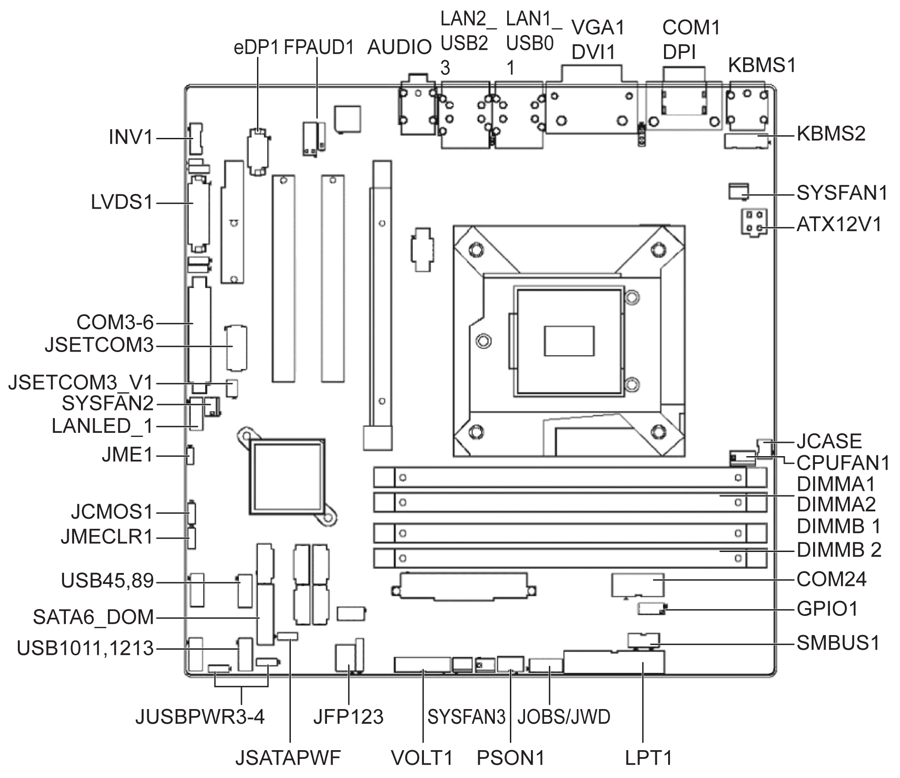

# Board Features and Board Layout

Board Features and Board Layout

The figure shows Universal and Optimized board layout, jumper, and connector locations:

The table lists the Rack iPC Universal and Optimized jumpers and their function:

| Label | Function |
| --- | --- |
| JFP1 | Power switch/HDD LED/SMBus/speaker |
| JFP2 | Power LED and keyboard lock |
| CMOS1 | CMOS clear (default 1-2) |
| PSON1 | AT(1-2) / ATX(2-3) (default 2-3) |
| JWDT1+JOBS1 | Watchdog reset and OBS alarm |
| JCASE1 | Case open pin header |
| JLVDS1 | Voltage 3.3 V/5 V/12 V selector for LVDS1 connector (default 1-2, 3.3 V) |
| JLVDS\_CLT1 | Brightness control selector for analog or digital (default 1-2, analog) |
| JEME1 | Intel AMT disable jumper |
| JMECLR1 | Clear AMT setting |
| JUSBPWR1 | USB port 0-1 power source switch between +5 Vsb and +5 V |
| JUSBPWR2 | USB port 2-3 power source switch between +5 Vsb and +5 V |
| JUSBPWR3 | USB port 4/5/8/9 power source switch between +5 Vsb and +5 V |
| JUSBPWR4 | USB port 10/11/12/13 power source switch between +5 Vsb and +5 V |

The table lists the Rack iPC Universal and Optimized connectors and their function:

| Label | Function |
| --- | --- |
| LPT1 | Parallel port, supports SPP/EPP/ECP mode |
| LVDS1 | LVDS1 connector |
| INV1 | LVDS1 inverter connector |
| COM3456 | Serial port connectors (RS-232) |
| USB45 | USB port 4, 5 (on board) |
| USB89 | USB port 8, 9 (on board) |
| USB1011 | USB port 10, 11 (on board) |
| USB1213 | USB port 12, 13 (on board) |
| VGA | VGA connector |
| COM1 | Serial port connector (RS-232) |
| KBMS1 | PS/2 keyboard and mouse connector |
| CPUFAN1 | CPU FAN connector(4-pin) |
| SYSFAN1 | System FAN1 connector(3-pin) |
| SYSFAN2 | System FAN2 connector(3-pin) |
| SYSFAN3 | System FAN3 connector(3-pin) |
| SYSFAN4 | System FAN4 connector(3-pin) |
| LAN1\_USB01 | LAN1 / USB port 0, 1 |
| LAN2\_USB23 | LAN2 / USB port 2, 3 |
| AUDIO1 | Audio connector |
| SPDIF\_OUT1 | SPDIF audio out pin header |
| FPAUD1 | HD audio front panel pin header |
| PCIEX16\_1 | PCIe x16 slot |
| SATA1 | Serial ATA data connector 1 |
| SATA2 | Serial ATA data connector 2 |
| SATA3 | Serial ATA data connector 3 |
| SATA4 | Serial ATA data connector 4 |
| SATA5 | Serial ATA data connector 5 |
| SATA6 | Serial ATA data connector 6 |
| DIMMA1 | Channel a DIMM1 |
| SPI\_CN1 | SPI flash update connector. |
| GPIO1 | GPIO header |
| ATX12V1 | ATX 12 V auxiliary power connector (for CPU) |
| ATXPWR1 | ATX 20-pin main power connector (for system) |
| DVI | DVI-D connector on rear panel |
| COM2 | Serial port COM2, pin header 2x5 |
| EDP1 | eDP connector (2x10 pin header) |
| JTAG | Joint test action group connector 2x5 P |
| SMBUS1 | SMBUS expansion pin header 1x4 P |