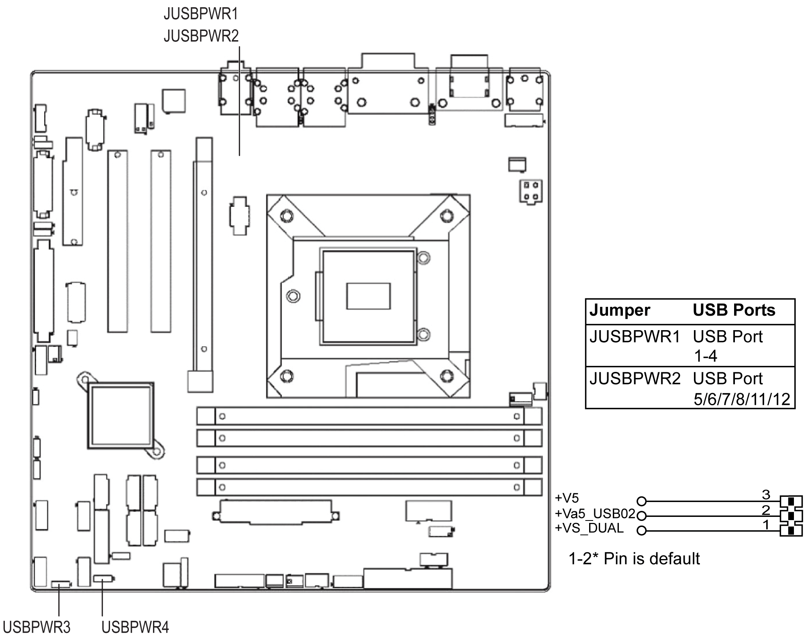

# USB Power Switch

USB Power Switch

The Rack iPC allows users to set the USB power between +5 VSB and +5 V. When the jumper is set to +5 V (default 2-3 pin), the board does not support wake from S3 by keyboard or mouse. If you need to set as +5 Vsb, change the jumper (1-2 pin) and modify the customized BIOS at the same time.

