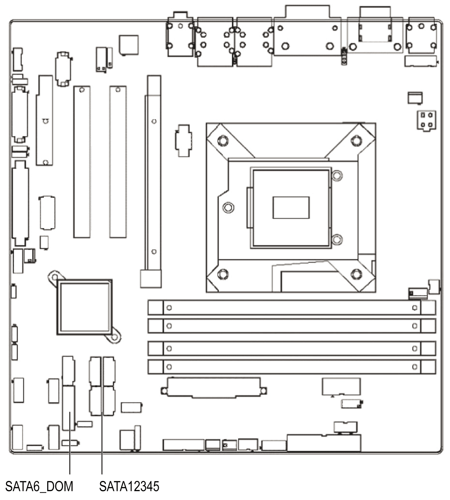

# Serial ATA Interface (SATA1...6)

Serial ATA Interface (SATA1...6)

The Rack iPC features a high performance serial ATA interface (up to 300 MB/s) and serial ATA III interface (up to 600 MB/s) which eases hard drive wiring with thin, space-saving cables.

