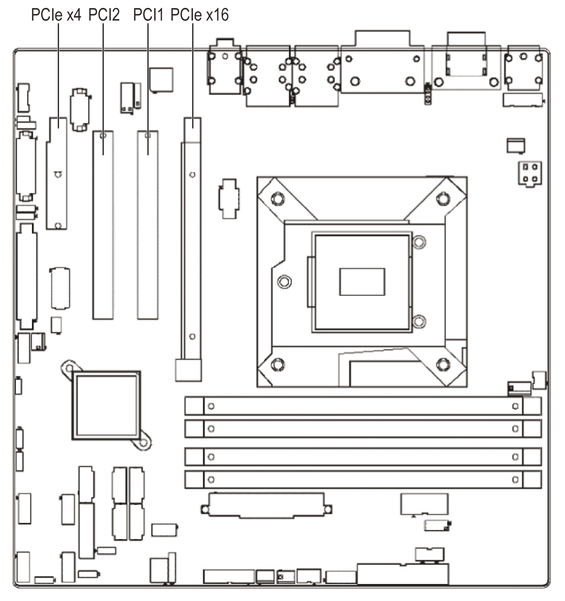

# PCI and PCI Express Slots

PCI and PCI Express Slots

The Rack iPC provides a PCIe x4 slot, a PCIe x16 slot and 2 PCI slots for users to install add-on cards when their applications require higher graphic performance than the embedded graphics controller CPU can provide.

