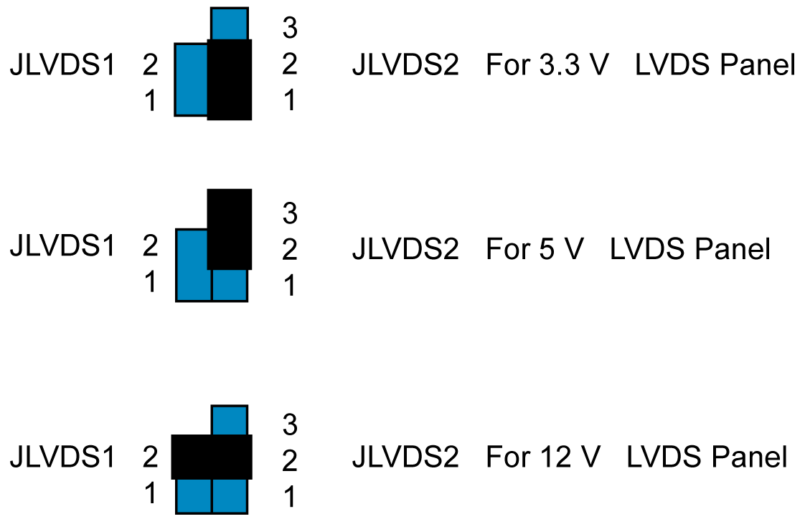

# JLVDS1-2: LCD Power 3.3 V/ 5 V/ 12 V Selector

JLVDS1-2: LCD Power 3.3 V/ 5 V/ 12 V Selector

The table shows the LCD power selector:

| Closed pins | Result |
| --- | --- |
| JLVDS2, 1-2 | Jumper for +3.3 V |
| JLVDS2, 2-3 | Jumper for +5 V |
| JLVDS1, 2  JLVDS2, 2 | Jumper for +12 V |

