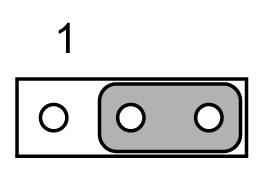

# JUSBPWR1-4 (USB Power Selection Connector)

JUSBPWR1-4 (USB Power Selection Connector)

The figure shows the USB power selection connector:

Default setting: Pin 2-3 (+5 V)

The table describes the USB power selection connector:

| Pin | Pin name |
| --- | --- |
| 1 | +V5\_DUAL |
| 2 | +V5\_USB |
| 3 | +V5 |