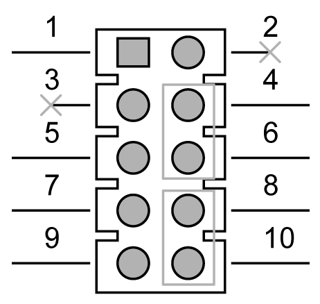

# Watchdog Timer Output and OBS Alarm Option

Watchdog Timer Output and OBS Alarm Option

The table describes the timer output and alarm option:

| Pin | Pin name |
| --- | --- |
| 1 | +5 V |
| 2 | NC |
| 3 | NC |
| 4 | SIO\_WG |
| 5 | SIO\_IRRX |
| 6 | SRST# |
| 7 | GND |
| 8 | ERR\_BEEP |
| 9 | SIO\_IRTX |
| 10 | OBS\_BEEP |

