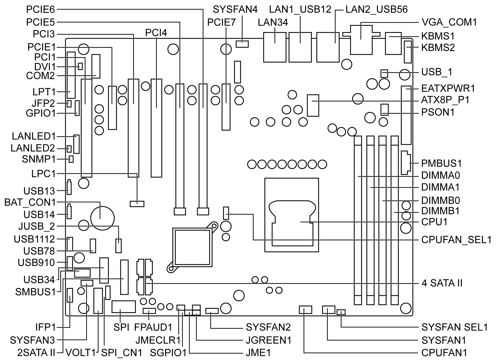

# Board Layout

Board Layout

The figure shows the board layout and jumper locations:

The table describes the Rack iPC Performance jumpers and their function:

| Label | Function |
| --- | --- |
| JCMOS1 | CMOS clear |
| JME1 | Intel ME disable jumper for ME/BIOS update |
| JWDT1 | Watch dog reset |
| JGREEN1 | Deep sleep Sx mode |
| JUSB\_1,JUSB\_2 | USB port and KBMS power source switch between +5 VSB and +5 V |
| CPUFAN\_SEL1, SYSFAN\_SEL1 | FAN PWM(1-2)/DC mode selection(2-3) |
| PSON1 | AT(1-2) / ATX(2-3) |

The table describes the Rack iPC Performance connectors and their function:

| Label | Function |
| --- | --- |
| ATX24P\_P1 | ATX 24-pin main power connector (for system) |
| ATX8P\_P1 | Processor power connector (for CPU) |
| SATA0...1 | SATA III (6 Gb/s) |
| SATA2...5 | SATA II (3 Gb/s) |
| USB12 | USB 3.0 port 1 2 |
| USB34 | USB 3.0 port 3 4 (Header) |
| USB56 | USB 2.0 port 5 6 |
| USB78, USB910, USB1112 | USB 2.0 port 7,8,9,10,11,12 (Header) |
| USB13, USB14 | USB 2.0 port 13, 14 (USB type A) |
| PCIE2, PCIE7 | PCIE x4 slot |
| PCIE5, PCIE6 | PCIe x16 slot (x8 link) |
| DIMMA0,DIMMA1,DIMMB0,DIMMB1 | DDR3 slot |
| CPUFAN1 | CPU FAN connector |
| SYSFAN1,SYSFAN2,SYSFAN 3,SYSFAN4 | System FAN connector |
| LAN1\_USB12,LAN2\_USB56 | LAN1 / USB 3.0 port 1, 2 stack connector LAN2 / USB 2.0 port 5, 6 stack connector |
| LAN34 | LAN 3.4 stack connector |
| VGA\_COM1 | VGA+COM connector |
| KBMS1 | PS/2 keyboard and mouse connector |
| KBMS2 | External keyboard and mouse connector(6 pin) |
| SPI1 | SPI socket |
| SPI\_CN1 | SPI flash card pin header |
| LANLED1,LANLED2 | LAN LED extension connector |
| SMBUS1 | SM bus From PCH |
| SNMP1 | SM bus from HW monitor IC |
| GPIO1 | GPIO header |
| FPAUD1 | Audio front panel header |
| LPT1 | Parallel port |
| COM2 | Serial port: RS-232 |
| JFP1 | Front panel header |
| LPC1 | Low pin count connector for Schneider Electric TPM LPC modules |
| LANLED1 | LAN1/2 LED extension connector |
| LANLED2 | LAN3/4 LED extension connector |
| VOLT1 | Voltage display |
| PMBUS1 | PMBUS connector to communicate with power supply |