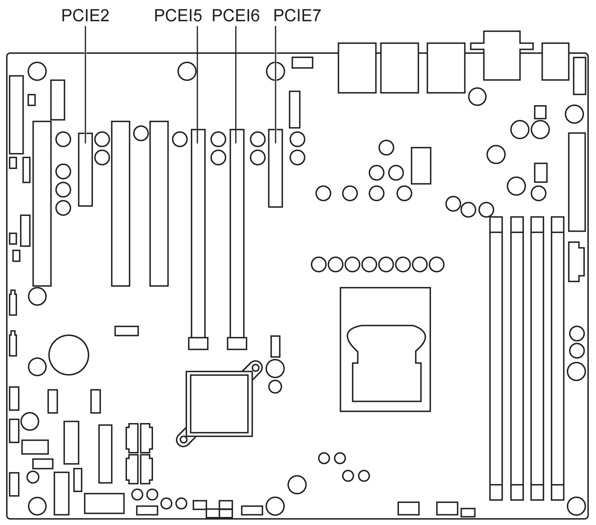

# PCIe Slots Expansion Slot (PCIE2, PCIE5, PCIE6, PCIE7)

PCIe Slots Expansion Slot (PCIE2, PCIE5, PCIE6, PCIE7)

The Rack iPC Performance provides 2 PCIe x16 slots (x8 link) and 2 PCie x4 slots for users to install add-on VGA cards. When their applications require higher graphics performance than the embedded graphics controller CPU can provide, or high bandwidth demanded I/O card, such as frame grabber card, raid card, and 10 G LAN card.

