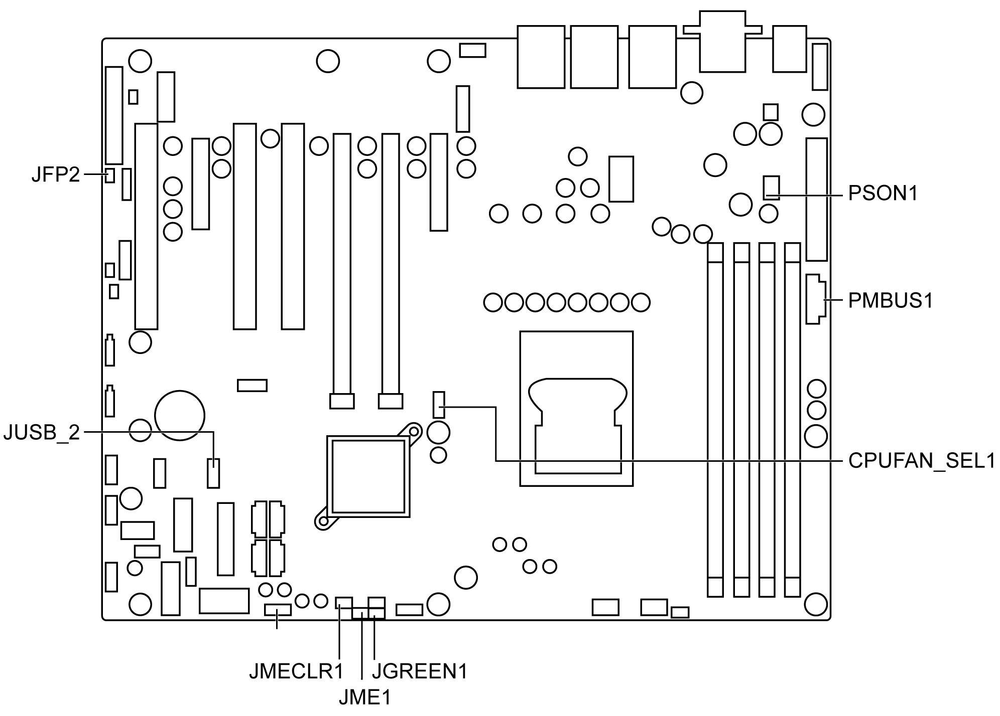

# Jumpers and Connectors

Jumpers and Connectors

Connectors on the Rack iPC Performance motherboard link it to external devices such as hard disk drives and a keyboard. In addition, the board has a number of jumpers that are used to configure your system for your application. The tables below list the function of each of the jumpers and connectors. Later sections in this chapter give instructions on setting jumpers.

The table describes the Rack iPC Performance jumpers and connectors:

The table describes the Rack iPC Performance jumpers and their function:

| Label | Function |
| --- | --- |
| JCMOS1 | CMOS clear |
| JME1 | Intel ME disable jumper for ME/BIOS update |
| JWDT1 | Watch dog reset |
| JGREEN1 | Deep sleep Sx mode |
| JUSB\_1,JUSB\_2 | USB port and KBMS power source switch between +5 VSB and +5 V |
| CPUFAN\_SEL1, SYSFAN\_SEL1 | FAN PWM(1-2)/DC mode selection(2-3) |
| PSON1 | AT(1-2) / ATX(2-3) |