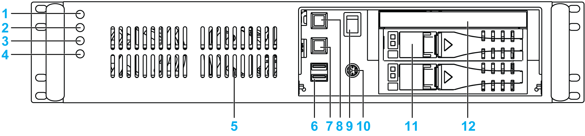
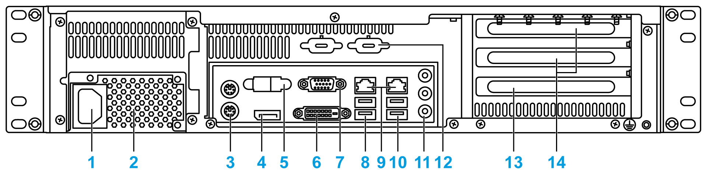
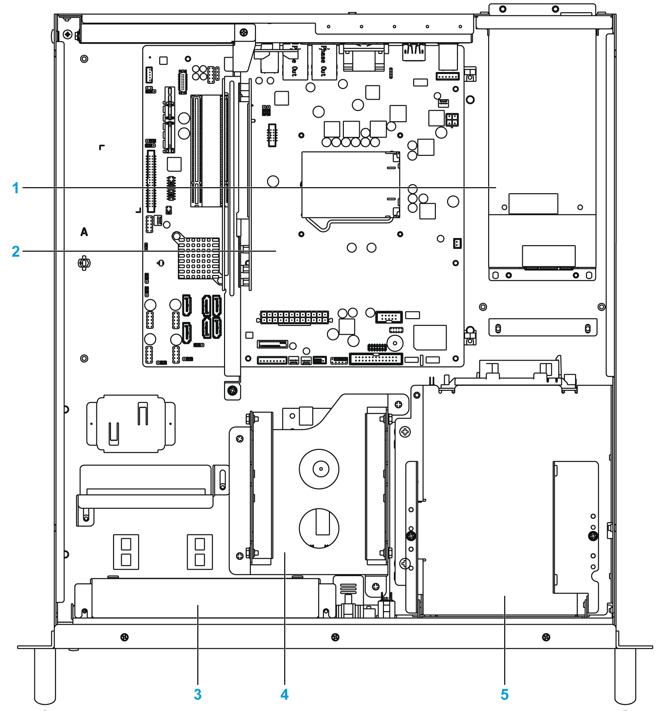

# Description of the Rack iPC Optimized

Description of the Rack iPC Optimized

Front View

1   Power LED

2   HDD LED

3   Fan LED

4   Temperature LED

5   Fan x 2

6   USB port 2.0 x 2

7   Alarm reset button

8   System reset button

9   Power switch

10   KB/MS connector

11   Hot swap hard disk tray 3.5" (when it is not used with OS) x 2

12   Slim optical drive bay

Rear View

1   Power connector

2   Power supply unit

3   KB/MS connector

4   Display port connector

5   Serial port connector

6   DVI connector

7   VGA connector

8   USB port 3.0 x 2

9   LAN port x 2

10   USB port 3.0 x 2

11   Audio port

12   Spare Sub-D9 housing x 2

13   Expansion slot PCI

14   Expansion slot PCIe (x8/x16) x 2

Top View

1   Power supply unit

2   Micro ATX motherboard

3   System fan x 2

4   Internal drive 3.5” SATA 3 for OS

5   Hot swap hard disk tray 3.5" SATA 2 x 2

EIO0000001745.01

© 2019 Schneider Electric. All rights reserved.