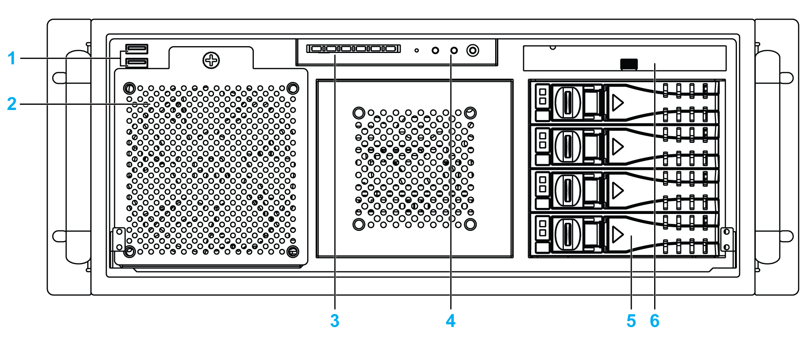
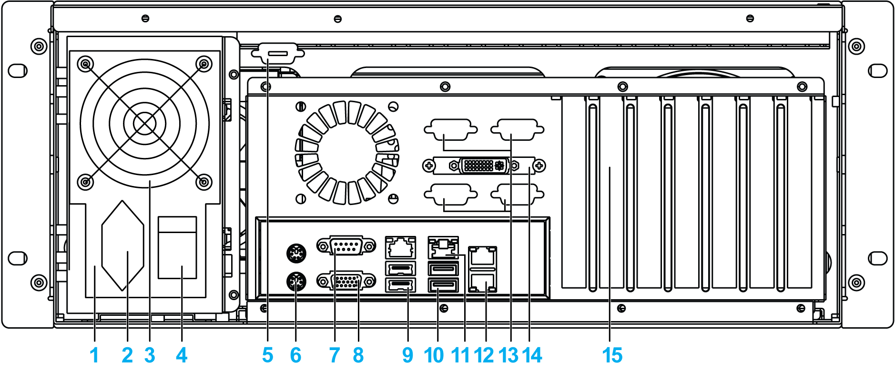
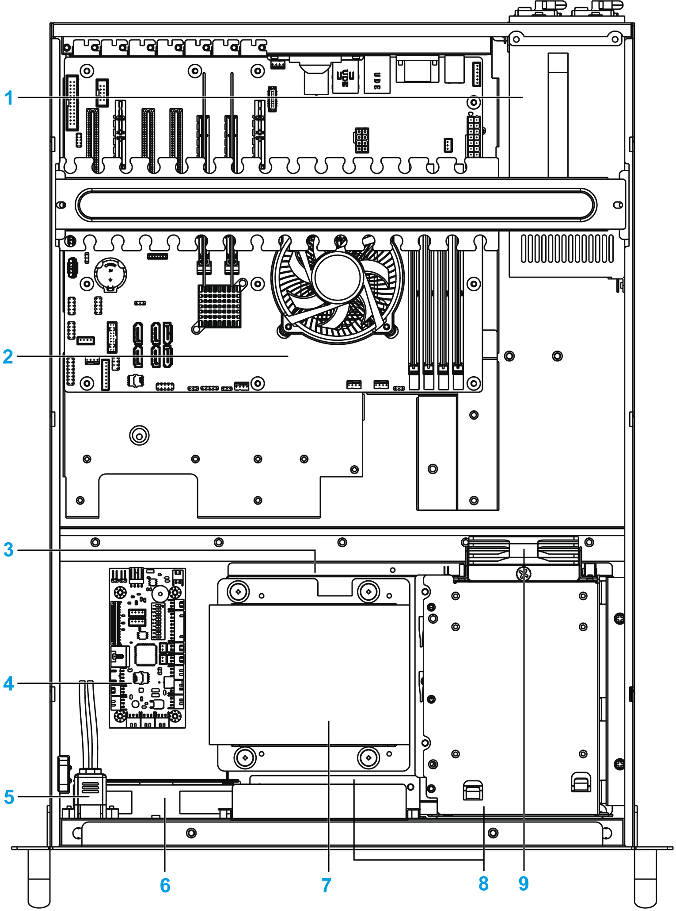

# Description of The Rack iPC Performance

Description of The Rack iPC Performance

Front View

1   USB ports 2.0 x 2

2   Front-accessible fan

3   LED x 6

4   Switch/Button x 4

5   Hot swap hard disk tray 3.5" (when it is not used with OS) x 4

6   Slim optical drive bay

Rear View with Single Power Supply

1   Power supply unit

2   Power supply connector

3   Fan

4   Power supply switch

5   Spare Sub-D9 housing

6   KB/MS connector

7   Serial port connector

8   VGA connector

9   USB port 2.0 x 2

10   USB port 3.0 x 2

11   LAN port x 2

12   Spare LAN port x 2

13   Spare Sub-D9 housing x 4

14   DVI connector

15   Expansion slots (maximum 7): 2 PCIe x4 and 2 PCIe x8/x16 and 3 PCI. By default-mounted audio ports on 1 slot)

Rear View with Redundant Power Supply

1   Power supply connector x 2

2   Power supply unit x 2

3   Button

4   LED

5   Spare Sub-D9 housing

6   KB/MS connector

7   Serial port connector

8   VGA connector

9   USB port 2.0 x 2

10   USB port 3.0 x 2

11   LAN port x 2

12   Spare LAN port x 2

13   Spare Sub-D9 housing x 4

14   DVI connector

15   Expansion slots (maximum 7): 2 PCIe x4 and 2 PCIe x8/x16 and 3 PCI. By default-mounted audio ports on 1 slot

Top View

1   Power supply unit

2   ATX motherboard

3   Hard disk

4   Alarm board featuring system fan speed control

5   Case-open switch

6   Front-accessible fan

7   Internal drive SATA 3 3.5” with OS

8   Hot swap hard disk tray 3.5" x 4

9   Storage fan (easy to maintain with the thumb screw)

EIO0000001745.01

© 2019 Schneider Electric. All rights reserved.