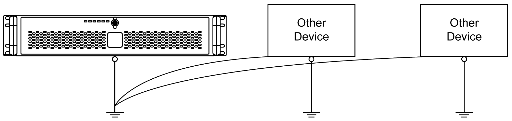
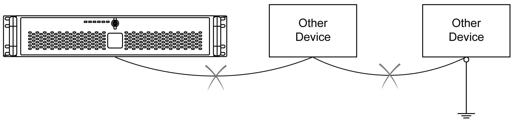

# Grounding

Grounding

Overview

The grounding resistance between the Rack iPC ground and the ground must be 100 Ω or less. When using a long grounding wire, check the resistance and, if required, replace a thin wire with a thicker wire and place it in a duct. Refer to the table below for maximum lengths of wire with the given cross-section.

Ground Wire Dimensions

| Wire cross-section | Maximum line length |
| --- | --- |
| 2.5 mm2 (AWG 13) | 30 m (98 ft) |
| 60 m (196 ft) round trip |

Dedicated Ground

|  |
| --- |
| Warning_Color.gifWARNING |
| UNINTENDED EQUIPMENT OPERATION |
| oUse only the authorized grounding configurations shown below.  oConfirm that the grounding resistance is 100 Ω or less.  oTest the quality of your ground connection before applying power to the device. Excess noise on the ground line can disrupt operations of the Magelis Industrial PC. |
| Failure to follow these instructions can result in death, serious injury, or equipment damage. |

Connect the Rack iPC ground to a dedicated ground:

Shared Ground Allowed

If a dedicated ground is not possible, use a shared ground:

Shared Ground Not Allowed

Do not connect the Rack iPC to ground through other devices:

Shared Ground - Avoid Ground Loop

When connecting an external device to a Rack iPC with the shield ground (SG), ensure that a ground loop is not created. The Rack iPC’s ground connection screw and SG are connected internally.

Grounding I/O Signal Lines

Electromagnetic radiation may interfere with the control communications of the Magelis Industrial PC.

|  |
| --- |
| Warning_Color.gifWARNING |
| UNINTENDED EQUIPMENT OPERATION |
| oIf wiring of I/O lines near power lines or radio equipment is unavoidable, use shielded cables and ground one end of the shield to the Magelis Industrial PC ground connection screw.  oDo not wire I/O lines in proximity to power cables, radio devices, or other equipment that may cause electromagnetic interference. |
| Failure to follow these instructions can result in death, serious injury, or equipment damage. |

EIO0000001745.01

© 2019 Schneider Electric. All rights reserved.