# Advanced Menu

Advanced Menu

Advanced BIOS Features Tab

The Advanced tab screen for the Rack iPC Optimized:

The Advanced tab screen for the Rack iPC Universal:

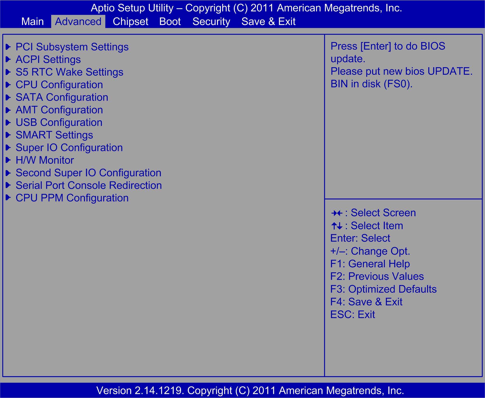

The Advanced tab screen for the Rack iPC Performance:

For details about the Advanced submenus, refer to:

o[PCI Subsystem Settings](#XREF_D_SE_0033799_33)

o[ACPI Settings](#XREF_D_SE_0033799_25)

o[Trusted Computing](#XREF_D_SE_0033799_34)

o[S5 RTC Wake Settings](#XREF_D_SE_0033799_24)

o[CPU Configuration](#XREF_D_SE_0033799_26)

o[SATA Configuration](#XREF_D_SE_0033799_27)

o[Intel TXT Configuration](#XREF_D_SE_0033799_35)

o[AMT Configuration](#XREF_D_SE_0033799_15)

o[USB Configuration](#XREF_D_SE_0033799_28)

o[SMART Settings](#XREF_D_SE_0033799_29)

o[Super I/O Configuration](#XREF_D_SE_0033799_30)

o[AOAC Configuration](#XREF_D_SE_0033799_31)

o[H/W Monitor](#XREF_D_SE_0033799_36)

o[Second Super I/O Configuration](#XREF_D_SE_0033799_37)

o[Serial Port Console Redirection](#XREF_D_SE_0033799_38)

o[CPU PPM Configuration](#XREF_D_SE_0033799_39)

Rack iPC BIOS Update

| Step | Action |
| --- | --- |
| 1 | Save the new BIOS on a USB pen drive. |
| 2 | Rename the BIOS file to “update.bin”. |
| 3 | Plug the pen drive into the Rack iPC. |
| 4 | Enter the BIOS setup. |
| 5 | In this menu, select the Rack iPC BIOS update option.  Result: The BIOS is automatically updated to the new version. |

PCI Subsystem Settings Submenu

The PCI Subsystem Settings submenu:

This table shows the PCI Subsystem Settings option:

| BIOS setting | Description |
| --- | --- |
| Above 4G Decoding | Enables or disables 64-bit capable devices to be decoded on above 4 G address space if the system supports 64-bit PCI decoding. |

ACPI Settings Submenu

The ACPI Settings (Advanced configuration and power interface) submenu:

This table shows the ACPI Settings options:

| BIOS setting | Description |
| --- | --- |
| Power On By Modem | Enables or disables the power-on by modem. |
| Enable Hibernation | Enables or disables hibernation. |
| ACPI Sleep State | Optimized: Auto  Universal: Auto  Performance: S3 only (Suspend to RAM) |
| Lock Legacy Resources | Locks legacy resources of the devices. |
| S3 Video Report | Optimized: Enables or disables S3 resume for VBIOS.  Universal: Enables or disables S3 resume for VBIOS. |
| PowerOn by Modem | The system can be awakened from an ACPI sleep by a wake-up signal from a modem that supports this signal. |
| Power Type | Optimized: ATX  Universal: ATX |

Trusted Computing Submenu

This submenu enables/disables the TPM (TPM 1.1/1.2) setup in BIOS.

The TPM (Trusted platform module) is a secure key generator and key cache management component that enables protected storage of encryption keys and authentication credentials for enhanced security capabilities.

The Trusted Computing submenu:

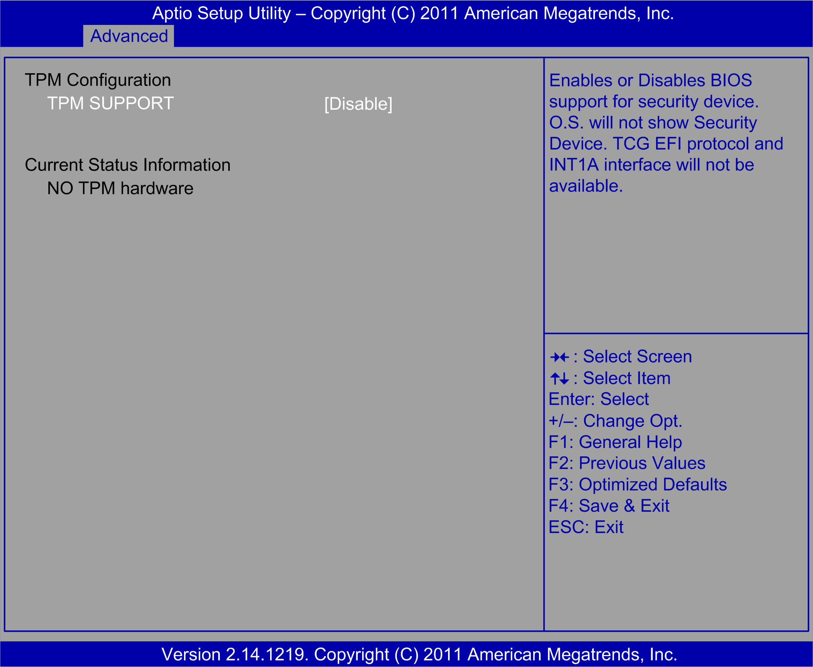

This table shows the Trusted Computing option:

| BIOS setting | Description |
| --- | --- |
| TM Support | Enables or disables TPM if the TPM module is installed on the motherboard. |

S5 RTC Wake Settings Submenu

The S5 RTC Wake Settings submenu:

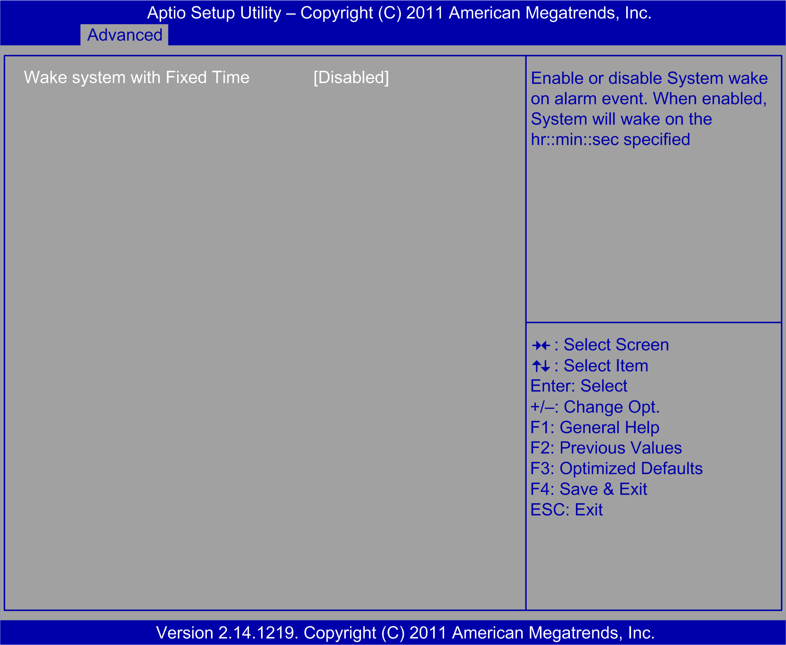

This table shows the S5RTC Wake Settings options:

| BIOS setting | Description |
| --- | --- |
| Wake System with Fixed Time | Enables or disables system wake-up on an alarm after a fixed time. |
| Wake System with Dynamic Time | Enables or disables system wake-up on an alarm after a dynamic time. |

CPU Configuration Submenu

The CPU Configuration submenu for the Rack iPC Universal and Optimized:

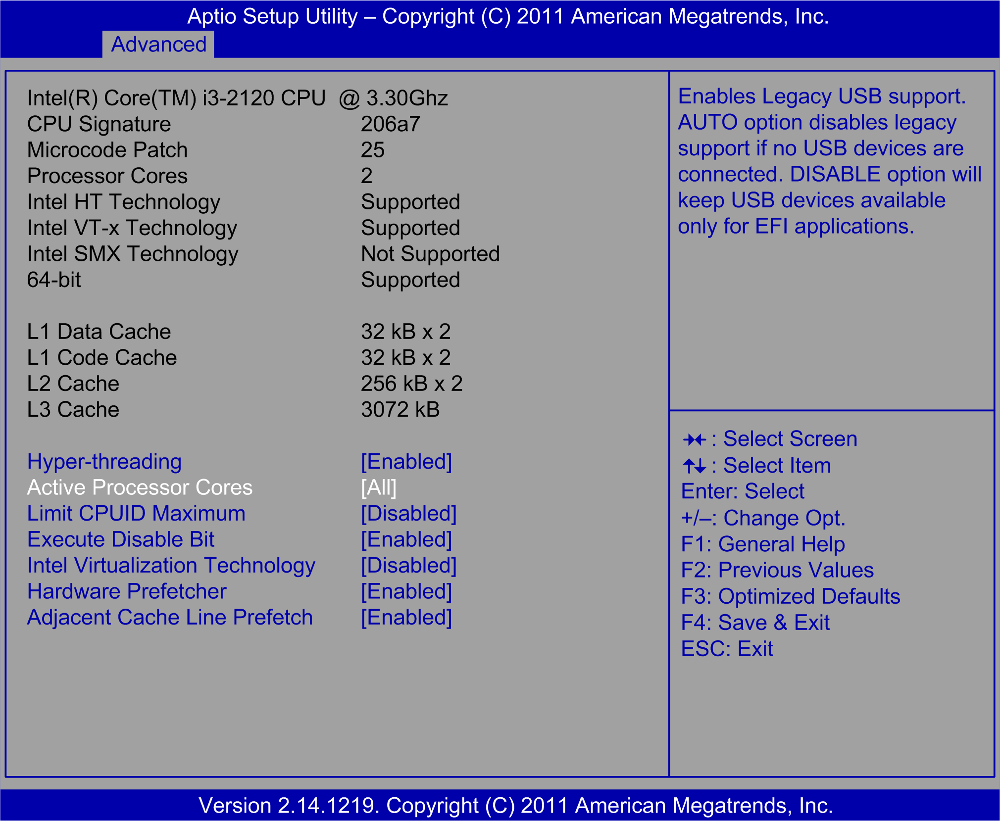

Universal   Intel(R) Core(TM) i3-2120 CPU @ 3.30 GHz

Optimized   Intel(R) Pentium(R) CPU G850 @ 2.90 GHz

The CPU Configuration submenu for the Rack iPC Performance:

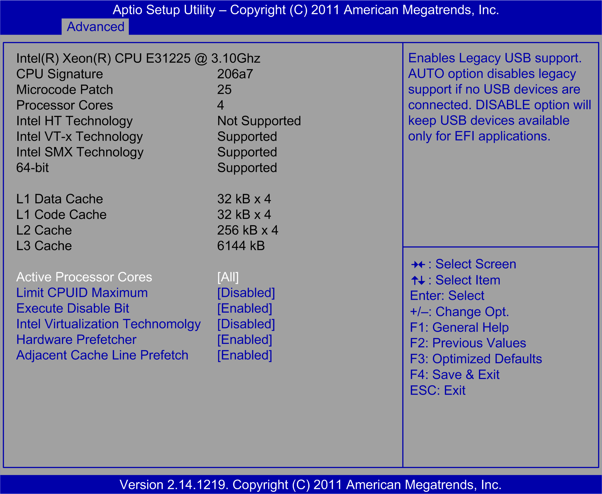

This table shows the CPU Configuration options:

| BIOS setting | Description |
| --- | --- |
| Active Processor Cores | Allows choosing the number of CPU cores to activate in each processor package. |
| Limit CPUID Maximum | Allows limiting the CPUID maximum value.  If enabled, legacy operating systems can boot without support for CPUs with extended CPUID functions. |
| Execute Disable Bit | Enables or disables the no-execution page protection technology. |
| Intel Virtualization Technology | Intel virtualization technology (Intel VT) is a set of hardware enhancements to Intel server and client platforms that provide software-based virtualization solutions.  Intel VT allows a platform to run multiple operating systems and applications in independent partitions, therefore, allowing one computer system to function with multiple operating systems. |
| Hardware Perfectcher | The processor fetches data and instructions (that are likely to be required soon) from the memory into the cache. This reduces the latency associated with memory reads. |
| Adjacent Cache Line Prefectch | Enables or disables the adjacent cache line prefetch feature. |

SATA Configuration Submenu

The SATA Configuration submenu for Optimized Rack iPC:

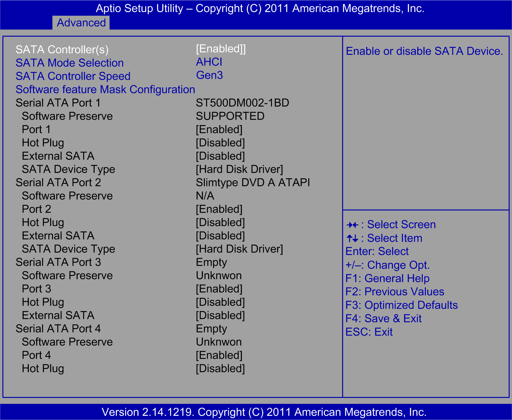

The SATA Configuration submenu for Universal Rack iPC:

The SATA Configuration submenu for Performance Rack iPC:

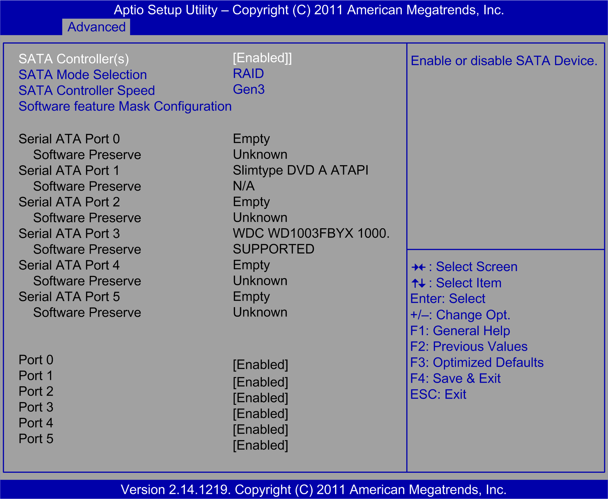

This table shows the SATA Configuration options:

| BIOS setting | Description |
| --- | --- |
| SATA Controller(s) | Enables or disables the SATA function.  NOTE: This option is only available if SATA Mode Selection is set to IDE. |
| SATA Mode Selection | Universal: The SATA mode can be either IDE or AHCI. |

Intel TXT Configuration Submenu

The Intel TXT Configuration (Intel trusted execution technology configuration) submenu:

This table shows the Intel TXT Configuration options:

| BIOS setting | Description |
| --- | --- |
| Secure Mode Extension (SMX) | Enables or disables the Intel secure mode extensions (SMX) technology. |
| Intel TXT Configuration | Enables or disables the Intel trusted execution technology.  NOTE:  This option is only available if the following Intel technologies are enabled:  oSecure mode extensions (SMX)  oVirtualization technology (VT)  oVirtualization for directed I/O (VT-d) |

AMT Configuration Submenu

The AMT Configuration (Intel active management technology configuration) submenu:

This table shows the AMT Configuration options:

| BIOS setting | Description |
| --- | --- |
| Intel AMT | Enables or disables the Intel AMT BIOS extensions. |
| Un-Configure ME | When disabled, ATM/ME can be unconfigured without a password.  When enabled, this action requires a password. |
| Watchdog | When set to Enabled, the watchdog timer monitors the time taken for each task performed by a software or hardware:  oOS timer [0]  oBIOS timer [0] |

USB Configuration Submenu

The USB Configuration submenu:

This table shows the USB Configuration options:

| BIOS setting | Description |
| --- | --- |
| USB Devices: | 1 keyboard, 1 mouse, 2 hubs. |
| Legacy USB Support | Enables support for legacy USB. The Auto option disables legacy support if no USB devices are connected. |
| USB 3.0 Support | – |
| XHCI Hand-off | – |
| EHCI Hand-Off | This is a work-around for the OS without EHCI hand-off support. |
| Device reset time-out | Sets USB mass storage to reset time-out value of the device. |
| Mass Storage Devices | Displays USB mass storage device information. |

SMART Settings Submenu

The SMART Settings submenu:

This table shows the SMART Settings option:

| BIOS setting | Description |
| --- | --- |
| SMART Self Test | – |

Super I/O Configuration Submenu

The Super I/O Configuration submenu:

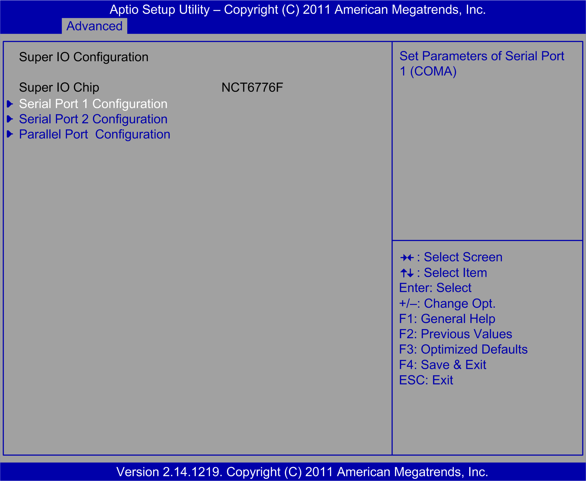

Serial Port 1 Configuration submenu:

This table shows the Serial Port 1 Configuration options:

| BIOS setting | Description |
| --- | --- |
| Serial Port | Enables or disables serial port 1. |
| Change Settings | Selection of the optional settings for serial port 1. |

Serial Port 2 Configuration submenu:

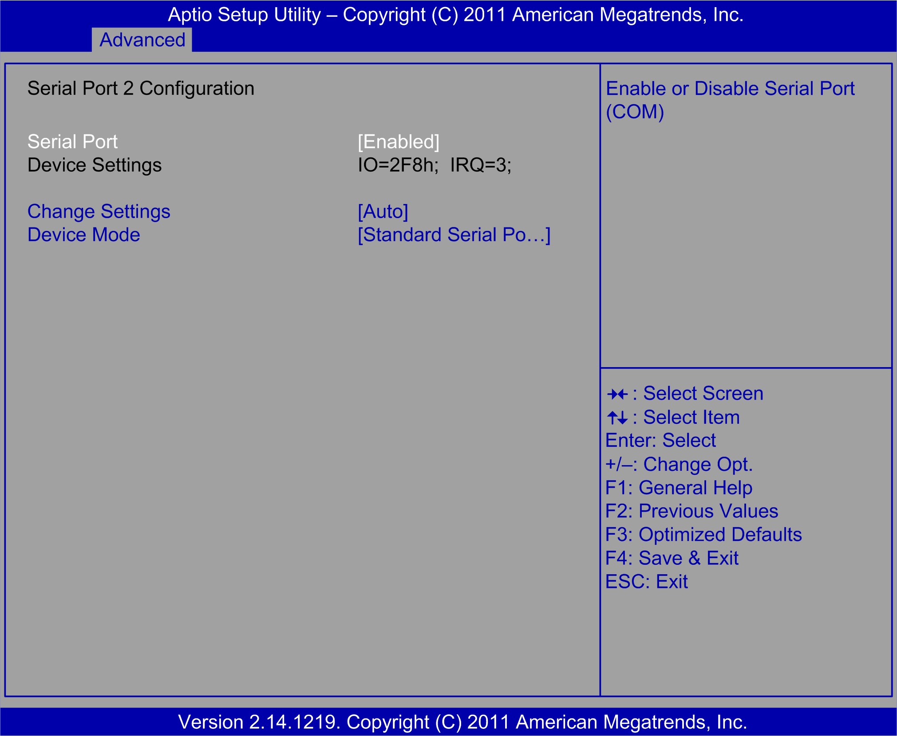

This table shows the Serial Port 2 Configuration options:

| BIOS setting | Description |
| --- | --- |
| Serial Port | Enables or disables serial port 2. |
| Change Settings | Selection of the optional settings for serial port 2. |
| Device Mode | Serial port 2 choices:  oStandard serial port mode [Default]  oIrDA 1.0 (HP SIR) mode  oASKIR mode  Performance: STD Printer Mode |

Parallel Port Configuration submenu:

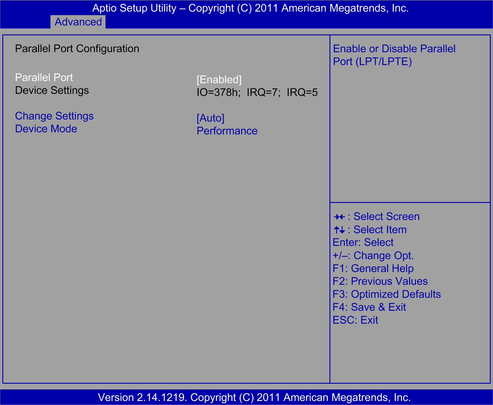

This table shows the Parallel Port Configuration options:

| BIOS setting | Description |
| --- | --- |
| Parallel Port | Enables or disables the parallel port. |
| Change Settings | Selection of the optional settings for the parallel port. |
| Device Mode | Parallel port choices.  Optimized: Auto  Universal and Performance: ECP and EPP 1.9 Mode |

AOAC Configuration Submenu

The AOAC Configuration (Always-ON/Always connected) option screen:

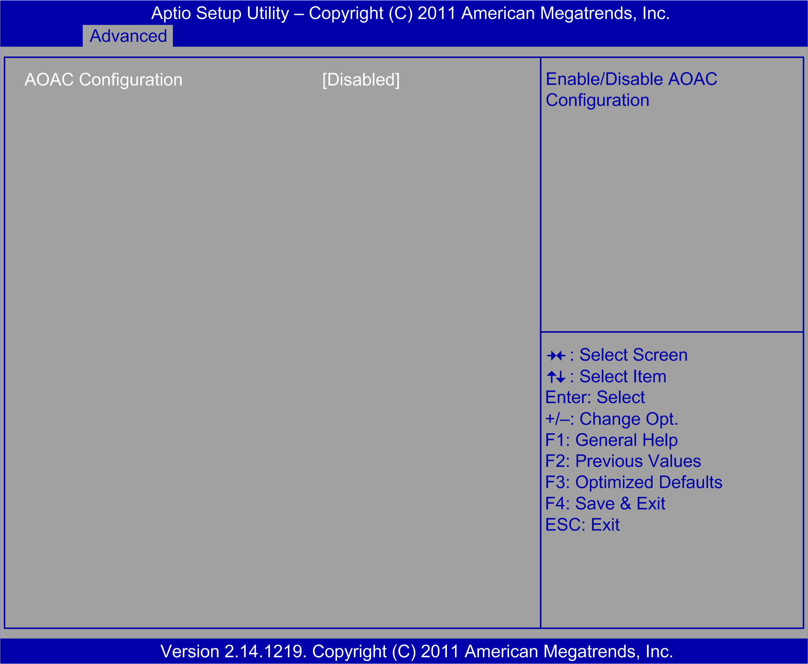

This table shows the AOAC Configuration menu options:

| BIOS setting | Description |
| --- | --- |
| AOAC Configuration | Enables or disables the AOAC function. |

H/W Monitor Submenu

The H/W Monitor submenu:

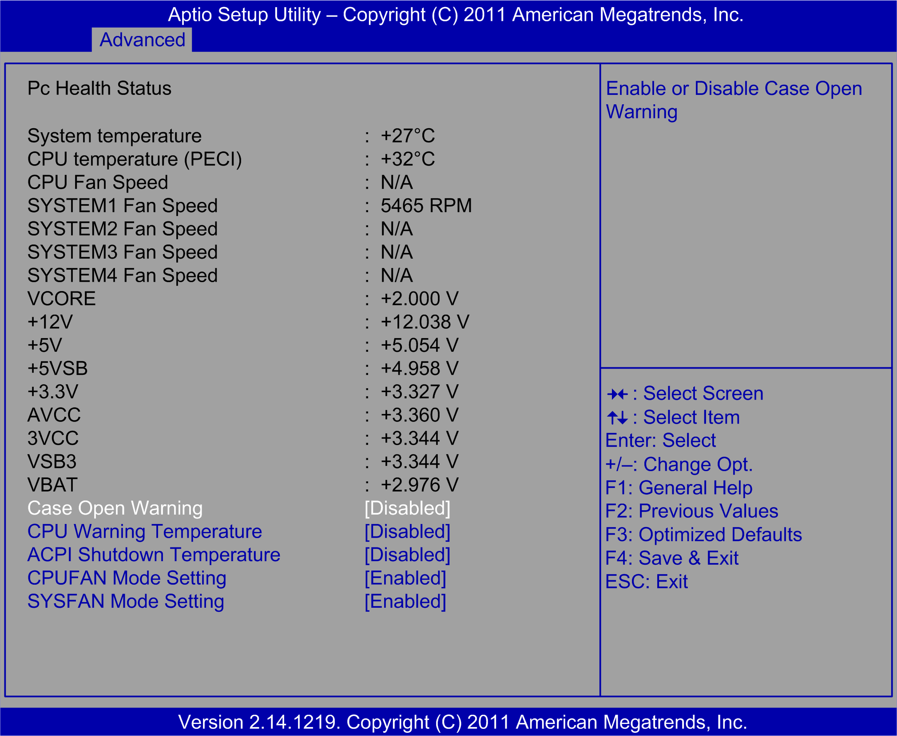

This table shows the H/W Monitor options:

| BIOS setting | Description |
| --- | --- |
| Case Open Warning | Enables or disables the chassis intrusion monitoring function. When enabled, if the case is opened, the speaker beeps. |
| CPU Warning Temperature | Sets the CPU informing temperature threshold.  If the system reaches the informing temperature, the speaker beeps. |
| ACPI Shutdown Temperature | Sets the ACPI shutdown temperature threshold.  If the system reaches the shutdown temperature, it is automatically shut down by the ACPI OS to protect the system from overheating damage. |
| CPUFAN Mode Setting | Enables or disables the CPUFAN mode to SMART FAN. |
| SYSFAN Mode Setting | Enables or disables the SYSFAN mode to SMART FAN. |

Second Super I/O Configuration Submenu

The Second Super I/O Configuration submenu:

Serial Port 3 Configuration submenu:

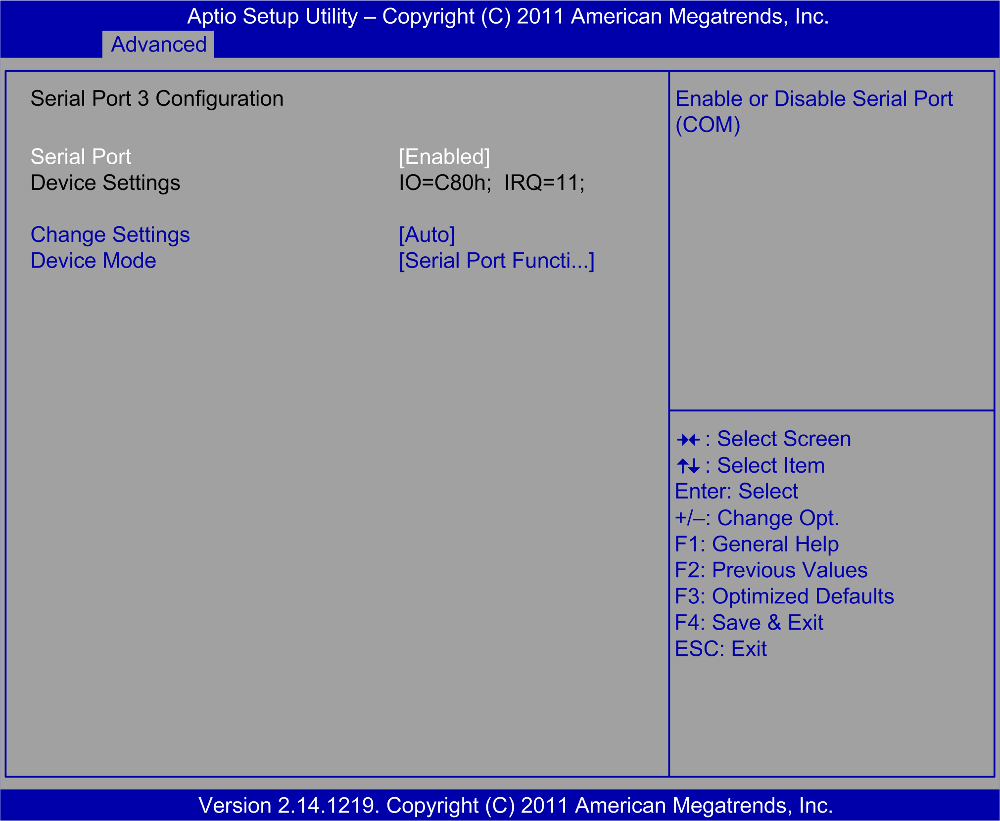

This table shows the Serial Port 3 Configuration options:

| BIOS setting | Description |
| --- | --- |
| Serial Port | Enables or disables serial port 3. |
| Change Settings | Selection of the optional settings for serial port 3. |
| Auto Flow Control | When COM is to set as RS-485, this port supports auto flow control function. |

Serial Port 4 Configuration submenu:

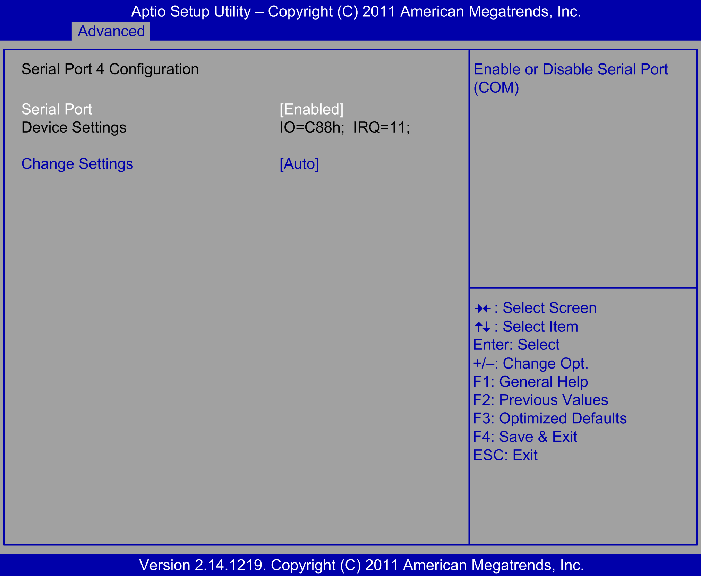

This table shows the Serial Port 4 Configuration options:

| BIOS setting | Description |
| --- | --- |
| Serial Port | Enables or disables serial port 4. |
| Change Settings | Selection of the optional settings for serial port 4. |

Serial Port 5 Configuration submenu:

This table shows the Serial Port 5 Configuration options:

| BIOS setting | Description |
| --- | --- |
| Serial Port | Enables or disables the serial port 5. |
| Change Settings | Selection of the optional settings for the serial port 5. |

Serial Port 6 Configuration submenu:

This table shows the Serial Port 6 Configuration options:

| BIOS setting | Description |
| --- | --- |
| Serial Port | Enables or disables the serial port 6. |
| Change Settings | Selection of the optional settings for the serial port 6. |

Serial Port Console Redirection Submenu

The Serial Port Console Redirection submenu:

This table shows the Serial Port Console Redirection option:

| BIOS setting | Description |
| --- | --- |
| Console Redirection | Enables or disables the console redirection feature. |

CPU PPM Configuration Submenu

The CPU PPM Configuration submenu:

This table shows the CPU PPM Configuration options:

| BIOS setting | Description |
| --- | --- |
| EIST | Enables or disables the Intel CPU SpeedStep. |
| Turbo Mode | Performance: [Enabled] |

EIO0000001745.01

© 2019 Schneider Electric. All rights reserved.