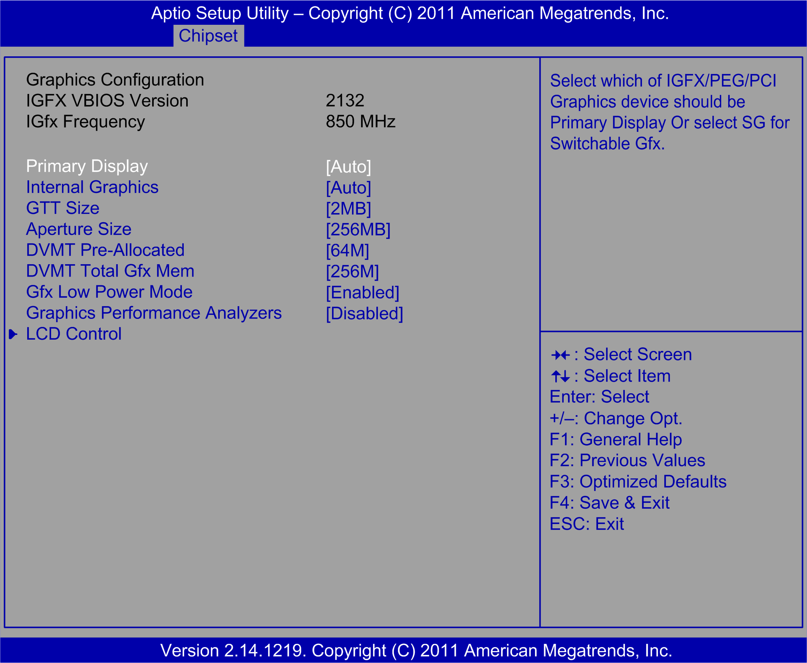

# Chipset Menu

Chipset Menu

System Agent (SA) Configuration Submenu

The System Agent submenu:

Additional System Agent options are

o[Graphics Configuration](#XREF_D_SE_0033835_5)

o[NB PCIe Configuration](#XREF_D_SE_0033835_7)

Graphics Configuration Submenu

The Graphics Configuration submenu

This table shows 2 Graphics Configuration options:

| BIOS setting | Description |
| --- | --- |
| Primary Display [Auto] | Sets the video device that is activated during POST. |
| LCD Control | Sets LCD video device parameters. |

LCD Control Submenu of the Graphics Configuration Menu

The LCD Control submenu

This table shows the LCD Control option:

| BIOS setting | Description |
| --- | --- |
| Primary IGFX Boot Display [VBIOS Default] | Sets the video device that is activated during POST. |

NB PCIe Configuration Submenu

The NB PCIe Configuration submenu

This table shows the NB PCIe Configuration option:

| BIOS setting | Description |
| --- | --- |
| De-emphasis Control | Performance: -3.5 dB. |

EIO0000001745.01

© 2019 Schneider Electric. All rights reserved.