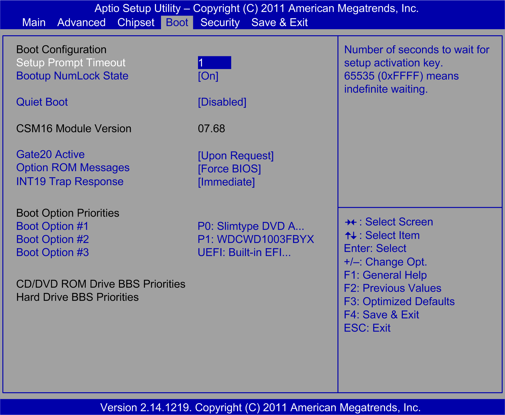

# Boot Menu

Boot Menu

Boot Tab

The Boot tab screen:

This table shows the Boot menu options:

| BIOS setting | Description |
| --- | --- |
| Setup Prompt Timeout | Selects the number of seconds to wait for the setup activation key. |
| Bootup NumLock State | Selects the Numlock at power-on. |
| Quiet Boot | If disabled, the BIOS displays the normal POST messages.  If enabled, an OEM Logo is shown instead of the POST messages. |
| Option ROM Message | Sets the display mode for an optional ROM. |
| Interrupt 19 Capture | Allows optional ROMs to trap interrupt 19. |
| Boot Option Priorities | Sets boot device priority.  Optimized:  oBoot Option # 2 P1: Slimtype DVD A...  oBoot Option # 1 P0: ST500DM002-1BD  Universal:  oBoot Option # 2 P5: Slimtype DVD A...  oBoot Option # 1 P0: WDC WD50003ABYX...  Performance:  oBoot Option # 1 P5: Slimtype DVD A...  oBoot Option # 2 P1: WDC WD1003FBYX-01Y7B1  oBoot Option # 3 UEFI: Built-in EFI... |

EIO0000001745.01

© 2019 Schneider Electric. All rights reserved.