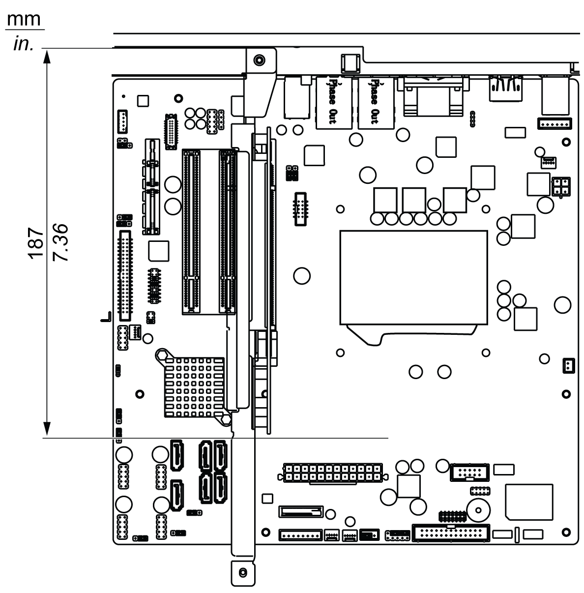

# PCIe or PCI Card Installation

PCIe or PCI Card Installation

Overview

Before installing or removing a PCIe or PCI card, shut down Windows® in an orderly fashion and remove all power from the device.

|  |
| --- |
| DangerElectrical_Color.gifDanger_Color.gifDANGER |
| HAZARD OF ELECTRIC SHOCK, EXPLOSION OR ARC FLASH |
| oRemove all power from the device before removing any covers or elements of the system, and prior to installing or removing any accessories, hardware, or cables.  oUnplug the power cable from both the Magelis Industrial PC and the power supply.  oAlways use a properly rated voltage sensing device to confirm power is off.  oReplace and secure all covers or elements of the system before applying power to the unit.  oUse only the specified voltage when operating the Magelis Industrial PC. The AC unit is designed to use 100...240 Vac input. |
| Failure to follow these instructions will result in death or serious injury. |

PCI Card Dimensions

NOTE: PCI cards cannot exceed the following dimensions.

PCI full length and standard height for the Rack iPC Universal and Optimized:

oLength: 187 mm (7.36 in.)

oHeight: 106.7 mm (4.2 in.)

PCI card maximum length:

PCI full length and standard height for the Rack iPC Performance:

oLength: 194 mm (7.63 in.)

oHeight: 106.7 mm (4.2 in.)

PCI card maximum length:

PCIe Card Dimensions

NOTE: PCIe cards cannot exceed the following dimensions.

PCI full length and standard height:

oLength: 174 mm (6.85 in.)

oHeight: 106.7 mm (4.2 in.)

PCIe or PCI Card Installation

|  |
| --- |
| NOTICE |
| ELECTROSTATIC DISCHARGE |
| Take the necessary protective measures against electrostatic discharge before attempting to remove the Magelis Industrial PC cover. |
| Failure to follow these instructions can result in equipment damage. |

NOTE:

oRemove all power before attempting this procedure.

oIt is recommended that you install the software driver before you install the hardware in your system.

| Step | Action |
| --- | --- |
| 1 | Disconnect the power cord to the Rack iPC. |
| 2 | Touch the housing or ground connection (not the power supply) to discharge any electrostatic charge from your body. |
| 3 | Loosen 2 screws on the rear of the top cover for the Rack iPC Performance and Universal.  Loosen 5 screws on the rear and both sides of the top cover for the Rack iPC Optimized. |
| 4 | Slide the top cover backwards and then lift it up Rack iPC Optimized:  G-SE-0030844.1.gif-high.gif      Slide the top cover backwards and then lift it up for the Rack iPC Performance and Universal:  G-SE-0032115.1.gif-high.gif |
| 5 | Insert the PCIe or PCI board into the expansion board connector and in place using the filler panel screw. Install and plug the PCIe or PCI card on your PCIe or PCI Bus.  Installing a riser card and an add-on card for the Rack iPC Universal and Optimized]:  G-SE-0032136.1.gif-high.gif      1   Installing a riser card  2   Installing add-on cards |
| 6 | Reinstall the top cover and tight the screws. |
| 7 | Connect the power cord to the Rack iPC. |
| 8 | Turn the Rack iPC power-on. |
| 9 | The driver installs the PCIe or PCI communication card automatically. |
| 10 | Refer to the pin assignment and wiring for further information. |

|  |
| --- |
| Caution_Color.gifCAUTION |
| OVERTORQUE AND LOOSE HARDWARE |
| oDo not exert more than 0.5 Nm (4.5 lb-in) of torque when tightening the installation fastener, enclosure, accessory, or terminal block screws. Tightening the screws with excessive force can damage the installation fastener.  oWhen fastening or removing screws, ensure they do not fall inside the Magelis Industrial PC chassis. |
| Failure to follow these instructions can result in injury or equipment damage. |

EIO0000001745.01

© 2019 Schneider Electric. All rights reserved.