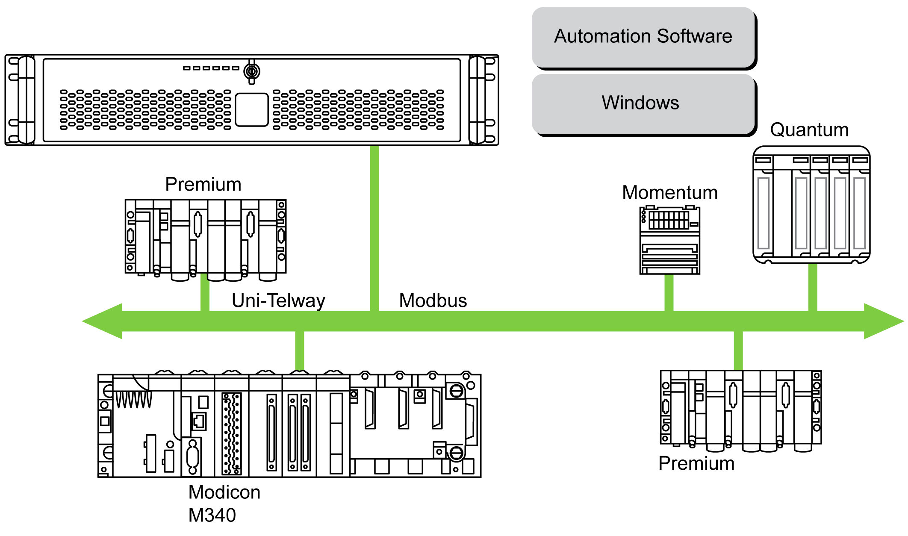
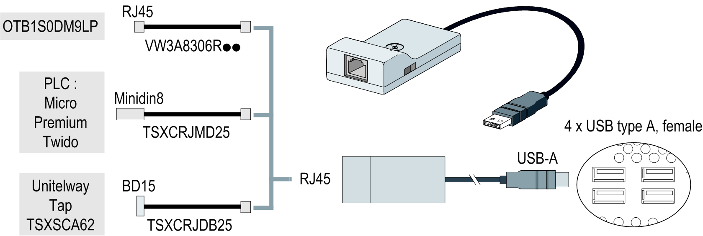
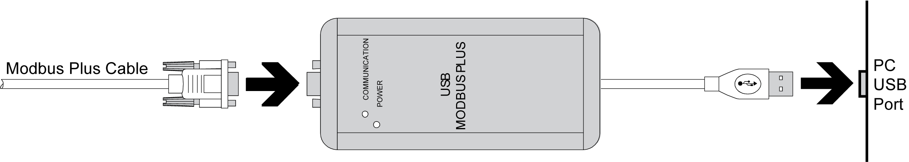

# Connections to PLCs

Connections to PLCs

Connection to PLCs

Introduction

Two different kinds of architecture are possible when connecting the Rack iPC to PLCs:

oTransparent Ready architecture

oTraditional architecture

Transparent Ready Architecture

With its built-in Ethernet 10/100 Mbit/s ports, you can integrate the Rack iPC into full Ethernet architectures, such as Transparent Ready. Transparent Ready devices in this type of architecture enable transparent communication over the Ethernet TCP/IP network. Communication services and Web services permit the sharing and distribution of data between levels 1, 2 and 3 of the Transparent Ready architecture.

Used as a client station, the Rack iPC makes it easier to implement Web client solutions for:

oBasic servers embedded in field devices (Advantys STB/Momentum distributed I/O, ATV 71/38/58 starters, OsiSense identification systems, and so on).

oFactoryCast Web servers embedded in Modicon PLCs (TSX Micro, Premium, and Quantum) or the FactoryCast gateway. The following services are available as standard (without the need for additional programming): alarm management, comprehensive view management, and Web home pages created by users.

oFactoryCast HMI Web servers embedded in Modicon Premium and Quantum PLCs which also provide basic data management services, automatic e-mail sending triggered by specific process events and arithmetic and logic calculations for data preprocessing.

Traditional Architecture

The Rack iPC terminal with Vijeo Designer automation software can be used in fieldbus architectures such as Uni-Telway/Modbus or Fipway/Modbus Plus.

The Rack iPC terminal can connect to Uni-Telway, Modbus, and Fipway networks, but different connection devices are required depending on the network and on the communication port used. These devices are specified below:

oFor USB slot:

oModbus and Uni-Telway with the TSXCUSB485 converter enables the Rack iPC to connect to remote devices using an RS-485 interface.

The Rack iPC, compatible with Modbus and Uni-Telway, requires the standard Schneider-Electric drivers provided with software such as Unity Pro, PL7-Pro, or a driver on the CD called TLXCDDRV20M. An example is provided in the drawing below:

NOTE: The Vijeo Designer Runtime is not compatible with this device. Vijeo Designer Runtime communicates using an RS-232 interface.

oModbus Plus network with the TSXCUSBMBP converter. This converter is compatible with PCs equipped with CONCEPT, ProWORX, or Unity Pro. An example is provided in the drawing below:

(1) Requires the X-Way drivers CD-ROM, TLXCDDRV20M.

Cables and Converters

For different types of PLCs, the following cables and converters are required:

oTSXPCX1031 connection cable for Nano, Micro and Premium.

This cable is supplied with Unity Pro, PL7-Pro and PL7 Junior software.

oFT20CBCL30 connection cable for the Series 7 family (including TSX 27 PLCs, and TSX/PMX 47/67/87/107 PLCs).

This cable is supplied with the XTEL pack software.

oTSX17ACCPC converter for TSX 17 PLCs.

oTSXCUSB232 converter for connecting the Rack iPC, via an USB port, to remote devices using a RS-232C interface.

NOTE: This device, compatible with Modbus and Uni-Telway, requires the standard Schneider-Electric drivers provided with software such as Unity Pro, PL7-Pro, or a driver on the CD called TLXCDDRV20M.

An example using the TSXUSB232 converter is provided in the drawing below:

EIO0000001745.01

© 2019 Schneider Electric. All rights reserved.