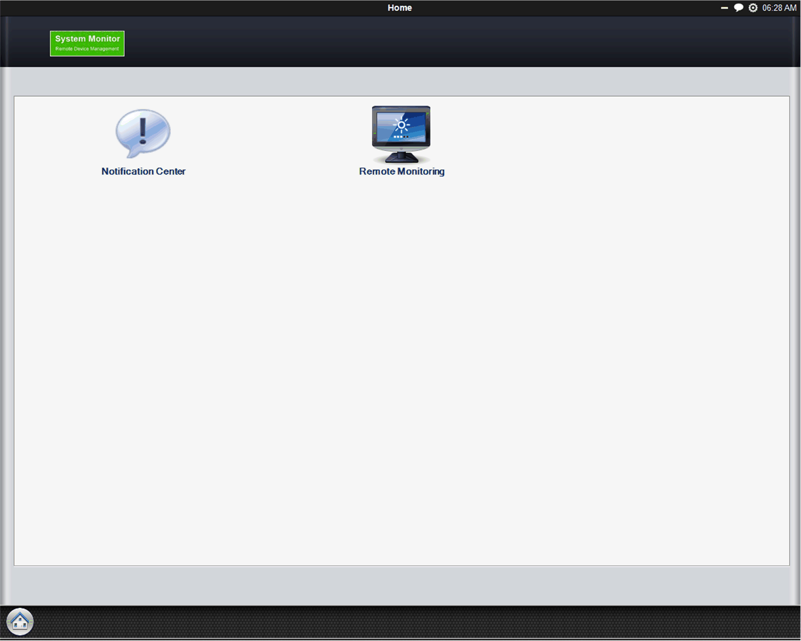
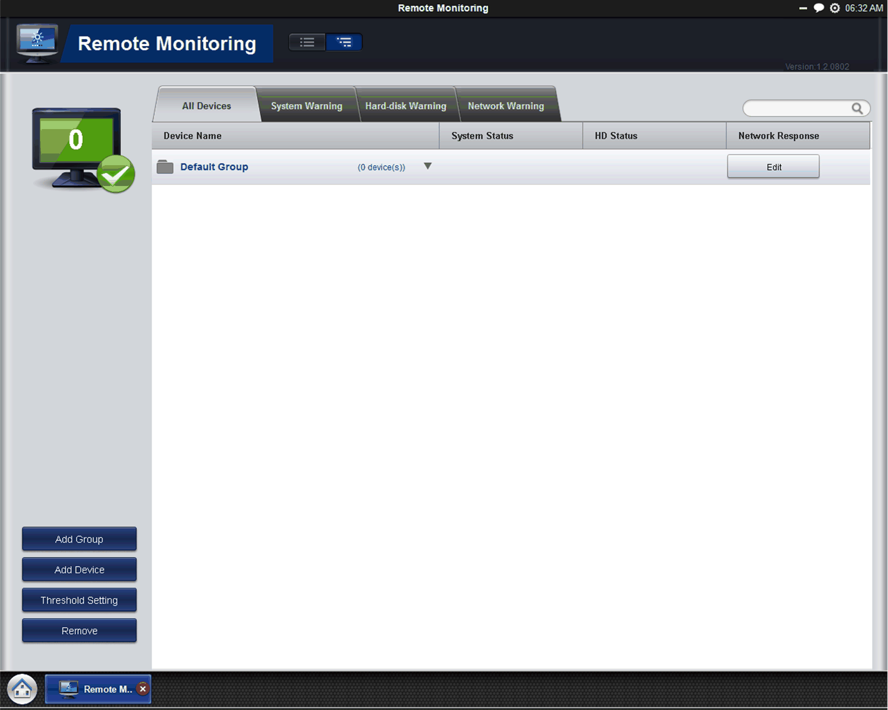

# System Monitor Interface

System Monitor Interface

Overview

The System Monitor interface provides a remote device monitoring, desktop connection, features that help you to access multiple clients through a single console for remote device management. The System Monitor immediately recognizes sudden equipment, provides real-time equipment maintenance, and an active update feature improves system stability and reliability.

The Remote Monitoring monitors system status of remote devices, including hard disk temperature, hard drive health, network connection, system / CPU temperatures, system / CPU fan speeds and system voltages. Support for email alarms and function logs so that managers can regularly keep track of their remote devices.

Depending on the configuration, if thresholds are exceeded, the System Monitor opens a popup message, sound a buzzer, and makes an entry in the Windows event log. You can configure a system shutdown when an alarm occurs.

System Monitor Requirements

Operating system requirements:

| Operating system |
| --- |
| Windows XP |
| Windows 7 |

Software requirements:

| Description | Software |
| --- | --- |
| Framework | Microsoft.NET Framework version 2.0 or higher |
| Driver | Software APP 2.0 API |

System Monitor Console

System Monitor console acts as a server for the clients. Devices that run on System Monitor console displays the health and status information from the System Monitor clients. The console has to be made available by client over a network.

To launch the System Monitor console, click Windows Start Menu > All Programs > Schneider-Electric > System Monitor

Click Remote Monitoring applications:

System Monitor Agent

This procedure describes the System Monitor Stand Alone Agent general user interface:

| Stage | Description |
| --- | --- |
| 1 | The System Monitor stands alone agent automatically starts when the system starts. If you have to enter a new server IP address, you need to open the System Monitor Agent, click the icon in the toolbar:  G-SE-0033177.1.gif-high.gif |
| 2 | You have to enter your Password Authentications:  G-SE-0033176.1.gif-high.gif |
| 3 | You have to enter your server IP address. Your server is the device which has System Monitor console running. Name the device gives the possibility to recognize it in multiple client configurations:  G-SE-0028462.1.gif-high.gif |
| 4 | Click Save & Connect connect the agent to the System Monitor console server:  G-SE-0028463.1.gif-high.gif |
| 5 | If you want to see the Hardware Monitor, you need to open the System Monitor Agent, click the icon in the toolbar:  G-SE-0033214.1.gif-high.gif |

EIO0000001745.01

© 2019 Schneider Electric. All rights reserved.