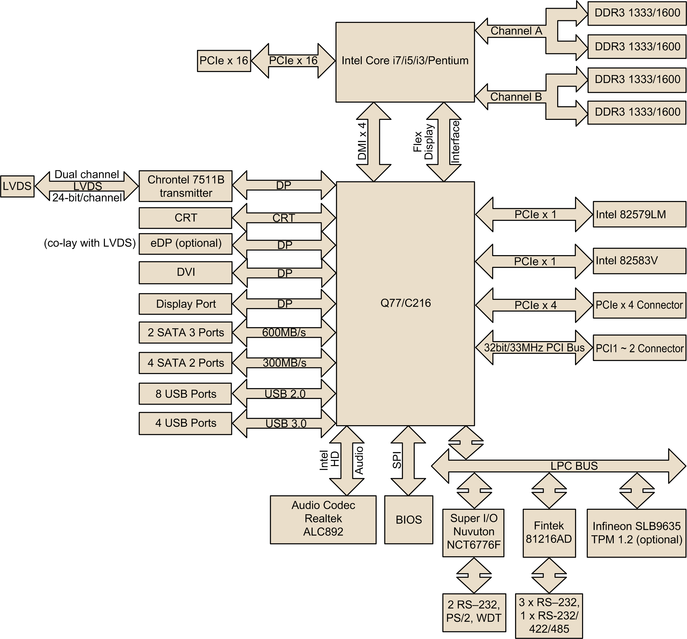

# Description of the Rack iPC Universal and Optimized Motherboard

Description of the Rack iPC Universal and Optimized Motherboard

Rack iPC Universal and Optimized Board Introduction

The Rack iPC Universal and Optimized motherboards are designed with the Intel® Q77/C216 chipsets used for industrial applications that require both performance computing and enhanced power management capabilities.

Board Features

The Intel® Q77/C216 based board provides:

oRich I/O connectivity: Dual GbE LAN via PCIe x1 bus, 2 PCI 32- bit/33 MHz PCI slots, 1 PCIe x16 slot (Gen 3), 1 PCIe x4 slot (Gen 2), 8 USB 2.0 ports and 4 USB 3.0 ports.

oStandard micro ATX form factor with industrial features: The Rack iPC Universal and Optimized use a full featured micro ATX motherboard with balanced expandability and performance.

oWide selection of storage devices: SATA HDD, customers benefit from the flexibility of using the most suitable storage device for larger capacity

oOptimized integrated graphic solution: The Intel® flexible display interface supports versatile display options and a 32-bit 3D graphics engine.

Rack iPC Universal System

The Universal system has:

oCPU processor: Intel® Core i3 2120 3.3 GHz

oBIOS: AMI EFI 64 Mbit/s SPI BIOS

oSystem chipset: Intel® Q77/C216

oSATA hard disk drive interface: Four on-board SATA connectors with data transmission rate up to 300 Mbit, and 2 on-board SATA connectors with data transmission rate up to 600 Mbit

Rack iPC Optimized System

The Optimized system has:

oCPU processor: Intel® Pentium G850 2.9 GHz/Celeron G540 2.5 GHz

oBIOS: AMI EFI 64 Mbit/s SPI BIOS

oSystem chipset: Intel® Q77/C216

oSATA hard disk drive interface: Four on-board SATA connectors with data transmission rate up to 300 Mbit, and 2 on-board SATA connectors with data transmission rate up to 600 Mbit

Memory

RAM: Up to 32 GB in 4 slots 240-pin DIMM sockets. Supports dual-channel DDR3 1333/1600 MHz SDRAM.

The Rack iPC supports either ECC buffered DIMMs or non-ECC unbuffered DIMMs. The Rack iPC does not support both ECC and non-ECC DIMMs in the same configuration.

Input/Output

oPCIe slot: 1 PCIe x16 expansion slot, 1 PCIe x4 expansion slot

oPCI bus: 2 PCI slots, 32-bit/33 MHz PCI 2.2 compliant

oEnhanced parallel port: Configured to LPT1 or disabled. Standard DB-25 female connector cable is an optional accessory. LPT1 supports EPP/SPP/ECP.

oSerial ports on rear panel: RS-232/422/485 with hardware auto-flow control, 4 RS-232, and 1 RS-232 sub-DB9 connectors.

oKeyboard and PS/2 mouse connector: 2 x 6-pin mini-DIN connectors located on the mounting bracket for easy connection to a PS/2 keyboard and mouse.

oUSB port: Supports up to 8 USB 2.0 ports with transmission rates up to 480 Mbps/s and 4 USB 3.0 ports with transmission rates up to 5 Gbps.

oGPIO: Rack iPC Universal and Optimized support 8-bit GPIO from super I/O for general-purpose control applications.

Graphics

oController: Intel® HD graphics

oDisplay memory: 1 GB maximum shared memory when 2 GB or more of system memory is installed

oDVI: Supports DVI up to 1920 x 1200 resolution at 60 Hz refresh rate

oVGA: Supports VGA up to 2048 x 1536 resolution at 75 Hz refresh rate

oLVDS: Supports LVDS up to resolution 1920 x 1200

oDisplay port: Supports a maximum resolution of 2560 x 1600 at 60 Hz

oeDP: Supports a maximum resolution of 1920 x 1200 at 60 Hz

oTriple display: VGA+eDP (or LVDS)+DP, VGA+eDP(or LVDS)+DVI, VGA+DP+DVI

oDual display: VGA+eDP (or LVDS), VGA+DVI, eDP(or LVDS)+DVI, VGA+DP, DP+ DVI, LVDS+DP

Ethernet LAN

oSupports dual 10/100/1000 Mbps/s Ethernet ports via PCI express x 1 bus which provides 500 MB/s data transmission rate.

oController: LAN1: Intel® 82579LM; LAN2: Intel® 82583 V

Industrial Features

oWatchdog timer: Used to generate a system reset. The watchdog timer is programmable, with each unit equal to 1 second or 1 minute (255 levels)

Board Features and Board Layout

The figure shows Universal and Optimized board layout, jumper, and connector locations:

The table lists the Rack iPC Universal and Optimized jumpers and their function:

| Label | Function |
| --- | --- |
| JFP1 | Power switch/HDD LED/SMBus/speaker |
| JFP2 | Power LED and keyboard lock |
| CMOS1 | CMOS clear (default 1-2) |
| PSON1 | AT(1-2) / ATX(2-3) (default 2-3) |
| JWDT1+JOBS1 | Watchdog reset and OBS alarm |
| JCASE1 | Case open pin header |
| JLVDS1 | Voltage 3.3 V/5 V/12 V selector for LVDS1 connector (default 1-2, 3.3 V) |
| JLVDS\_CLT1 | Brightness control selector for analog or digital (default 1-2, analog) |
| JEME1 | Intel AMT disable jumper |
| JMECLR1 | Clear AMT setting |
| JUSBPWR1 | USB port 0-1 power source switch between +5 Vsb and +5 V |
| JUSBPWR2 | USB port 2-3 power source switch between +5 Vsb and +5 V |
| JUSBPWR3 | USB port 4/5/8/9 power source switch between +5 Vsb and +5 V |
| JUSBPWR4 | USB port 10/11/12/13 power source switch between +5 Vsb and +5 V |

The table lists the Rack iPC Universal and Optimized connectors and their function:

| Label | Function |
| --- | --- |
| LPT1 | Parallel port, supports SPP/EPP/ECP mode |
| LVDS1 | LVDS1 connector |
| INV1 | LVDS1 inverter connector |
| COM3456 | Serial port connectors (RS-232) |
| USB45 | USB port 4, 5 (on board) |
| USB89 | USB port 8, 9 (on board) |
| USB1011 | USB port 10, 11 (on board) |
| USB1213 | USB port 12, 13 (on board) |
| VGA | VGA connector |
| COM1 | Serial port connector (RS-232) |
| KBMS1 | PS/2 keyboard and mouse connector |
| CPUFAN1 | CPU FAN connector(4-pin) |
| SYSFAN1 | System FAN1 connector(3-pin) |
| SYSFAN2 | System FAN2 connector(3-pin) |
| SYSFAN3 | System FAN3 connector(3-pin) |
| SYSFAN4 | System FAN4 connector(3-pin) |
| LAN1\_USB01 | LAN1 / USB port 0, 1 |
| LAN2\_USB23 | LAN2 / USB port 2, 3 |
| AUDIO1 | Audio connector |
| SPDIF\_OUT1 | SPDIF audio out pin header |
| FPAUD1 | HD audio front panel pin header |
| PCIEX16\_1 | PCIe x16 slot |
| SATA1 | Serial ATA data connector 1 |
| SATA2 | Serial ATA data connector 2 |
| SATA3 | Serial ATA data connector 3 |
| SATA4 | Serial ATA data connector 4 |
| SATA5 | Serial ATA data connector 5 |
| SATA6 | Serial ATA data connector 6 |
| DIMMA1 | Channel a DIMM1 |
| SPI\_CN1 | SPI flash update connector. |
| GPIO1 | GPIO header |
| ATX12V1 | ATX 12 V auxiliary power connector (for CPU) |
| ATXPWR1 | ATX 20-pin main power connector (for system) |
| DVI | DVI-D connector on rear panel |
| COM2 | Serial port COM2, pin header 2x5 |
| EDP1 | eDP connector (2x10 pin header) |
| JTAG | Joint test action group connector 2x5 P |
| SMBUS1 | SMBUS expansion pin header 1x4 P |

Block Diagram

The figure shows the block diagram of the Universal and Optimized motherboards:

EIO0000001745.01

© 2019 Schneider Electric. All rights reserved.