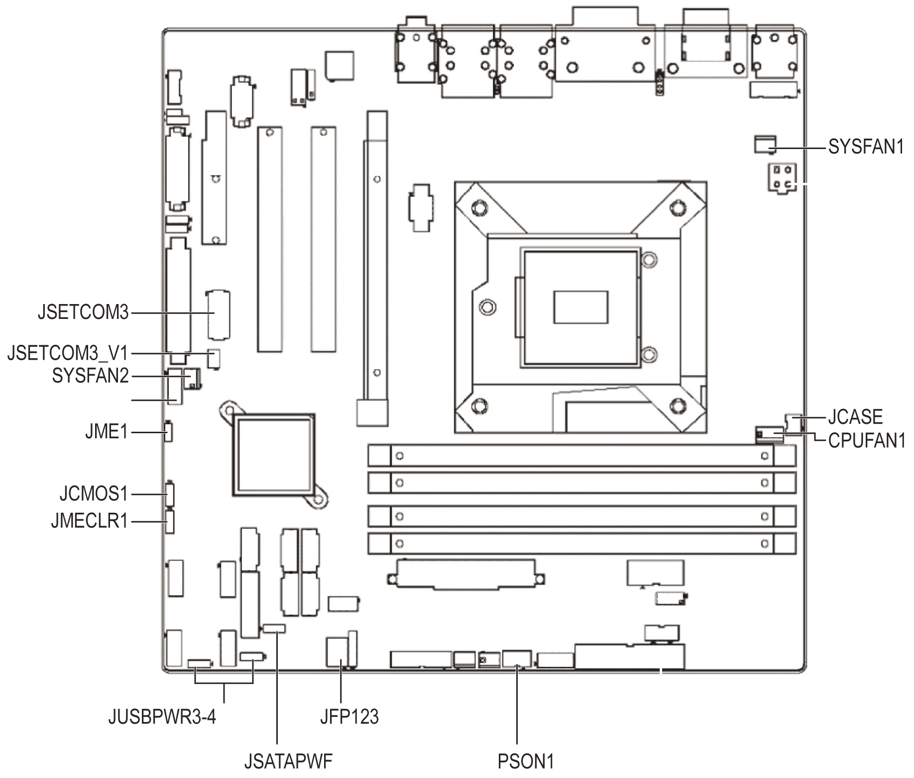

# Mounting Jumpers of the Rack iPC Universal and Optimized

Mounting Jumpers of the Rack iPC Universal and Optimized

Overview

You may configure the Rack iPC Universal and Optimized to match the needs of your application by setting jumpers.

NOTE: A pair of needle-nose pliers may be helpful when working with jumpers.

Jumpers and Connectors

Connectors on the Rack iPC motherboard link it to devices such as hard disk drives and a keyboard. In addition, the board has a number of jumpers used to configure your system for your application. The tables below list the function of each of the board jumpers and connectors. Later sections in this chapter give instructions on setting jumpers.

The figure shows the Rack iPC Universal and Optimized jumpers and connectors:

The table lists the Rack iPC Universal and Optimized jumpers and their function:

| Label | Function |
| --- | --- |
| JFP1 | Power switch/HDD LED/SMBus/speaker |
| JFP2 | Power LED and keyboard lock |
| CMOS1 | CMOS clear (default setting 1-2) |
| PSON1 | AT(1-2) / ATX(2-3) (default setting 2-3) |
| JWDT1+JOBS1 | Watchdog reset and OBS alarm |
| JCASE1 | Case open pin header |
| JLVDS1 | Voltage 3.3 V/5 V/12 V selector for LVDS1 connector (default setting 1-2, 3.3 V) |
| JLVDS\_CLT1 | Brightness control selector for analog or digital (default setting 1-2, analog) |
| JEME1 | Intel AMT disable jumper |
| JMECLR1 | Clear AMT setting |
| JUSBPWR1 | USB port 0-1 power source switch between +5 Vsb and +5 V |
| JUSBPWR2 | USB port 2-3 power source switch between +5 Vsb and +5 V |
| JUSBPWR3 | USB port 4/5/8/9 power source switch between +5 Vsb and +5 V |
| JUSBPWR4 | USB port 10/11/12/13 power source switch between +5 Vsb and +5 V |

CMOS Clear

The Rack iPC motherboard contains a jumper that can erase CMOS data and reset the system BIOS information. Normally this jumper should be set with pins 1-2 closed. If you want to reset the CMOS data, set CMOS1 to 2-3 closed for just a few seconds, and then move the jumper back to 1-2 closed. This procedure resets the CMOS to its default setting.

The table shows the CMOS clear data:

| Function | Jumper setting |
| --- | --- |
| Keep CMOS data (default setting) | G-SE-0029173.1.gif-high.gif |
| Clear CMOS data | G-SE-0029174.1.gif-high.gif |

JLVDS1-2: LCD Power 3.3 V/ 5 V/ 12 V Selector

The table shows the LCD power selector:

| Closed pins | Result |
| --- | --- |
| JLVDS2, 1-2 | Jumper for +3.3 V |
| JLVDS2, 2-3 | Jumper for +5 V |
| JLVDS1, 2  JLVDS2, 2 | Jumper for +12 V |

JUSBPWR1-4 (USB Power Selection Connector)

The figure shows the USB power selection connector:

Default setting: Pin 2-3 (+5 V)

The table describes the USB power selection connector:

| Pin | Pin name |
| --- | --- |
| 1 | +V5\_DUAL |
| 2 | +V5\_USB |
| 3 | +V5 |

Serial Ports COM3

The figure shows the COM3 selection connector:

PSON1: ATX, AT Mode Selector

The table describes the ATX,AT mode selector:

| Closed pin | Result |
| --- | --- |
| 1–2 | AT mode |
| 2–3 (default setting) | ATX mode |

Watchdog Timer Output and OBS Alarm Option

The table describes the timer output and alarm option:

| Pin | Pin name |
| --- | --- |
| 1 | +5 V |
| 2 | NC |
| 3 | NC |
| 4 | SIO\_WG |
| 5 | SIO\_IRRX |
| 6 | SRST# |
| 7 | GND |
| 8 | ERR\_BEEP |
| 9 | SIO\_IRTX |
| 10 | OBS\_BEEP |

BIOS Update ME Mode Selector

JME1 jumper enables users to select BIOS update freely without lock protection when using ADVSPI or with lock protection.

| Function | Jumper setting | BIOS protect | Master region access control | Update tool | ME version | ME function after update | Setting | JME1 PWR working status |
| --- | --- | --- | --- | --- | --- | --- | --- | --- |
| Production\* | (1-2) pin closed | None | FF | ADVSPI | updated | Link/remote control | default | AC on/stdby |
| – | Lock Read:0B Write:0A | ADVSPI | Not updated | Link/remote control | OEM request | AC on/stdby | – |
| Manufacture mode | (2-3) pin closed | None | FF | ADVSPI | Updated | None | None | None |

\* In the default production mode, there is no lock protection for BIOS. The master region access control setting is FF, users can update the complete BIOS with the ADVSPI tool. The function is same as manufacture mode. BIOS ME (Management engine) function keeps link/remote control. The jumper can be set under AC off PWR status; it cannot be set under standby PWR status.

In production mode with lock protection for BIOS, the master region access control setting is Read:0B, Write:0A. Users cannot update BIOS ME firmware freely. BIOS ME (Management engine) function keeps link/remote control. This setting is only for OEM project requests. The jumper can be set under AC off PWR status, it cannot set under standby PWR status.

In manufacture mode, BIOS has no lock protection function. The master region access control setting is FF, users can update complete BIOS with ADVSPI tool. However, the BIOS ME function does not keep the link/remote control after the BIOS been updated.

Case Open Sensor

The Rack iPC motherboard contains a jumper that provides a chassis open sensor. The buzzer on the motherboard beeps when the case is opened.

PCI Bus Routing Table

| AD  PCI slot INT | PCI1 | PCI2 |
| --- | --- | --- |
| AD16 | AD21 |
| A | A | F |
| B | B | G |
| C | C | H |
| D | D | E |

Mounting Jumper Clips

| Step | Action |
| --- | --- |
| 1 | Remove the power. |
| 2 | Insert the jumper. |

Jumper Setting

The table describes the setting for the low voltage differential signaling (LVDS) power setting:

| CN17 | LVDS power |
| --- | --- |
| Setting | Function |
| 1-3  2-4 | VDD\_DSUB (pin 7 and pin 20) of LVDS pin is 5 Vdc |
| 3-5  4-6 | VDD\_DSUB (pin 7 and pin 20) of LVDS pin is 3.3 Vdc |

The table describes the setting for the clear CMOS setting:

| CN3 | Clear CMOS |
| --- | --- |
| Setting | Function |
| – | Normal (default setting) |
| 1-2 | Clear CMOS |

EIO0000001745.01

© 2019 Schneider Electric. All rights reserved.