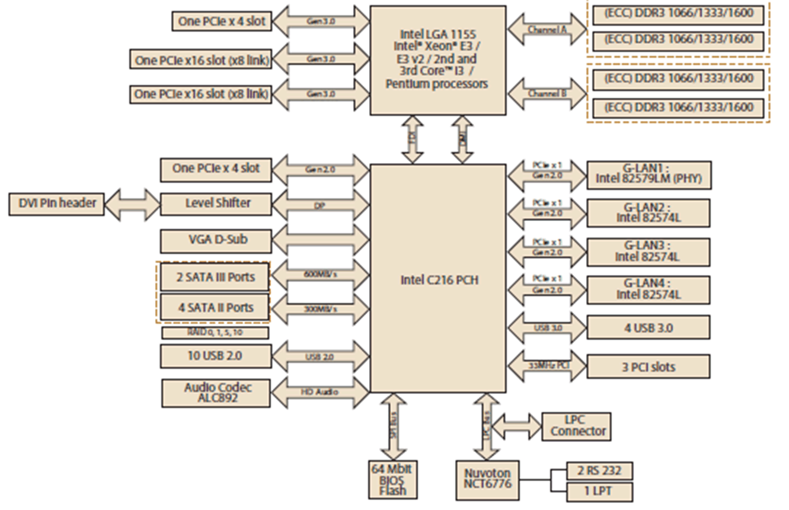

# Description of the Rack iPC Performance Motherboard

Description of the Rack iPC Performance Motherboard

Introduction

The Rack iPC Performance motherboard is the advanced Intel® C216 board used for industrial server grade applications that require high-performance computing. The motherboard has an Intel® 4-Core Xeon® E3 processor. High reliability and outstanding performance make the Rack iPC an ideal platform for industrial networking applications.

Board Features

The following is a description of the Rack iPC Performance motherboard features:

oPCIe architecture: The Intel® C216 PCH chipset supports 2 PCIe x16 slots (Gen III x8 link), 2 PCIe x4 slot.

oHigh performance I/O capability: 4 GB LAN via PCIe bus, 3 PCI 32-bit/ 33 MHz PCI slots, 4 USB 3.0,10 USB 2.0 ports. (2 Type A USB 2.0), 2 SATA III and 4 SATA II connectors.

oStandard ATX form factor with industrial features: long product life, reliable operation under wide temperature range, watchdog timer functions, etc.

oAutomatic power-on after power outage: These industrial motherboards allow users to set the system to power on automatically after a power outage. Refer to the detailed "AT" mode settings.

oActive management technology 8.0: The hardware and firmware base solution is powered by the system auxiliary power plane to remotely monitor.

oNetwork systems: Intel AMT(iAMT) stores hardware and software information in nonvolatile memory. Built-in management provides out-of-band management capabilities, allowing remote discovery and KVM to repair systems after OS failure detections or when a system has crashed. Alert and event logging features detect issues and quickly reduce downtime, pro-actively blocking incoming threats, containing infected clients before they impact the network, and operatively notifying the user when critical software agents are removed. For iAMT enable, refer AMT configuration. Schneider Electric provides a software tool called System Monitor used to enable the iAMT function. Refer to [System Monitor](../iPC_-_System_Monitor/iPC_-_System_Monitor-2.htm#XREF_D_SE_0033062_30).

System

oSATA hard disk drive interface: Six on-board SATA connectors:

Two SATA III connectors with data transmission rates up to 600 MB/s and

Four SATA II connectors with data transmission rates up to 300 MB/s

With support the Schneider Electric host controller interface (AHCI) technology.

oSystem chipset: Intel® C216

Memory

RAM: Up to 32 GB in four 240-pin DIMM sockets that support dual-channel DDR3 ECC or Non-ECC 1066/1333/1600 SDRAM.

Input/Output

The Intel® C216 chipset provides:

oPCIe slot: 2 PCIe x16 expansion slots (x8 link) and 2 PCIe x4 expansion slots

oPCI bus: 3 PCI slots, 32-bit, 33 MHz PCI 2.2 compliant

oEnhanced parallel port: Configured to LPT1 or disabled. Standard DB-25 female connector cable is an optional accessory. LPT1 supports EPP/SPP/ECP.

oSerial port: Two serial ports. (COM1 is rear I/O, COM2 is on board connector)

oPS/2 keyboard and mouse connector: 2 x 6-pin mini-DIN connectors are located on the mounting bracket for easy connection to PS/2 keyboard and mouse.

oUSB port: Supports up to 4 USB 3.0 ports with transmission rates up to 5 Gbps and 10 USB 2.0 ports with transmission rates up to 480 Mbps/s.

oLPC: 1 LPC connector to support Schneider Electric LPC modules, such as TPM module.

oGPIO: Rack iPC Performance supports 8-bit GPIO from super I/O for general-purpose control applications.

Graphics

oIntegrated Intel HD graphics processor

oDisplay memory: 1 GB maximum shared memory when 2 GB or more of system memory is installed

oDVI-D: Resolution of 1920 x 1200 @ 60 Hz refresh rate (Only for QG2 version)

oCRT: Resolution of 2048 x 1536 @ 75 Hz refresh rate

Ethernet LAN

oSupports dual/four 10/100/1000 Mbps/s Ethernet ports via PCIe bus which provides a 300 MB/s data transmission rate.

oInterface: 10/100/1000 Mbps/s

oController: LAN1: Intel 82579LM; LAN2/3/4: Intel 82574 L (LAN 3/4 are for G4 SKU only).

Industrial Features

oWatchdog timer: Use to generate system reset or NC. The watchdog timer is programmable, with each unit equal to 1 second or 1 minute (255 levels).

Board Layout

The figure shows the board layout and jumper locations:

The table describes the Rack iPC Performance jumpers and their function:

| Label | Function |
| --- | --- |
| JCMOS1 | CMOS clear |
| JME1 | Intel ME disable jumper for ME/BIOS update |
| JWDT1 | Watch dog reset |
| JGREEN1 | Deep sleep Sx mode |
| JUSB\_1,JUSB\_2 | USB port and KBMS power source switch between +5 VSB and +5 V |
| CPUFAN\_SEL1, SYSFAN\_SEL1 | FAN PWM(1-2)/DC mode selection(2-3) |
| PSON1 | AT(1-2) / ATX(2-3) |

The table describes the Rack iPC Performance connectors and their function:

| Label | Function |
| --- | --- |
| ATX24P\_P1 | ATX 24-pin main power connector (for system) |
| ATX8P\_P1 | Processor power connector (for CPU) |
| SATA0...1 | SATA III (6 Gb/s) |
| SATA2...5 | SATA II (3 Gb/s) |
| USB12 | USB 3.0 port 1 2 |
| USB34 | USB 3.0 port 3 4 (Header) |
| USB56 | USB 2.0 port 5 6 |
| USB78, USB910, USB1112 | USB 2.0 port 7,8,9,10,11,12 (Header) |
| USB13, USB14 | USB 2.0 port 13, 14 (USB type A) |
| PCIE2, PCIE7 | PCIE x4 slot |
| PCIE5, PCIE6 | PCIe x16 slot (x8 link) |
| DIMMA0,DIMMA1,DIMMB0,DIMMB1 | DDR3 slot |
| CPUFAN1 | CPU FAN connector |
| SYSFAN1,SYSFAN2,SYSFAN 3,SYSFAN4 | System FAN connector |
| LAN1\_USB12,LAN2\_USB56 | LAN1 / USB 3.0 port 1, 2 stack connector LAN2 / USB 2.0 port 5, 6 stack connector |
| LAN34 | LAN 3.4 stack connector |
| VGA\_COM1 | VGA+COM connector |
| KBMS1 | PS/2 keyboard and mouse connector |
| KBMS2 | External keyboard and mouse connector(6 pin) |
| SPI1 | SPI socket |
| SPI\_CN1 | SPI flash card pin header |
| LANLED1,LANLED2 | LAN LED extension connector |
| SMBUS1 | SM bus From PCH |
| SNMP1 | SM bus from HW monitor IC |
| GPIO1 | GPIO header |
| FPAUD1 | Audio front panel header |
| LPT1 | Parallel port |
| COM2 | Serial port: RS-232 |
| JFP1 | Front panel header |
| LPC1 | Low pin count connector for Schneider Electric TPM LPC modules |
| LANLED1 | LAN1/2 LED extension connector |
| LANLED2 | LAN3/4 LED extension connector |
| VOLT1 | Voltage display |
| PMBUS1 | PMBUS connector to communicate with power supply |

Block Diagram

The figure shows the block diagram of Performance motherboard:

EIO0000001745.01

© 2019 Schneider Electric. All rights reserved.