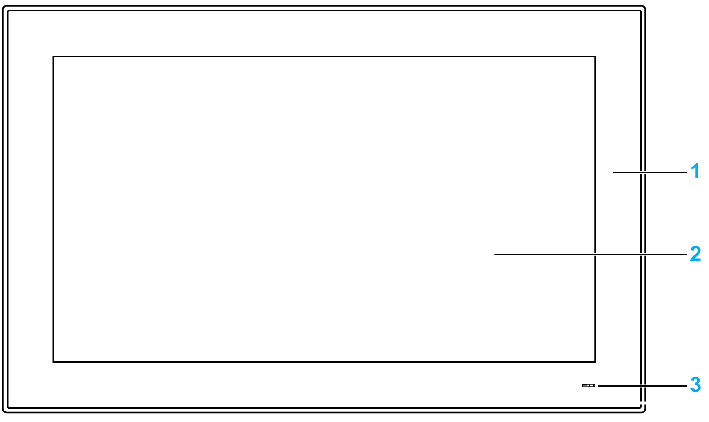

# S-Panel PC W19” Front View

S-Panel PC W19” Front View

1   Panel

2   Multi-touch panel

3   Status indicator

The table describes the meaning of the status indicator:

| Color | State | Meaning |
| --- | --- | --- |
| Orange | On | Stand by. |
| Green | On | S-Panel PC is on. |
| – | Off | S-Panel PC is off. |