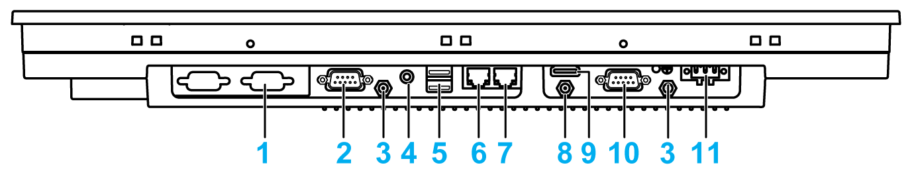

# S-Panel PC W19” Bottom View

S-Panel PC W19” Bottom View

1   1 x optional interface

2   COM2, port RS-232/422/485

3   SMA connector for the wireless LAN external antenna

4   Audio line out

5   USB1 (USB 3.0) and USB2 (USB 3.0)

6   Eth2 (10/100/1000 Mbit/s)

7   Eth1 (10/100/1000 Mbit/s)

8   SMA connector for the GPRS/4G external antenna (use an extension cable to connect the external antenna when HDMI cable is connected)

9   Monitor/Panel, HDMI

10   COM1, port RS-232

11   DC power connector