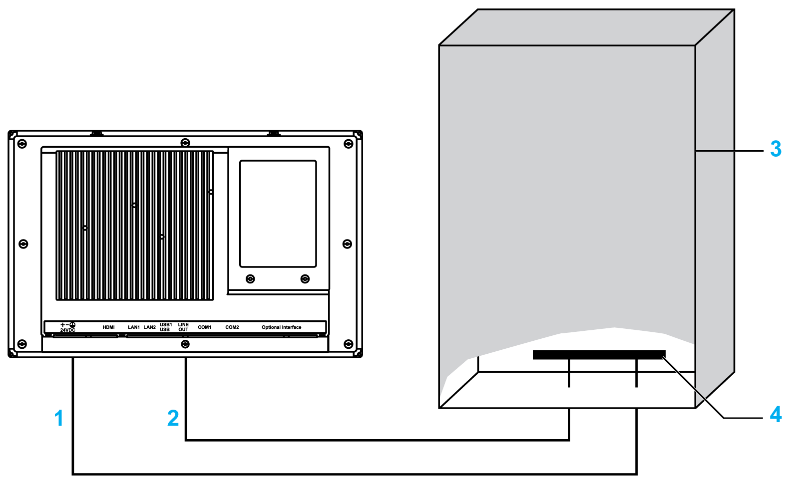
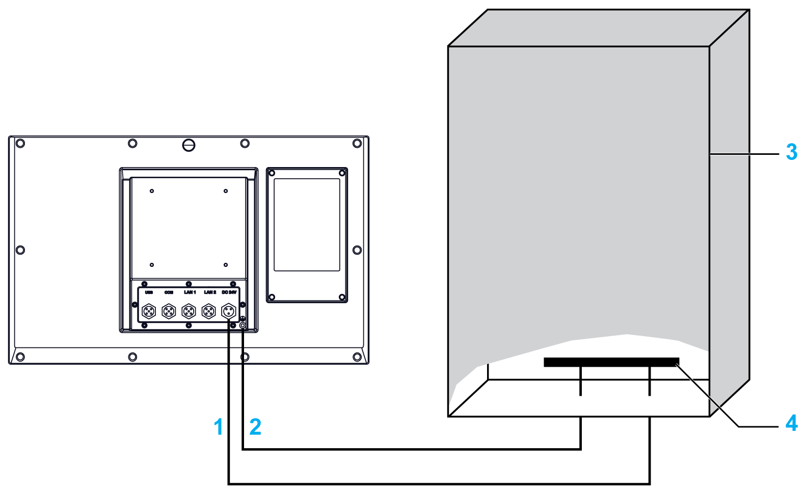
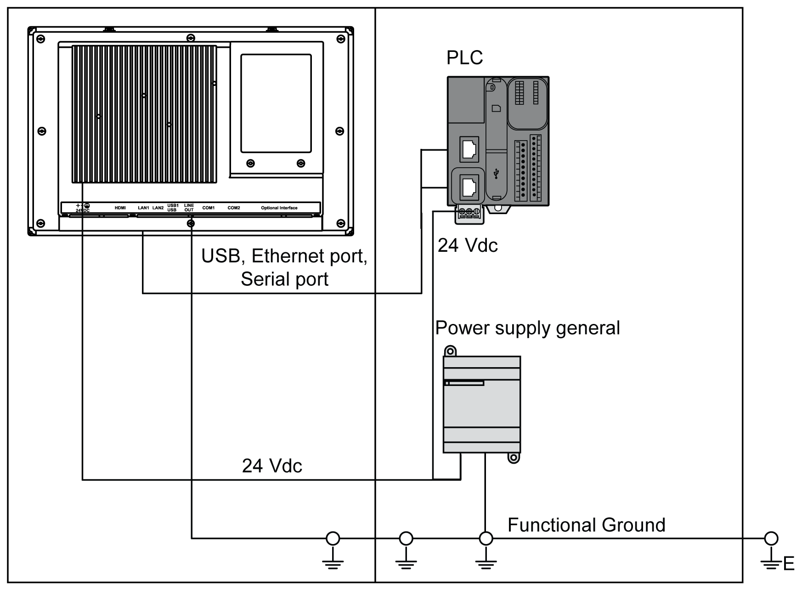
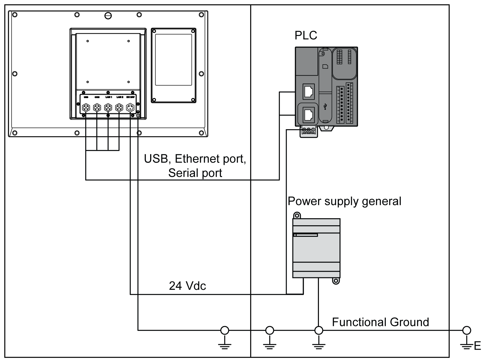

# Grounding Procedure

Grounding Procedure

|  |
| --- |
| Warning_Color.gifWARNING |
| UNINTENDED EQUIPMENT OPERATION |
| oUse only the authorized grounding configurations shown below.  oConfirm that the grounding resistance is 100 Ω or less.  oTest the quality of your ground connection before applying power to the device. Excess noise on the ground line can disrupt operations of the Magelis Industrial PC. |
| Failure to follow these instructions can result in death, serious injury, or equipment damage. |

The S-Panel PC ground has 2 connections:

oDC supply voltage

oGround connection pin

The figure shows the S-Panel PC:

1   Supply voltage

2   Ground connection pin (functional ground connection pin)

3   Switching cabinet

4   Grounding strip

The figure shows the Enclosed PC:

1   Supply voltage

2   Ground connection pin (functional ground connection pin)

3   Switching cabinet

4   Grounding strip

The figure shows the S-Panel PC:

NOTE: For AC use the [AC power supply module](Simple_Panel_PC_-_Connections-5.htm#XREF_D_SE_0049437_1).

The figure shows the Enclosed PC:

| Step | Action |
| --- | --- |
| 1 | Ensure all of the following is done for the system wiring:  oConnect the cabinet to ground.  oEnsure that all cabinets are grounded together.  oConnect the ground of the power supply to the cabinet.  oConnect the ground pin of the S-Panel PC to the cabinet.  oConnect the I/O to the controller if needed.  oConnect the power supply to the S-Panel PC. |
| 2 | Check that the grounding resistance is 100 Ω or less. |
| 3 | When connecting the SG line to another device, ensure that the design of the system/connection does not produce a ground loop.  NOTE: The SG and ground connection screw are connected internally in the S-Panel PC. |
| 4 | Use 2.5 mm2 (AWG 14) wire to make the ground connection. Create the connection point as close to the S-Panel PC as possible and make the wire as short as possible. |