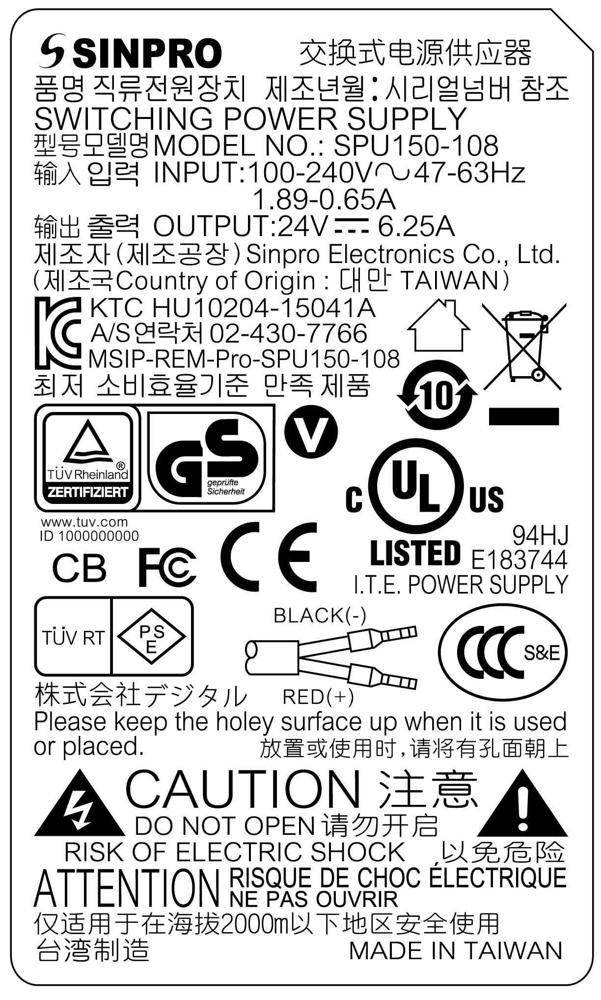

# Overview

Overview

|  |
| --- |
| DangerElectrical_Color.gifDanger_Color.gifDANGER |
| HAZARD OF ELECTRIC SHOCK, EXPLOSION OR ARC FLASH |
| oRemove all power from the device before removing any covers or elements of the system, and prior to installing or removing any accessories, hardware, or cables.  oUnplug the power cable from both the Magelis Industrial PC and the power supply.  oAlways use a properly rated voltage sensing device to confirm that power is off.  oReplace and secure all covers or elements of the system before applying power to the unit.  oUse only the specified voltage when operating the Magelis Industrial PC. The AC unit is designed to use 100...240 Vac input. |
| Failure to follow these instructions will result in death or serious injury. |

|  |
| --- |
| Warning_Color.gifWARNING |
| EQUIPMENT DISCONNECTION OR UNINTENDED EQUIPMENT OPERATION |
| oEnsure that power, communication, and accessory connections do not place excessive stress on the ports. Consider the vibration in the environment.  oSecurely attach power, communication, and external accessory cables to the panel or cabinet.  oUse only D-Sub 9-pin connector cables with a locking system in good condition.  oUse only commercially available USB cables. |
| Failure to follow these instructions can result in death, serious injury, or equipment damage. |

|  |
| --- |
| Warning_Color.gifWARNING |
| RISK OF BURNS |
| Do not touch the surface of the heat sink during operation. |
| Failure to follow these instructions can result in death, serious injury, or equipment damage. |

This figure shows the AC power supply module:

This figure shows the dimensions of the AC power supply module:

This figure shows the label of the AC power supply module:

