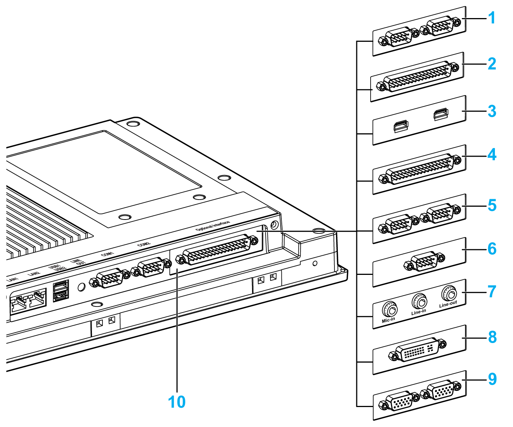

# Optional Interface

Optional Interface

Compatible table:

| Part number | Description | S-Panel PC | Enclosed PC |
| --- | --- | --- | --- |
| HMIYMINUSB1 | Interface USB 3.0, 2 x USB | Yes | Not applicable |
| HMIYMINAUD1 | Interface audio BKT, 1 x LI/LO/MIC | Not applicable | Not applicable |
| HMIYMINSL24851 | Interface 2 x RS-422/485 isolation | Yes | Not applicable |
| HMIYMINSL44851 | Interface 4 x RS-422/485 isolation, DB 37, cable | Yes | Not applicable |
| HMIYMINSL22321 | Interface 2 x RS-232 isolatation | Yes | Not applicable |
| HMIYMINSL42321 | Interface 4 x RS-232, DB37, cable | Yes | Not applicable |
| HMIYMINAUD21 | Interface audio 1 x LI/LO/MIC | Yes(1) | Not applicable |
| HMIYMINATPM201 | Interface TPM 2.0 | Not applicable | Not applicable |
| HMIYMINIO1 | Interface 16DI/8DO, 1 x DB37, 2 m cable | Yes | Not applicable |
| HMIYMINWIFI1 | Interface WiFi, AC3160, 2 x antenna | Yes | Not applicable |
| HMIYMINGPRS1 | Interface 3G, C109, 1 x antenna | Yes | Not applicable |
| HMIYMIN4GUS1 | Interface 4G US, 1 x antenna | Yes | Not applicable |
| HMIYMIN4GEU1 | Interface 4G EU/ASIA, 1 x antenna | Yes | Not applicable |
| HMIYADDPDVI11 | Interface DP to DVI adaptor, active mode | Not applicable | Not applicable |
| HMIYMINDVII1 | Interface 1 x DVI-I | Yes | Not applicable |
| HMIYMINVGADVID1 | Interface, 1 x DVI-D, 2 x VGA, two brackets | Yes(2) | Not applicable |
| HMIYMINDP1 | Interface display, HD BaseT TX | Not applicable | Not applicable |
| HMIYMINPRO1 | Interface Profibus w/NVRAM, 128 Mb + ML | Yes | Not applicable |
| HMIYMINCAN1 | Interface fieldbus, 2 x CANopen | Yes | Not applicable |
| (1) S-Panel PC has default audio line out. For Line in, Line out and Mic in, please use mini PCIe HMIYMINAUD21.  (2) Only support one Interface bracket; either with 2 x VGA or DVI-D bracket. | | | |

The figure shows the possible interfaces:

   

1   2 x RS-232/422/485 interface

2   4 x RS-232/422/485 interface

3   USB interface

4   DIO interface

5   CANopen interface

6   Profibus DP interface

7   Audio interface

8   DVI interface

9   VGA interface

10   Optional interface

The table shows the type and the interface part numbers:

| Designation | Part number | Interface | PCIe card | Pin header from system | Interface plate |
| --- | --- | --- | --- | --- | --- |
| [NVRAM card](Simple_panel_PC_-_Hardware_Modifications-15.htm#XREF_D_SE_0045327_1) | HMIYMINNVRAM1 | Card NVRAM (non-volatile random-access memory) | 1 | – | – |
| [RS-232/422/485 interface](Simple_panel_PC_-_Hardware_Modifications-9.htm#XREF_D_SE_0073866_1) | HMIYMINSL24851 | 2 x RS-422/485 isolated | 1 | – | 1 |
| HMIYMINSL44851 | 4 x RS-422/485 |
| HMIYMINSL22321 | 2 x RS-232 isolated |
| HMIYMINSL42321 | 4 x RS-232 |
| [DIO interface](Simple_panel_PC_-_Hardware_Modifications-8.htm#XREF_D_SE_0073865_1) | HMIYMINIO1 | 16 x DI / 8 x DO | 1 | – | 1 |
| [CANopen interface](Simple_panel_PC_-_Hardware_Modifications-11.htm#XREF_D_SE_0073867_1) | HMIYMINCAN1 | 2 x CanOpen/CanBus | 1 | – | 1 |
| [Profibus DP interface](Simple_panel_PC_-_Hardware_Modifications-12.htm#XREF_D_SE_0073868_1) | HMIYMINPRO1 | 1 x Profibus DP master NVRAM | 1 | – | 1 |
| [USB interface](Simple_panel_PC_-_Hardware_Modifications-14.htm#XREF_D_SE_0073871_1) | HMIYMINUSB1 | 2 x USB 3.0 (card with pin-header) | 1 | 1 | 1 |
| [Wireless LAN interface](Simple_panel_PC_-_Hardware_Modifications-13.htm#XREF_D_SE_0073869_1) | HMIYMINWIFI1 | 1 x Wireless LAN and 2 x antennas | 1 | – | 1 |
| [GPRS interface](Simple_panel_PC_-_Hardware_Modifications-16.htm#XREF_D_SE_0073872_1) | HMIYMINGPRS1 | 1 x GPRS (general packet radio service) card with mPCIe card | 1 |  | 1 |
| [Audio mini PCIe interface](Simple_panel_PC_-_Hardware_Modifications-10.htm#XREF_D_SE_0073873_1) | HMIYMINAUD21 | 1 x Audio | 1 | – | 1 |
| [DVI-I interface](Simple_panel_PC_-_Hardware_Modifications-17.htm#XREF_D_SE_0073407_1) | HMIYMINDVII1 | 1 x DVI-I | 1 | – | 1 |
| [VGA and DVI-D interface](Simple_panel_PC_-_Hardware_Modifications-17.htm#XREF_D_SE_0073407_1) | HMIYMINVGADVID1 | 1 x DVI-D | 1 | – | 1 |
| 2 x VGA | 1 | – | 1 |
| [4G for US interface](Simple_panel_PC_-_Hardware_Modifications-18.htm#XREF_D_SE_0073297_1) | HMIYMIN4GUS1 | 4G interface for US and antenna | 1 | – | 1 |
| [4G for EU/ASIA interface](Simple_panel_PC_-_Hardware_Modifications-18.htm#XREF_D_SE_0073297_1) | HMIYMIN4GEU1 | 4G interface for EU/Asia and antenna | 1 | – | 1 |