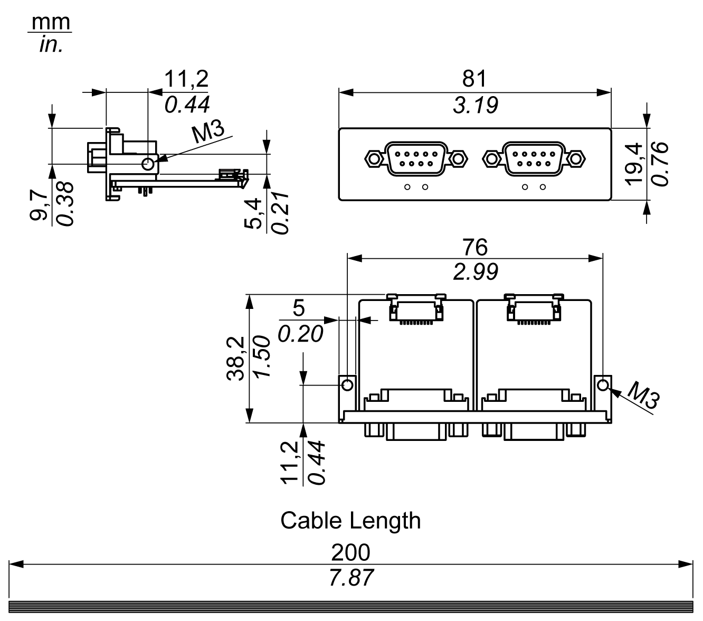
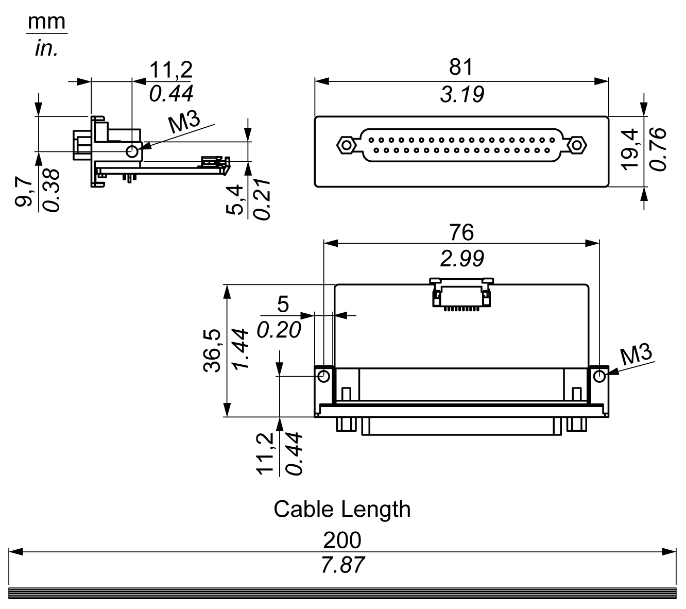

# Introduction

Introduction

The HMIYMINSL series are categorized as communication modules. They are all compatible with the mini PCIe card including isolated / non-isolated RS-232, RS-422/485 communication cards for automation control.

The figure shows the RS-232, RS-422/485 interfaces:

1   2 x RS-232, RS-422/485 interface

2   4 x RS-232, RS-422/485 interface

3   1 x interface cables

The following figure shows the dimensions of the 2 x RS-232, RS-422/485 interface:

The following figure shows the dimensions of the 4 x RS-232, RS-422/485 interface:

