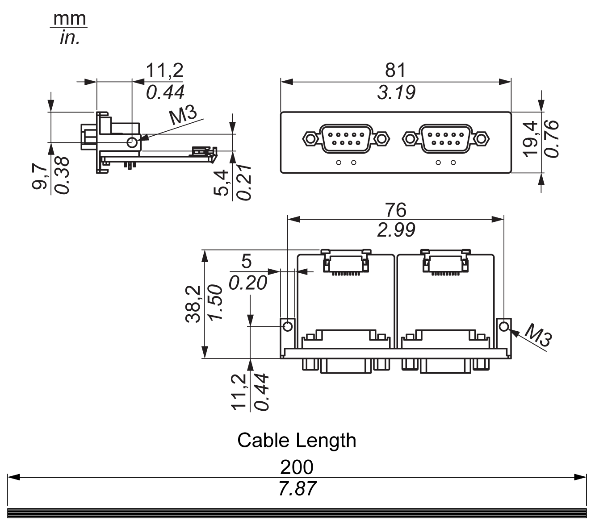

# Introduction

Introduction

The HMIYMINCAN1 is categorized as industrial communication with fieldbus protocol modules. It is compatible with the mini PCIe card.

The figure shows the CANopen interface:

The figure shows the dimensions of the CANopen interface:

