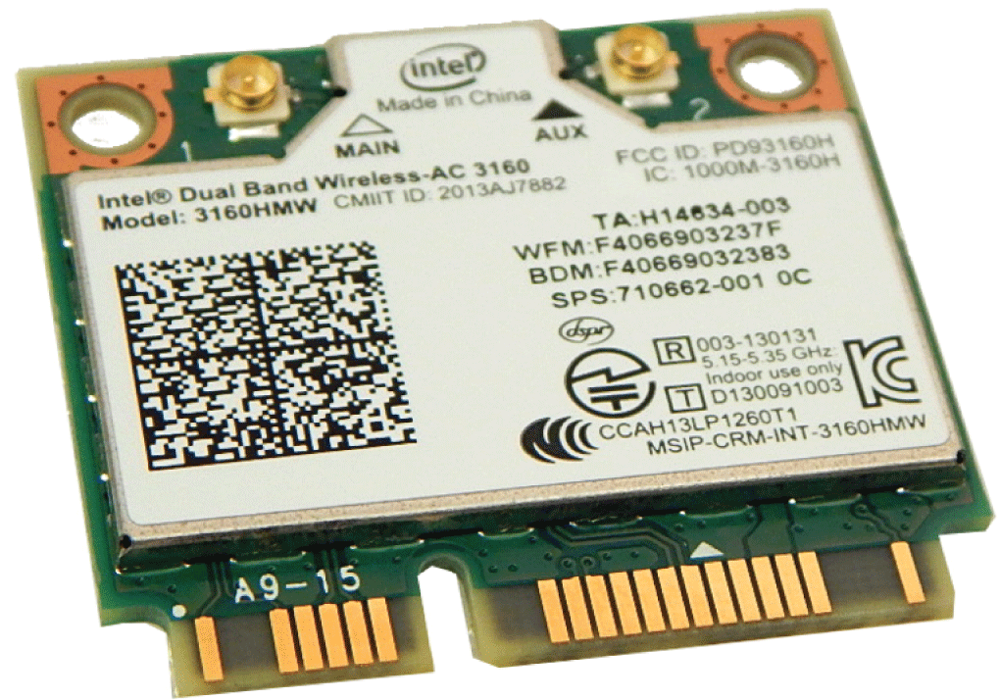
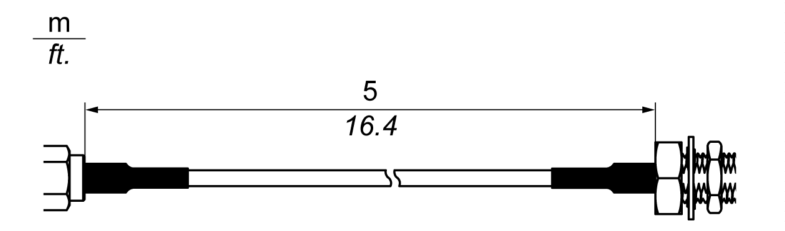

# Introduction

Introduction

The HMIYMINWIFI1 is categorized as a local area wireless for USB-equipped wireless embedded systems. It does not use the mini PCIe slot (Intel dual band wireless-AC 3160). Wireless LAN direct support to connect wireless LAN devices to each other with no need for a wireless access point.

The figure shows the wireless LAN interface card:

NOTE: The antennas are mounted directly on the product to the specific location. They can also be mounted remotely using intermediate cables.

The figure shows the dimensions of the remote wireless LAN antenna cable (HMIYCABWIFIAN51):

