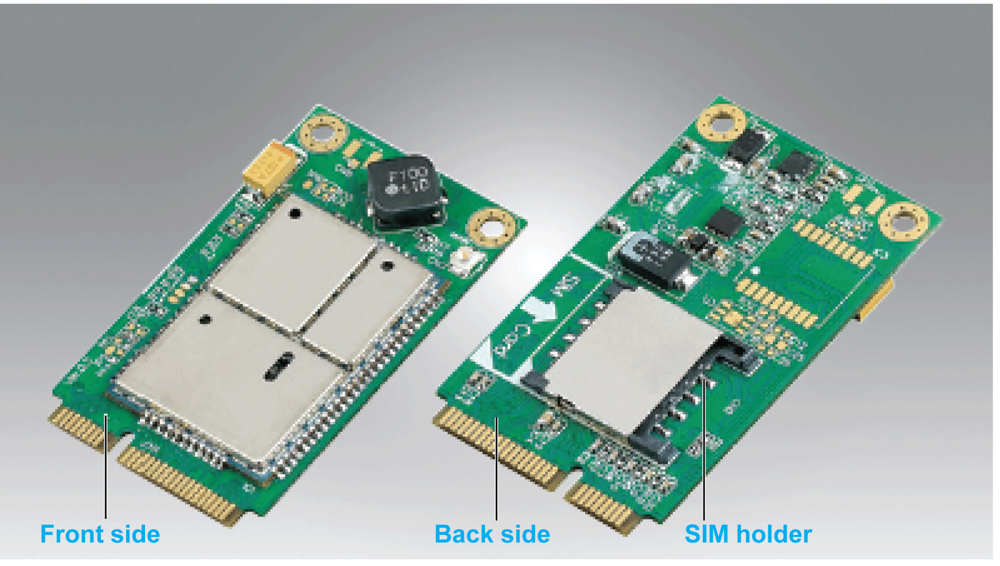

# Introduction

Introduction

The HMIYMINGPRS1 is categorized as a GPRS (general packet radio service). It provides a cost effective solution for wireless remote connection to distributed installations over the Internet. It is compatible with the mini PCIe card with SIM card holder.

GPRS is a packet-oriented data service based on GSM (global system for mobile). It offers the advantages to pay only for the total volume of data exchanged (in MB per month) regardless of the connection time while data communication via traditional circuit switching (PSTN/GSM) is charged per minute of connection time.

GSM connections are used for on-demand services such as sending SMS alarms or basic remote services such as diagnostics.

GPRS is more suitable for permanent access to remote installations providing:

oEasy remote programming.

oContinuous remote monitoring and control.

oTransparent routing capabilities from the Internet to LAN networks or serial network devices connected to the S-Panel PC gateway.

In addition, GPRS provides higher data exchange rates than GSM:

|  | Upload | Download |
| --- | --- | --- |
| Theoretical | 24 kbps | 48 kbps |
| Typical | 16 kbps | 20 kbps |

NOTE: These values depend on your service provider, the distance between your GPRS interface and the base station, and the current traffic.

NOTE: If too many browsers are being used on a modem connection (GPRS, PSTN), performance may decrease and lead to difficulties with page refreshing.

The figure shows the GPRS interface:

