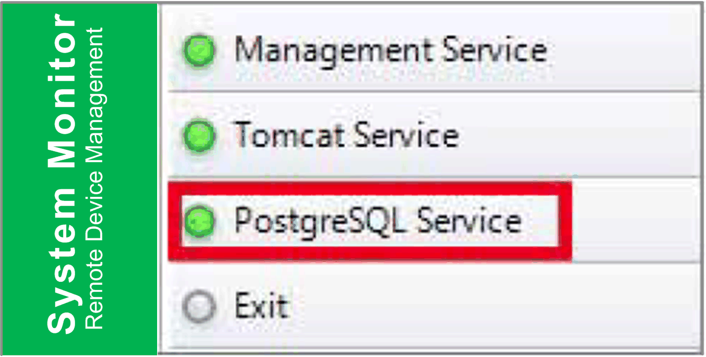

# PostgreSQL Service

PostgreSQL Service

PostgreSQL is an object-relational database management system (ORDBMS). As a database server, its function is to store data and retrieve it later, as requested by other software applications running on another computer across a network and the Internet. It can handle workloads ranging large internet-facing applications with many concurrent users. PostgreSQL provides replication of the database itself for availability and scalability.

Click PostgreSQL Service to start/stop System Monitor database service:

