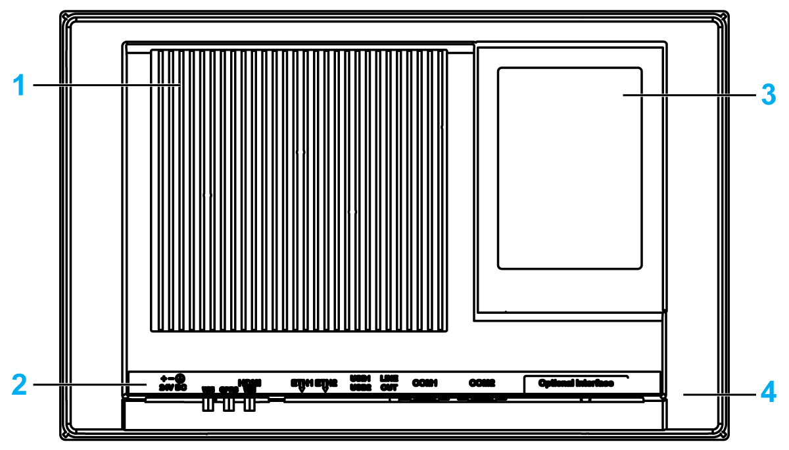
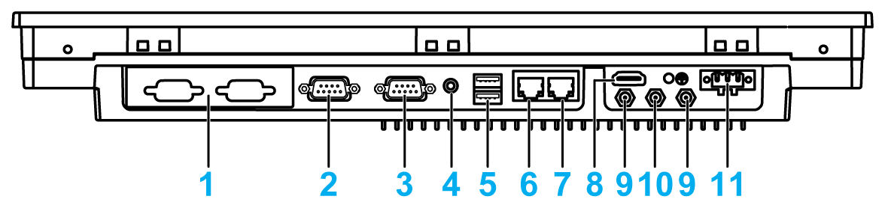
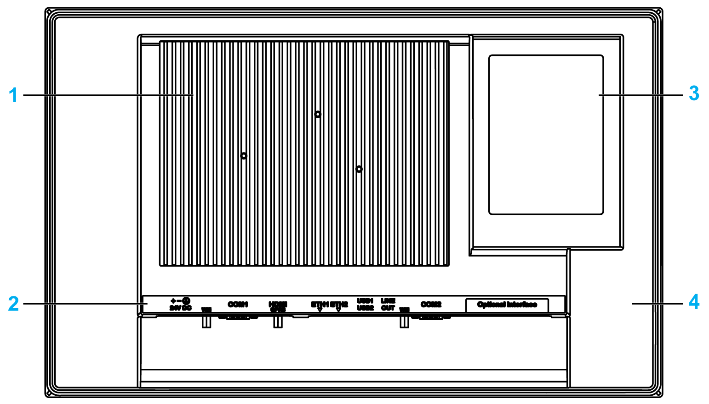

# S-Panel PC Description

S-Panel PC Description

Introduction

During operation, the surface temperature of the heat sink may exceed 70 °C (158 °F).

|  |
| --- |
| Warning_Color.gifWARNING |
| RISK OF BURNS |
| Do not touch the surface of the heat sink during operation. |
| Failure to follow these instructions can result in death, serious injury, or equipment damage. |

The Display PC multi-touch has a touch screen with projected capacitive touch technology that may operate abnormally when the surface is wet.

|  |
| --- |
| Warning_Color.gifWARNING |
| LOSS OF CONTROL |
| oDo not touch the touch screen area during Operating System startup.  oDo not operate when the touch screen surface is wet.  oIf the touch screen surface is wet, remove any excess water with a soft cloth before operation.  oMake sure to use only the authorized grounding configurations shown in the grounding procedure. |
| Failure to follow these instructions can result in death, serious injury, or equipment damage. |

NOTE:

oThe touch control is disabled in case of abnormal touch (like water) for a few seconds to avoid accidental touch. The normal touch function will be recovered a few seconds after removing the abnormal touch condition.

oDo not touch the touch screen area during Operating System startup since "touch panel firmware" initializes automatically when Windows starts up.

S-Panel PC W15” Front View

1   Panel

2   Multi-touch panel

3   Status indicator

The table describes the meaning of the status indicator:

| Color | State | Meaning |
| --- | --- | --- |
| Orange | On | Stand by. |
| Green | On | S-Panel PC is on. |
| – | Off | S-Panel PC is off. |

S-Panel PC W15” Rear View

1   Heat sink

2   S-Panel PC interface

3   Back cover for access mini PCIe, HDD/SSD, and CFast

4   Removal cover

NOTE: The cooling method is passive heat sink.

S-Panel PC W15” Bottom View

1   1 x optional interface

2   COM2 port RS-232/422/485

3   COM1 port RS-232

4   Audio line out

5   USB1 (USB 3.0) and USB2 (USB 3.0)

6   Eth2 (10/100/1000 Mbit/s)

7   Eth1 (10/100/1000 Mbit/s)

8   Monitor/Panel, HDMI

9   SMA connector for the wireless LAN external antenna

10   SMA connector for the GPRS/4G external antenna

11   DC power connector

NOTE: Use an extension cable to connect the external antenna.

S-Panel PC W19” Front View

1   Panel

2   Multi-touch panel

3   Status indicator

The table describes the meaning of the status indicator:

| Color | State | Meaning |
| --- | --- | --- |
| Orange | On | Stand by. |
| Green | On | S-Panel PC is on. |
| – | Off | S-Panel PC is off. |

S-Panel PC W19” Rear View

1   Heat sink

2   S-Panel PC interface

3   Back cover for access mini PCIe, HDD/SSD, and CFast

4   Removal cover

NOTE: The cooling method is passive heat sink.

S-Panel PC W19” Bottom View

1   1 x optional interface

2   COM2, port RS-232/422/485

3   SMA connector for the wireless LAN external antenna

4   Audio line out

5   USB1 (USB 3.0) and USB2 (USB 3.0)

6   Eth2 (10/100/1000 Mbit/s)

7   Eth1 (10/100/1000 Mbit/s)

8   SMA connector for the GPRS/4G external antenna (use an extension cable to connect the external antenna when HDMI cable is connected)

9   Monitor/Panel, HDMI

10   COM1, port RS-232

11   DC power connector

EIO0000002040.04

© 2019 Schneider Electric. All rights reserved.