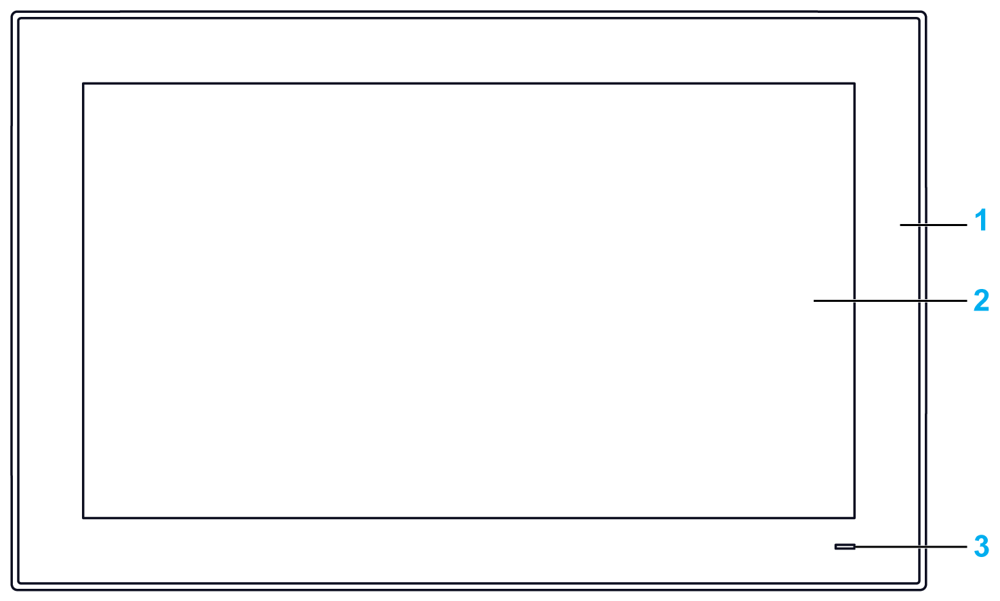
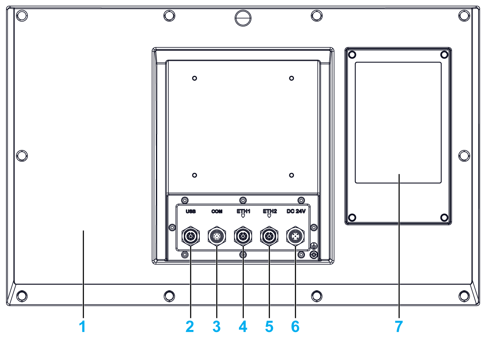

# Enclosed PC Description

Enclosed PC Description

Introduction

The Display PC multi-touch has a touch screen with projected capacitive touch technology that may operate abnormally when the surface is wet.

|  |
| --- |
| Warning_Color.gifWARNING |
| LOSS OF CONTROL |
| oDo not touch the touch screen area during Operating System startup.  oDo not operate when the touch screen surface is wet.  oIf the touch screen surface is wet, remove any excess water with a soft cloth before operation.  oMake sure to use only the authorized grounding configurations shown in the grounding procedure. |
| Failure to follow these instructions can result in death, serious injury, or equipment damage. |

NOTE:

oThe touch control is disabled in case of abnormal touch (like water) for a few seconds to avoid accidental touch. The normal touch function will be recovered a few seconds after removing the abnormal touch condition.

oDo not touch the touch screen area during Operating System startup since "touch panel firmware" initializes automatically when Windows starts up.

Enclosed PC W19” Front View

1   Panel

2   Multi-touch panel

3   Status indicator

The table describes the meaning of the status indicator:

| Color | State | Meaning |
| --- | --- | --- |
| Orange | On | Stand by. |
| Green | On | Enclosed PC is on. |
| – | Off | Enclosed PC is off. |

Enclosed PC Rear View

1   Cover

2   USB 2.0 with M12 connector 8-pin female

3   RS-232 with M12 connector 8-pin male

4   ETH1 10/100/1000 base-T with M12 connector 8-pin female

5   ETH2 10/100/1000 base-T with M12 connector 8-pin female

6   DC power with M12 connector 5-pin male

7   Back cover for access HDD/SSD

NOTE: The cooling method is passive heat sink.

NOTE: The Enclosed PC does not support the optional interface.

EIO0000002040.04

© 2019 Schneider Electric. All rights reserved.