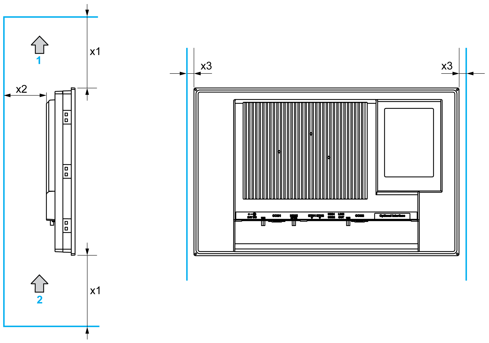
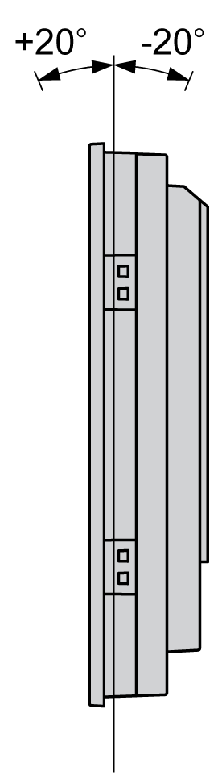
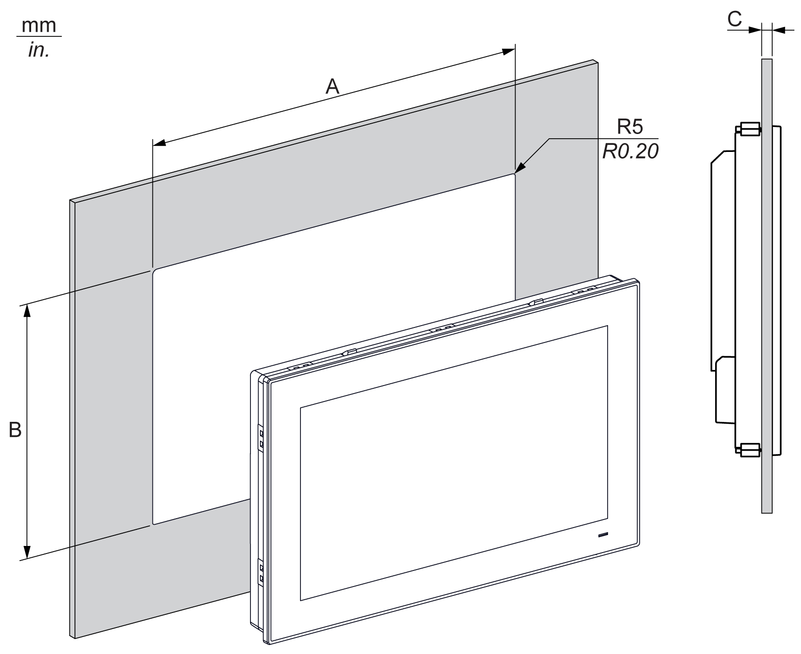

# Installation Requirements

Installation Requirements

Important Mounting Information

Overheating of the system can cause incorrect software behavior. To prevent the system from overheating, be aware of the following:

oThe environment characteristics of the system must be respected.

oThe S-Panel PC and the Enclosed PC are only permitted for operation in closed rooms.

oThe S-Panel PC and the Enclosed PC cannot be situated in direct sunlight.

oThe S-Panel PC vent holes must not be covered.

oWhen mounting the S-Panel PC and the Enclosed PC, adhere to the allowable mounting angle.

|  |
| --- |
| Warning_Color.gifWARNING |
| UNINTENDED EQUIPMENT OPERATION |
| oDo not place the Magelis Industrial PC next to other devices that might cause overheating.  oKeep the Magelis Industrial PC away from arc-generating devices such as magnetic switches and non-fused breakers.  oAvoid using the Magelis Industrial PC in environments where corrosive gases are present.  oInstall the Magelis Industrial PC in a location providing a minimum clearance of 10 mm (0.39 in) or more on the left and right sides, 50 mm (1.96 in) or more on the rear side, and 100 mm (3.93 in) or more above and below the product from all adjacent structures and equipment.  oInstall the Magelis Industrial PC with sufficient clearance for cable routing and cable connectors. |
| Failure to follow these instructions can result in death, serious injury, or equipment damage. |

Spacing Requirements

In order to provide sufficient air circulation, mount the S-Panel PC and the Enclosed PC so that the spacing above, below, and on the sides of the unit is as follows:

1   Air out

2   Air in

x1   > 100 mm (3.93 in)

x2   > 50 mm (1.96 in)

x3   > 10 mm (0.39 in)

Mounting Orientation

The following figure shows the allowable mounting orientation for the S-Panel PC and the Enclosed PC:

S-Panel PC Panel Cut Dimensions

For cabinet installation, you need to cut the correct sized opening in the installation panel.

The dimensions of the opening for installing the S-Panel PC are shown below:

| S-Panel PC Cut-out | A | B | C | R |
| --- | --- | --- | --- | --- |
| W15” | 412.4 ±0.7 mm  (16.24 ±0.03 in) | 261.7 ±0.4 mm  (10.30 ±0.02 in) | 2...6 mm  (0.08...0.23 in) | 5 mm  (0.20 in) |
| W19” | 479.3 ±1 mm  (18.87 ±0.04 in) | 300.3 ±0.7 mm  (11.82 ±0.03 in) |

NOTE:

oEnsure that the thickness of the installation panel is from 2 to 6 mm (0.08 to 0.23 in).

oAll installation panel surfaces used should be strengthened. Due consideration should be given to the weight of the S-Panel PC, especially if high levels of vibration are expected and the installation panel can move. Attach metal reinforcing strips to the inside of the panel near the panel cut-out to increase the strength of the installation panel.

oEnsure that all installation tolerances are maintained.

oThe S-Panel PC is designed for use on a flat surface of a Type 4X enclosure (indoor use only).

EIO0000002040.04

© 2019 Schneider Electric. All rights reserved.