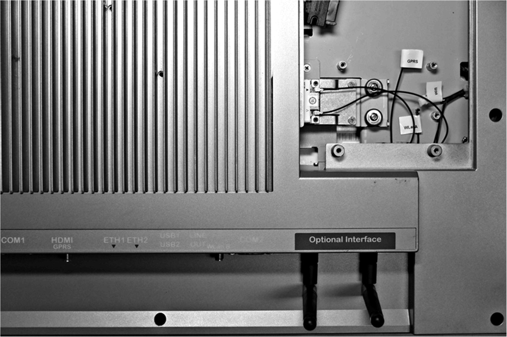

# Wireless LAN Interface Card Description

Wireless LAN Interface Card Description

Introduction

The HMIYMINWIFI1 is categorized as a local area wireless for USB-equipped wireless embedded systems. It does not use the mini PCIe slot (Intel dual band wireless-AC 3160). Wireless LAN direct support to connect wireless LAN devices to each other with no need for a wireless access point.

The figure shows the wireless LAN interface card:

NOTE: The antennas are mounted directly on the product to the specific location. They can also be mounted remotely using intermediate cables.

The figure shows the dimensions of the remote wireless LAN antenna cable (HMIYCABWIFIAN51):

Wireless LAN Interface Card Description

The table shows technical data for the wireless LAN interface card:

| Element | Characteristics |
| --- | --- |
| General | |
| IEEE WLAN standard | IEEE 802.11abgn, 802.11ac, 802.11d, 802.11e, 802.11i, 802.11h, 802.11w |
| Antenna connector | 2 x U.FL connectors |
| LED output | On/off |
| Communication | |
| Roaming | Supports seamless roaming between respective access points 802.11b, 802.11g, 802.11a/b/g, 802.11a/b/g/n, and 802.11ac) |
| Blue tooth | Dual-mode Blue tooth 2.1, 2.1+EDR, 3.0, 3.0+HS, 4.0 (BLE) |
| Authentication | WPA and WPA2, 802.1X (EAP-TLS, TTLS, PEAP, LEAP, EAP-FAST), EAP-SIM, EAP-AKA |
| Authentication protocols | PAP, CHAP, TLS, GTC, MS-CHAP, MS-CHAPv2 |
| Encryption | 64-bit and 128-bit WEP, AES-CCMP, TKIP |
| Wireless LAN direct encryption and authentication | WPA2, AES-CCMP |
| Management frame protection | 802.11w (WFA- protected management frames) |

Wireless LAN Interface Cable Description

The table shows technical data for the wireless LAN interface cable and antenna:

| Part number | Characteristics |
| --- | --- |
| HMIYCABWIFIAN51 | Remote wireless LAN antenna cable 5 m (16.4 ft) |

Compatible Table

| Part number | Description | S-Panel PC | Enclosed PC |
| --- | --- | --- | --- |
| HMIYMINWIFI1 | Interface WiFi, AC3160, 2 x antenna | Yes | Not applicable |

Cable Routing

S-Panel PC:

Device Manager and Hardware Installation

Install the driver before you install the interface into the S-Panel PC. The driver installation media is included with the package. After the interface is installed, you can verify whether it is properly installed on your system through the Device Manager.

EIO0000002040.04

© 2019 Schneider Electric. All rights reserved.