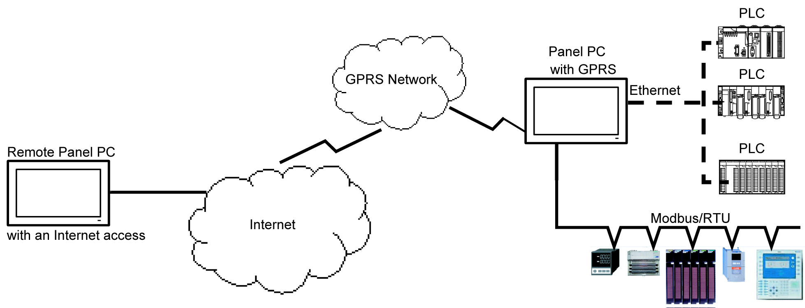
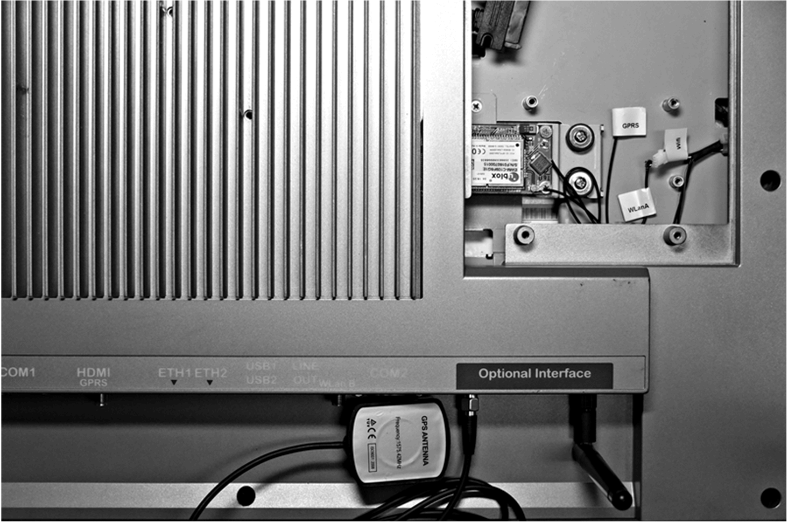

# GPRS Interface Description

GPRS Interface Description

Introduction

The HMIYMINGPRS1 is categorized as a GPRS (general packet radio service). It provides a cost effective solution for wireless remote connection to distributed installations over the Internet. It is compatible with the mini PCIe card with SIM card holder.

GPRS is a packet-oriented data service based on GSM (global system for mobile). It offers the advantages to pay only for the total volume of data exchanged (in MB per month) regardless of the connection time while data communication via traditional circuit switching (PSTN/GSM) is charged per minute of connection time.

GSM connections are used for on-demand services such as sending SMS alarms or basic remote services such as diagnostics.

GPRS is more suitable for permanent access to remote installations providing:

oEasy remote programming.

oContinuous remote monitoring and control.

oTransparent routing capabilities from the Internet to LAN networks or serial network devices connected to the S-Panel PC gateway.

In addition, GPRS provides higher data exchange rates than GSM:

|  | Upload | Download |
| --- | --- | --- |
| Theoretical | 24 kbps | 48 kbps |
| Typical | 16 kbps | 20 kbps |

NOTE: These values depend on your service provider, the distance between your GPRS interface and the base station, and the current traffic.

NOTE: If too many browsers are being used on a modem connection (GPRS, PSTN), performance may decrease and lead to difficulties with page refreshing.

The figure shows the GPRS interface:

GPRS Interface Description

The table shows technical data for the GPRS interface:

| Features | Values |
| --- | --- |
| General | |
| Bus type | mini PCIe card revision 1.2 |
| Connector | 1 x RF antenna coaxial connectors |
| Power consumption | 3.3...3.6 Vdc < 700 mA (HSPA connected mode) |
| Peak current | 1.5 A |
| Communication | |
| Protocol | UMTS/HSPA network: 800/850/900/1700/1900/2100 MHzEDGE/ GPRS/ GSM network: 850/ 900/ 1800/ 1900 MHz |
| Speed | Downlink: 7.2 Mb/s (HSDPA) / uplink: 5.76 Mb/s (HSUPA) |
| Dimensions (l x w x h) | 50.85 x 29.9 x 6.2 mm (2.0 x 1.17 x 0.24 in) |

Any excessive weight or stress on communication cables may disconnect the equipment.

|  |
| --- |
| Caution_Color.gifCAUTION |
| LOSS OF POWER |
| oEnsure that communication connections do not place excessive stress on the communication ports of the Magelis Industrial PC.  oSecurely attach communication cables to the panel or cabinet.  oUse only D-Sub 9-pin cables with a locking system in good condition. |
| Failure to follow these instructions can result in injury or equipment damage. |

Compatible Table

| Part number | Description | S-Panel PC | Enclosed PC |
| --- | --- | --- | --- |
| HMIYMINGPRS1 | Interface 3G, C109, 1 x antenna | Yes | Not applicable |

GPRS Remote Access

GPRS communication implies:

oThe GPRS interface is connected to the Internet via the GPRS network.

oThe remote PC or network is also connected to the Internet.

GPRS topologies can support:

oNAT (network address translation) routing tables for transparent routing to Ethernet devices

osecurity services such as IP address control or VPN tunnels for secured data exchange over the Internet

The following figure shows remote access to the network of the GPRS interface:

Connection Principles

GPRS communication requires a SIM card and a specific GPRS contract with a service provider.

The GPRS connection is always initiated from the interface to the GPRS network.

It is not possible for a client application to open a connection by directly dialing the GPRS interface. Nevertheless, the GPRS interface provides various solutions to connect to the GPRS network:

Permanent mode:

oAutomatic connection at startup, restart or after connection loss.

On-demand mode:

oCallback function: opens the connection upon receiving an incoming GSM or PSTN call.

oAutonomously on a process or application condition.

The GPRS interface connects the APN (access point name) of the service provider and receives an IP address back that can be static or dynamic.

The GPRS interface supports both static and dynamic IP addresses. If the address is dynamic, it is necessary to inform the remote application of the new IP address.

NOTE:

oGPRS uses the DNS server of the service provider; it replaces the DNS server configured in the S-Panel PC.

oThe default gateway set in the Ethernet configuration of the S-Panel PC is not used with a GPRS connection. The default route of the GPRS connection is used instead. Thus, it is not possible to route through Ethernet when the interface is connected to the GPRS network.

GPRS Contracts

GPRS service providers offer dedicated services adapted to industrial applications, also called M2M (machine to machine).

Service providers offer GPRS contracts with different options. The main options are:

oPublic or private IP address: Choose a contract that gives you a public IP address to be accessible directly from the Internet.

oStatic or dynamic IP address.

oIncoming TCP ports blocked or not: Some providers offer only subscriptions with TCP ports blocked for security reasons. For example, some provider block ports that are lower than 1024.

NOTE:

oFor ease of use and configuration, you should choose a contract that does not block TCP ports and provides a static IP address.

oIf your service provider blocks the public ports (< 1024), you must use a VPN and choose a contract that authorizes VPN traffic.

Cable Routing

S-Panel PC:

Device Manager and Hardware Installation

Install the driver before you install the interface into the S-Panel PC. The driver installation media is included with the package. After the interface is installed, you can verify whether it is properly installed on your system through the Device Manager.

EIO0000002040.04

© 2019 Schneider Electric. All rights reserved.