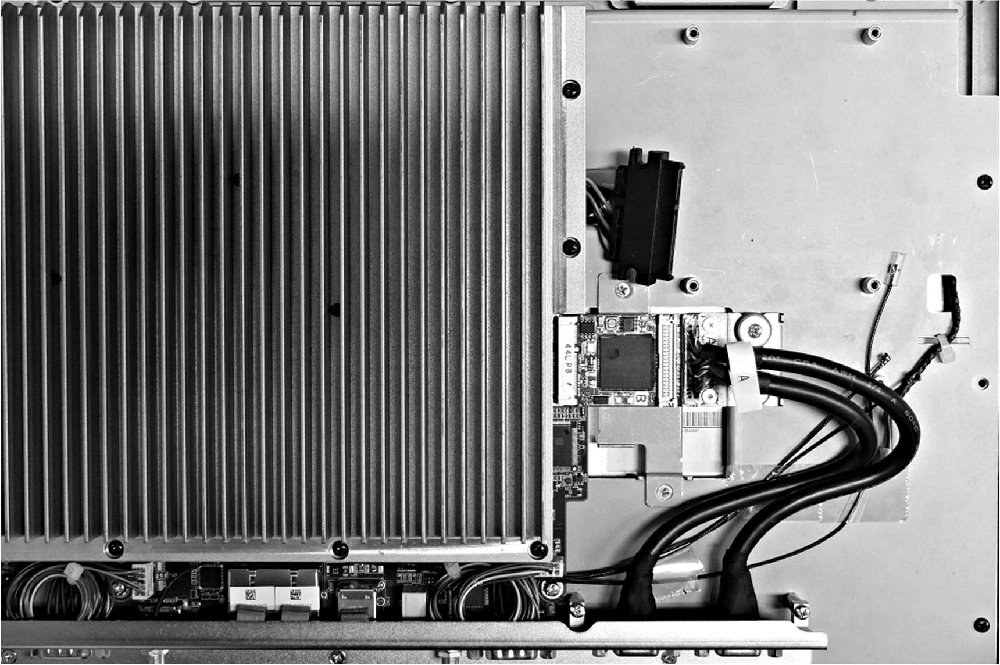
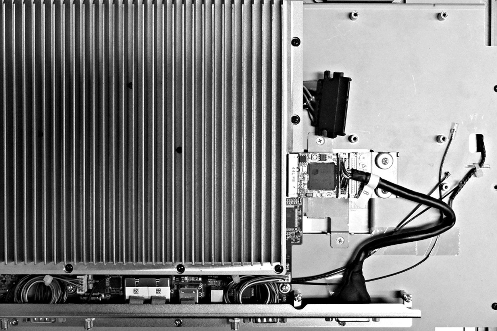
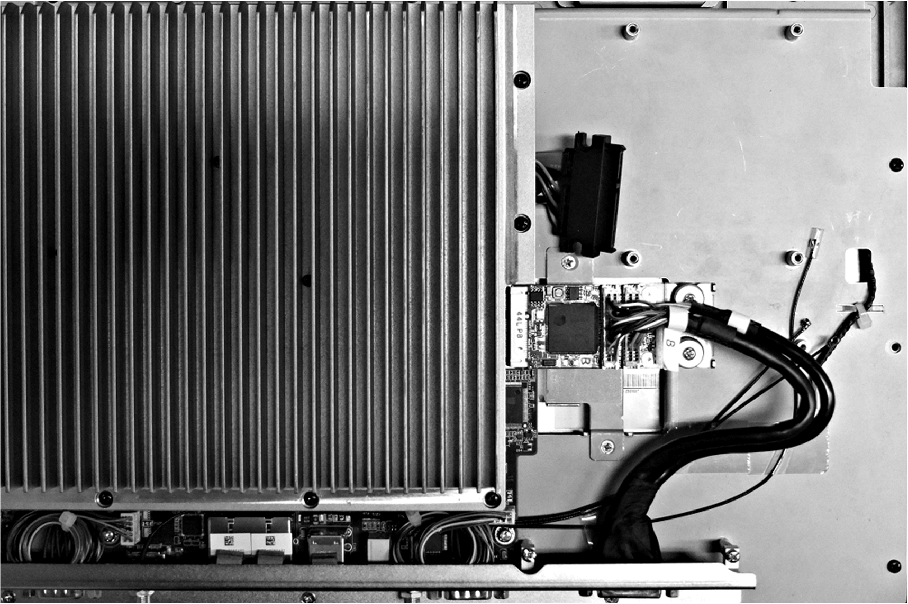

# VGA and DVI Interface Description

VGA and DVI Interface Description

Introduction

The HMIYMINVGADVID1 (interface 2 x VGA) is categorized as industrial module. It is compatible with the mini PCIe card. The Video Graphic card supports Full HD 1920 x 1080 definition and dual display mode. Two different screen images can be displayed on the two VGA ports (DVI-D is clone image of the first VGA).

The HMIYMINVGADVID1 (interface 1 x DVI-D) is categorized as industrial module. It is compatible with the mini PCIe card. The DVI-D connector requires one external interface slot.

The HMIYMINDVII1 (interface 1 x DVI-I) is categorized as industrial module. It is compatible with the mini PCIe card. The DVI-I connector requires one external interface slot. Both digital and analog signals are provided in the DVI-I connector to connect two displays with same images, thanks to a Y cable (cable with 3 connectors), converting the DVI-I connector to one DVI-D and one VGA connector.

Compatible Table

| Part number | Description | S-Panel PC | Enclosed PC |
| --- | --- | --- | --- |
| HMIYMINVGADVID1 | Interface 1 x DVI-D, 2 x VGA | Yes(1) | Not applicable |
| HMIYMINDVII1 | Interface 1 x DVI-I | Yes |
| (1) Only support one Interface bracket; either with 2 x VGA or DVI-D bracket. | | | |

Cable Routing

S-Panel PC and HMIYMINVGADVID1 (with 2 x VGA):

S-Panel PC and HMIYMINVGADVID1 (with 1 x DVI-D):

S-Panel PC and HMIYMINDVII1:

Interface Installation

Before installing or removing a mini PCIe card, shut down Windows operating system in an orderly fashion and remove the power from the device.

|  |
| --- |
| NOTICE |
| ELECTROSTATIC DISCHARGE |
| Take the necessary protective measures against electrostatic discharge before attempting to remove the Magelis Industrial PC cover. |
| Failure to follow these instructions can result in equipment damage. |

|  |
| --- |
| Caution_Color.gifCAUTION |
| OVERTORQUE AND LOOSE HARDWARE |
| oDo not exert more than 0.5 Nm (4.5 lb-in) of torque when tightening the installation fastener, enclosure, accessory, or terminal block screws. Tightening the screws with excessive force can damage the installation fastener.  oWhen fastening or removing screws, ensure that they do not fall inside the Magelis Industrial PC chassis. |
| Failure to follow these instructions can result in injury or equipment damage. |

NOTE: Remove the power before attempting this procedure.

The table describes how to install a VGA and DVI interface:

| Step | Action |
| --- | --- |
| 1 | Release motherboard screw:  G-SE-0062845.1.gif-high.gif |
| 2 | Install mini PCIe card:  G-SE-0062853.1.gif-high.gif |
| 3 | Tear down optional interface bracket:  G-SE-0062852.1.gif-high.gif |
| 4 | 2 x VGA interface:  G-SE-0062851.2.gif-high.gif |
| Continued | DVI-I interface:  G-SE-0062849.1.gif-high.gif      DVI-D interface:  G-SE-0062850.2.gif-high.gif |
| 5 | Install 2 x VGA interface bracket and connect the cable (analog signal):  G-SE-0062848.1.gif-high.gif      Install DVI-D interface bracket and connect the cable (analog signal):  G-SE-0062848.1.gif-high.gif      Install DVI-I interface bracket and connect the cable (analog signal):  G-SE-0062846.1.gif-high.gif |

EIO0000002040.04

© 2019 Schneider Electric. All rights reserved.