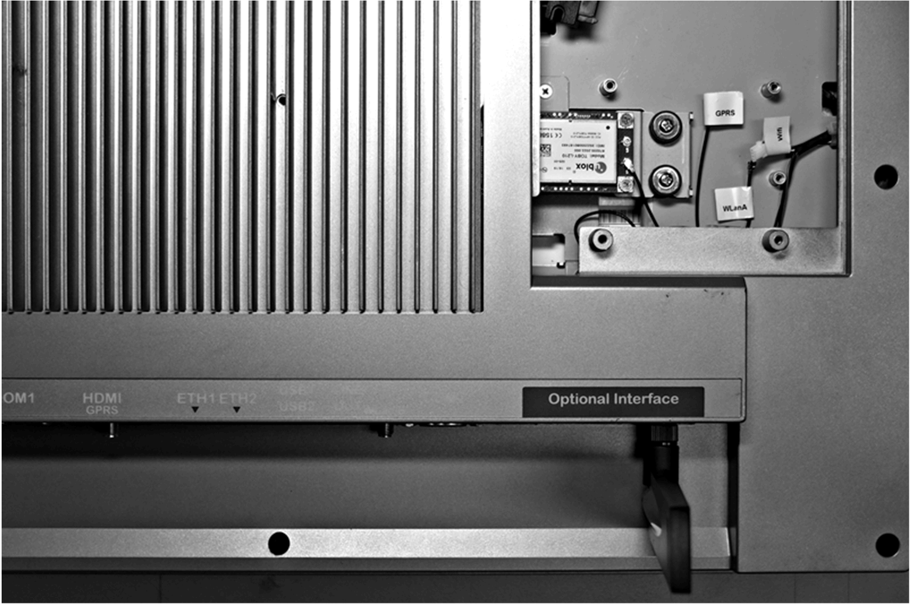

# 4G (mini PCIe) Interface Description

4G (mini PCIe) Interface Description

Introduction

The HMIYMIN4GEU1 and HMIYMIN4GUS1 are categorized as industrial communication modules.

The HMIYMIN4GEU1 is mini PCIe GPRS 4G for Europe and Asia frequencies.The kit including SIM card holder and external antennas.

The HMIYMIN4GUS1 is mini PCIe GPRS 4G for North America frequencies.The kit including SIM card holder and external antennas.

This figure shows the interface mini PCIe GPRS 4G:

1   mini PCIe connector

2   RF main antenna connector (use this for connection to the S-Panel PC)

3   RF diversity antenna connector

4   SIM holder

Description

The table shows technical data:

| Features | Values |
| --- | --- |
| General | |
| Bus type | SIM card |
| Power consumption | 3.3 Vdc x 2.6 A |
| Optional temperature | 0...45 °C (113 °F) |

Compatible Table

| Part number | Description | S-Panel PC | Enclosed PC |
| --- | --- | --- | --- |
| HMIYMIN4GUS1 | Interface 4G US,1 x antenna | Yes | Not applicable |
| HMIYMIN4GEU1 | Interface 4G EU/Asia,1 x antenna | Yes |

Cable Routing

S-Panel PC and HMIYMIN4GUS1:

S-Panel PC and HMIYMIN4GEU1:

Interface Installation

Before installing or removing a mini PCIe card, shut down Windows operating system in an orderly fashion and remove the power from the device.

|  |
| --- |
| NOTICE |
| ELECTROSTATIC DISCHARGE |
| Take the necessary protective measures against electrostatic discharge before attempting to remove the Magelis Industrial PC cover. |
| Failure to follow these instructions can result in equipment damage. |

|  |
| --- |
| Caution_Color.gifCAUTION |
| OVERTORQUE AND LOOSE HARDWARE |
| oDo not exert more than 0.5 Nm (4.5 lb-in) of torque when tightening the installation fastener, enclosure, accessory, or terminal block screws. Tightening the screws with excessive force can damage the installation fastener.  oWhen fastening or removing screws, ensure that they do not fall inside the Magelis Industrial PC chassis. |
| Failure to follow these instructions can result in injury or equipment damage. |

NOTE: Remove the power before attempting this procedure.

| Step | Action |
| --- | --- |
| 1 | Release mother screw:  G-SE-0062839.1.gif-high.gif |
| 2 | Install 4G mini PCIe card:  G-SE-0062844.2.gif-high.gif |
| 3 | Put ring into SMA cable:  G-SE-0062698.1.gif-high.gif |
| 4 | Put SMA cable into bracket:  G-SE-0062697.1.gif-high.gif |
| 5 | Put washer into SMA connector:  G-SE-0062696.1.gif-high.gif |
| 6 | Combination nut:  G-SE-0062695.1.gif-high.gif |
| 7 | Tear down optional interface bracket:  G-SE-0062843.1.gif-high.gif |
| 8 | Install antenna interface bracket and connect the cable:  G-SE-0062842.1.gif-high.gif       WLanA/ANT1: supports both Tx and Rx, providing the main antenna interface.  NOTE: When using a mini PCIe card with an external cable attached, install a clamp or other device to secure the cable. |
| 9 | Lock antenna:  G-SE-0062841.1.gif-high.gif |
| 10 | Connect pre-install SMA cable:  G-SE-0062840.1.gif-high.gif    1   WLanB/ANT2:supports Rx only for the LTE MIMO 2 x 2 and 3G Rx diversity configurations.  2   WLanA/ANT1: supports both Tx and Rx, providing the main antenna interface. |

Device Manager and Hardware Installation

Install the driver before you install the interface into the S-Panel PC. The driver installation media is included with the USB key of the S-Panel PC. After the interface is installed, you can verify whether it is properly installed on your system through the Device Manager.

EIO0000002040.04

© 2019 Schneider Electric. All rights reserved.