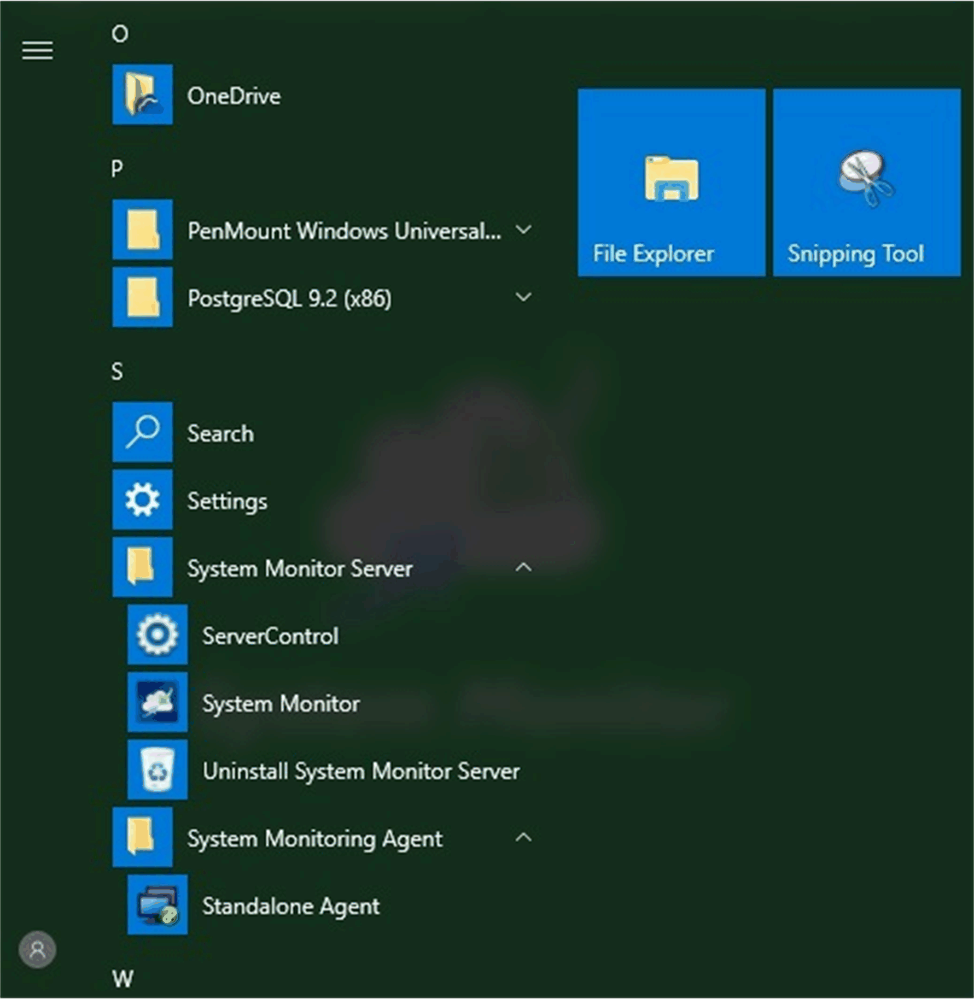
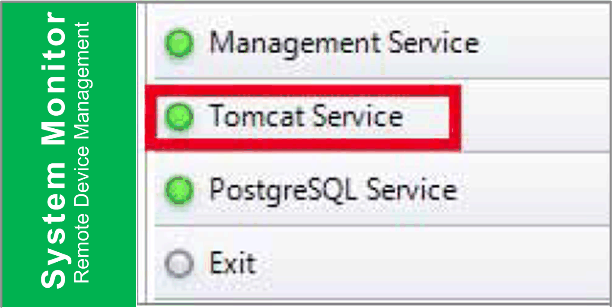
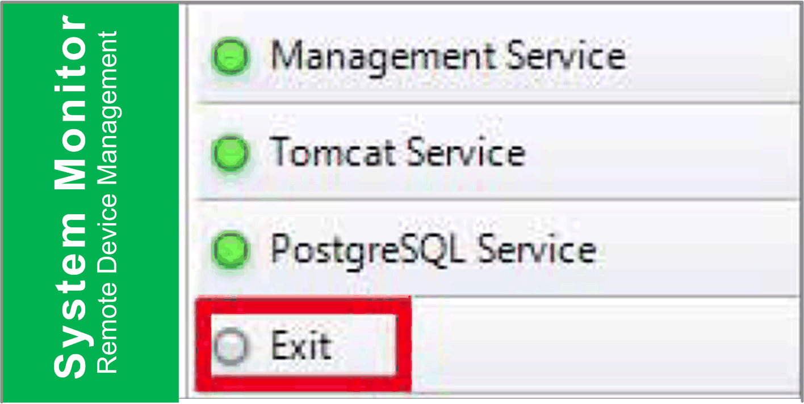
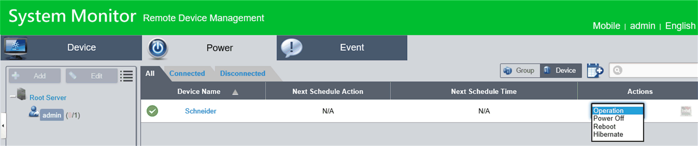

# System Monitor Interface

System Monitor Interface

Overview

The System Monitor 3.0 interface provides remote monitoring, a feature that helps you access multiple clients through a single console for remote device management. The System Monitor immediately recognizes equipment and provides real-time equipment maintenance, which improves system stability and reliability.

Remote Monitoring monitors system status of remote devices. The monitored items include hard disk temperature, hard drive health, network connection, CPU temperature, system voltages, system fan status, and UPS status.

Remote Monitoring also provides support for function logs so that managers can regularly check the status of their remote devices.

The System Monitor sends notification and makes an entry in the event log.

NOTE: When configuring the System Monitor, it is not possible to create a group/device as the virtual keyboard is not accessible from configuration. The workaround consists of plugging in a physical keyboard.

System Monitor Requirements

The table describes the software requirements:

| Description | Software |
| --- | --- |
| Framework | Microsoft.NET Framework version 3.5 or higher |
| Driver | Software 4.0 API |

System Monitor Console

The System Monitor console acts as a server for the clients. Devices that run on the System Monitor console display the health and status information from the System Monitor clients. The console has to be made available by the clients over a network.

Launch the system tray of ServerControl from Windows Start  > Programs and right-click to launch ServerControl menu from tray icon:

Click Management Service to start/stop main System Monitor management service:

Tomcat Service

Tomcat is an open-source Web server and servlet container. Tomcat implements several Java EE specifications including Java servlet, JavaServer pages (JSP), Java EL, and WebSocket, and provides a Java HTTP Web server environment for Java code to run in.

Click Tomcat Service to start/stop System Monitor Web service:

PostgreSQL Service

PostgreSQL is an object-relational database management system (ORDBMS). As a database server, its function is to store data and retrieve it later, as requested by other software applications running on another computer across a network and the Internet. It can handle workloads ranging large internet-facing applications with many concurrent users. PostgreSQL provides replication of the database itself for availability and scalability.

Click PostgreSQL Service to start/stop System Monitor database service:

Exit

Click Exit  to terminate server management console from tray icon and all System Monitor services that are still running in the background. You can restart console from Windows/Programs menu:

Remote Manage Devices Any Time, Any Where

System Monitor is a Console-Server-Agent web-based structure for cloud management. Agent here refers to S-Panel PC devices, and server refers to the server directly in contact with the agent. The server can be a physical entity located in a central control room, or a virtual host set up in a cloud. Console refers to a web-based interface that connects to the server and communicates with the agent through the server. Administrators can perform equipment status and maintenance checks on System Monitor console through an Internet browser at any time, from anywhere, using any connected device. The server-agent connection fit the MQTT communication protocol. This improves connection security and stability, and also decreases development time for System Monitor integration. The console-server-agent web-based structure not only lowers the difficulty of setting up System Monitor network environments when provisioning, but also provides a distributed connectivity structure that solves the challenges encountered with large-scale or multi-site device management. System Monitor is a real-time management platform that breaks geographical limitations. Administrators can manage all of their devices by simply using their PCs, smartphones, and tablets.

NOTE: MQTT (formerly message queue telemetry transport) is a publish-subscribe based messaging protocol for use on top of the TCP/IP protocol.

Power Management

Select the action from drop-down menu of each device/group list item to power off, reboot and hibernate device.

Seamless HW/SW Monitoring for Complete Protection

In order to ensure device stability, System Monitor actively monitors device temperatures, voltages, and the states of hard disks and other hardware. In addition to hardware monitoring functions, System Monitor has a software monitoring function to oversee program status. Active alerts are sent out if any abnormalities are observed, and System Monitor can execute related actions according to user settings, like stopping or restarting processes, which further ensure normal device operation. System Monitor provides a comprehensive, seamless, device monitor and control system that includes both hardware and software.

KVM Feature

The System Monitor features a remote KVM (keyboard, video, and mouse) and allow remote diagnosis and recovery in any situation. The time saving on trouble shooting with real-time remote monitoring and proactive alarm notifications ensure continued system health.

User-Friendly Map-View Interface

Taking advantage of web-based features, System Monitor provides map-view interface and leverages Google and Baidu maps to help administrators locate and manage their devices more easily. In addition to the maps, System Monitor also provides for building diagrams to help pinpoint device locations in offices, factories, or wherever. System Monitor provides a user-friendly interface in an overall easy-to-use environment.

NOTE: Baidu maps or Beidu maps is a Chinese online mapping service.

System Monitor Client (Desktop)

This procedure describes the User Login/Logout interface:

| Step | Description |
| --- | --- |
| 1 | The System Monitor supports mainstream browsers like Chrome, Firefox, Internet Explorer, and Safari. The portal page supports multi-language and auto-detects the language currently used by browsers for default displaying. You can select the language from the menu at top-right corner to change manually:  G-SE-0043573.1.gif-high.gif      User Log In  oYou can input valid user name, password, and click Login to verify and enter main management page (by default the user is admin and password admin).  oCheck Auto Login to allow users to cache login information and auto login each time.  NOTE: For security concerns, do not check this option if you are using a public PC.  If you forget your password, click Forgot Password. Put the registered user email in the prompt dialog after it has auto resent the password to your email. |
| 2 | Changing Password for First log in: For the first successful login, new user can change their password or bypass it:  G-SE-0043719.1.gif-high.gif |
| 3 | User Log Out  Click User Log Out from the right corner menu to check out the system. |

EIO0000002040.04

© 2019 Schneider Electric. All rights reserved.