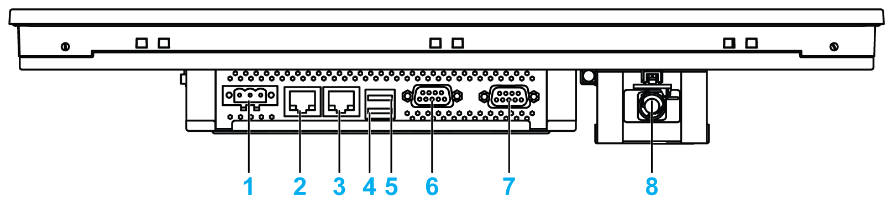

# S-Panel PC W15” Bottom View

S-Panel PC W15” Bottom View

1   DC power connector

2   ETH2 (10/100/1000 Mbit/s)

3   ETH1 (10/100/1000 Mbit/s)

4   USB2 (USB 3.0)

5   USB1 (USB 2.0)

6   COM2 port RS-232/422/485

7   COM1 port RS-232

8   Optional AC power supply