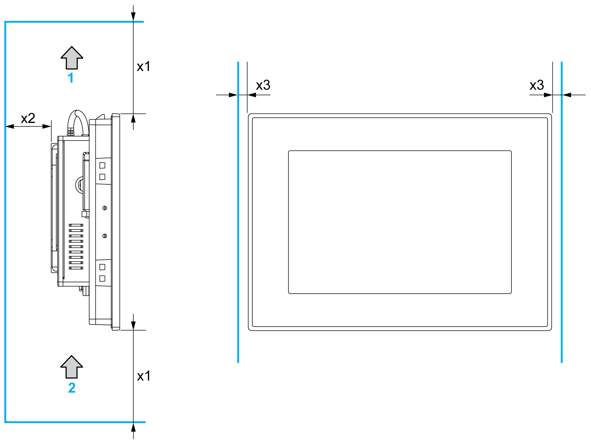

# Spacing Requirements

Spacing Requirements

In order to provide sufficient air circulation, mount the S-Panel PC so that the spacing above, below, and on the sides of the unit is as follows:

1   Air out

2   Air in

x1   > 100 mm (3.93 in)

x2   > 50 mm (1.96 in)

x3   > 10 mm (0.39 in)