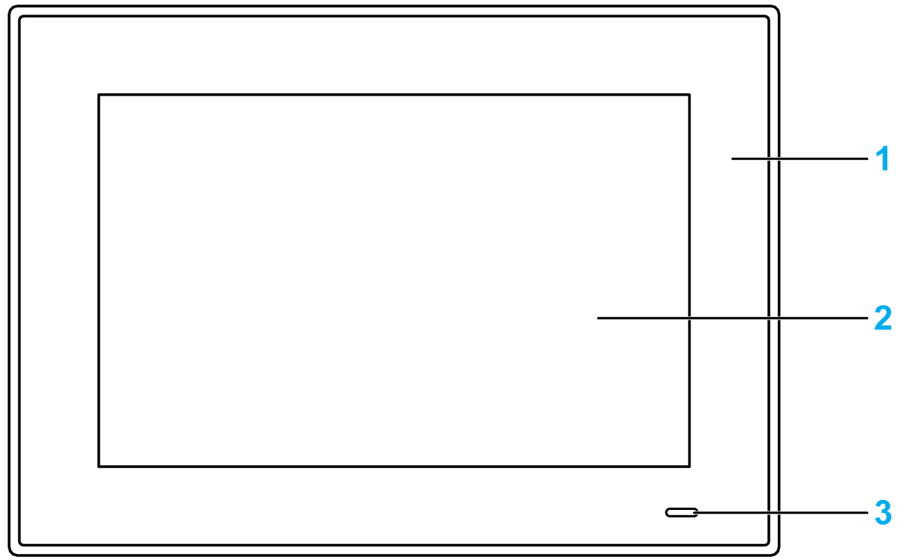
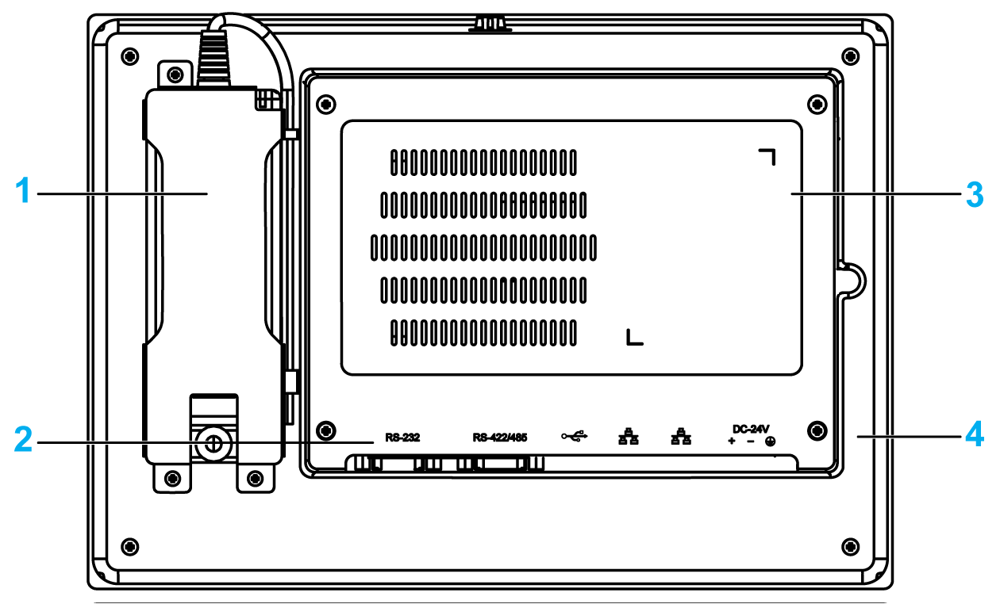
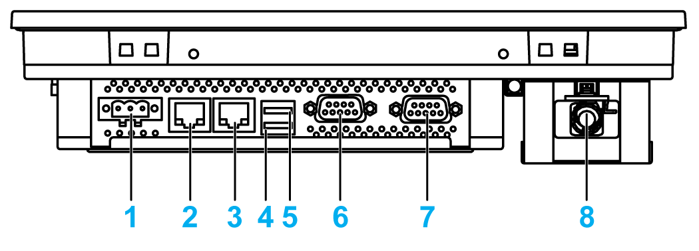
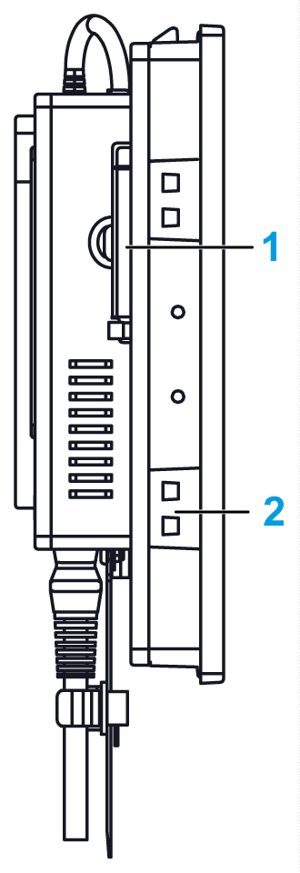
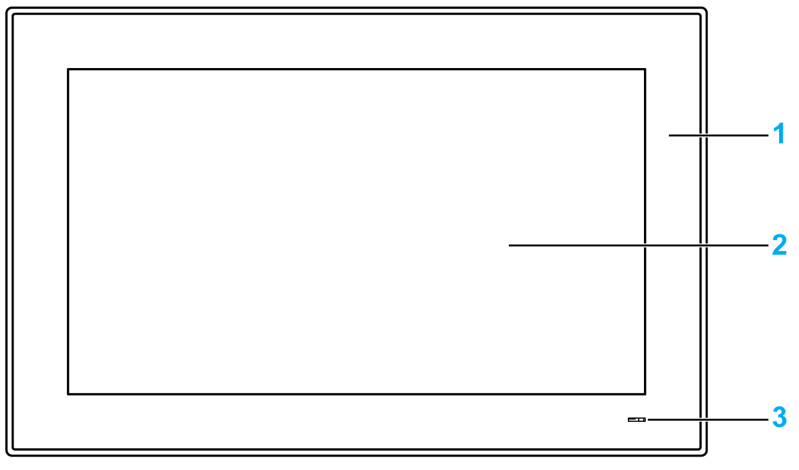
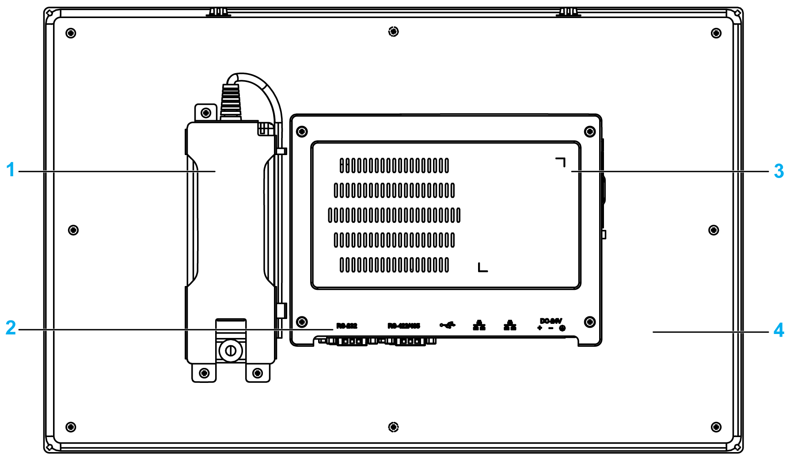
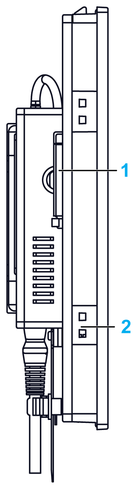

# Description

Description

Introduction

During operation, the surface temperature of the heat sink may exceed 70 °C (158 °F).

|  |
| --- |
| Warning_Color.gifWARNING |
| RISK OF BURNS |
| Do not touch the surface of the heat sink during operation. |
| Failure to follow these instructions can result in death, serious injury, or equipment damage. |

The Display PC multi-touch has a touch screen with projected capacitive touch technology that may operate abnormally when the surface is wet.

|  |
| --- |
| Warning_Color.gifWARNING |
| LOSS OF CONTROL |
| oDo not touch the touch screen area during Operating System startup.  oDo not operate when the touch screen surface is wet.  oIf the touch screen surface is wet, remove any excess water with a soft cloth before operation.  oMake sure to use only the authorized grounding configurations shown in the grounding procedure. |
| Failure to follow these instructions can result in death, serious injury, or equipment damage. |

NOTE:

oThe touch control is disabled in case of abnormal touch (like water) for a few seconds to avoid accidental touch. The normal touch function will be recovered a few seconds after removing the abnormal touch condition.

oDo not touch the touch screen area during Operating System startup since "touch panel firmware" initializes automatically when Windows starts up.

S-Panel PC W10” Front View

1   Panel

2   Multi-touch panel

3   Status indicator

The table describes the meaning of the status indicator:

| Color | State | Meaning |
| --- | --- | --- |
| Orange | On | Stand by. |
| Green | On | S-Panel PC is on. |
| – | Off | S-Panel PC is off. |

S-Panel PC W10” Rear View

1   Optional AC power supply module

2   S-Panel PC interface

3   Cover for access mini PCIe card and HDD/SSD drive

4   Panel

NOTE: The cooling method is passive heat sink.

S-Panel PC W10” Bottom View

1   DC power connector

2   ETH2 (10/100/1000 Mbit/s)

3   ETH1 (10/100/1000 Mbit/s)

4   USB2 (USB 2.0)

5   USB1 (USB 3.0)

6   COM2 port RS-232/422/485

7   COM1 port RS-232

8   Optional AC power supply

S-Panel PC W10” Side View

1   Access CFast memory card

2   Slot for the installation fasteners

S-Panel PC W15” Front View

1   Panel

2   Multi-touch panel

3   Status indicator

The table describes the meaning of the status indicator:

| Color | State | Meaning |
| --- | --- | --- |
| Orange | On | Stand by. |
| Green | On | S-Panel PC is on. |
| – | Off | S-Panel PC is off. |

S-Panel PC W15” Rear View

1   Optional AC power supply module

2   S-Panel PC interface

3   Cover for access mini PCIe card and HDD/SSD drive

4   Panel

NOTE: The cooling method is passive heat sink.

S-Panel PC W15” Bottom View

1   DC power connector

2   ETH2 (10/100/1000 Mbit/s)

3   ETH1 (10/100/1000 Mbit/s)

4   USB2 (USB 3.0)

5   USB1 (USB 2.0)

6   COM2 port RS-232/422/485

7   COM1 port RS-232

8   Optional AC power supply

S-Panel PC W15” Side View

1   Access CFast memory card

2   Slot for the installation fasteners

S-Panel PC Bottom View with Extension Kit

1   Extension kit (HMIYPADPSOSTO1)

2   Optional interface

EIO0000002041.03

© 2019 Schneider Electric. All rights reserved.