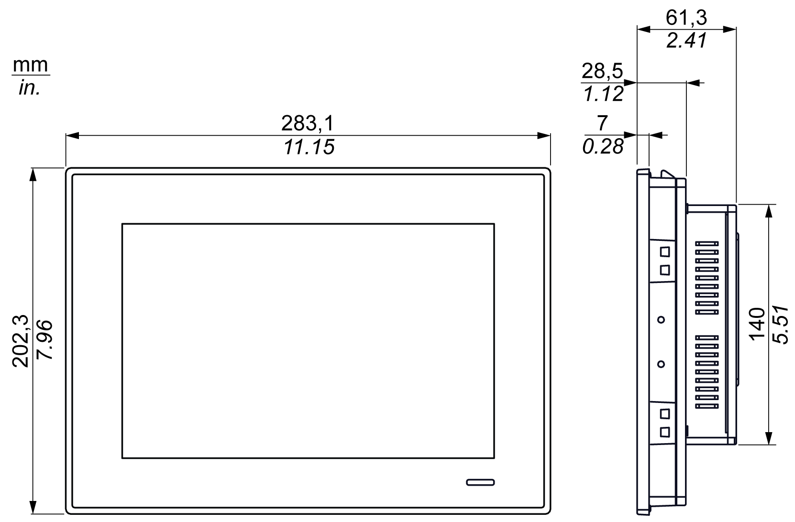
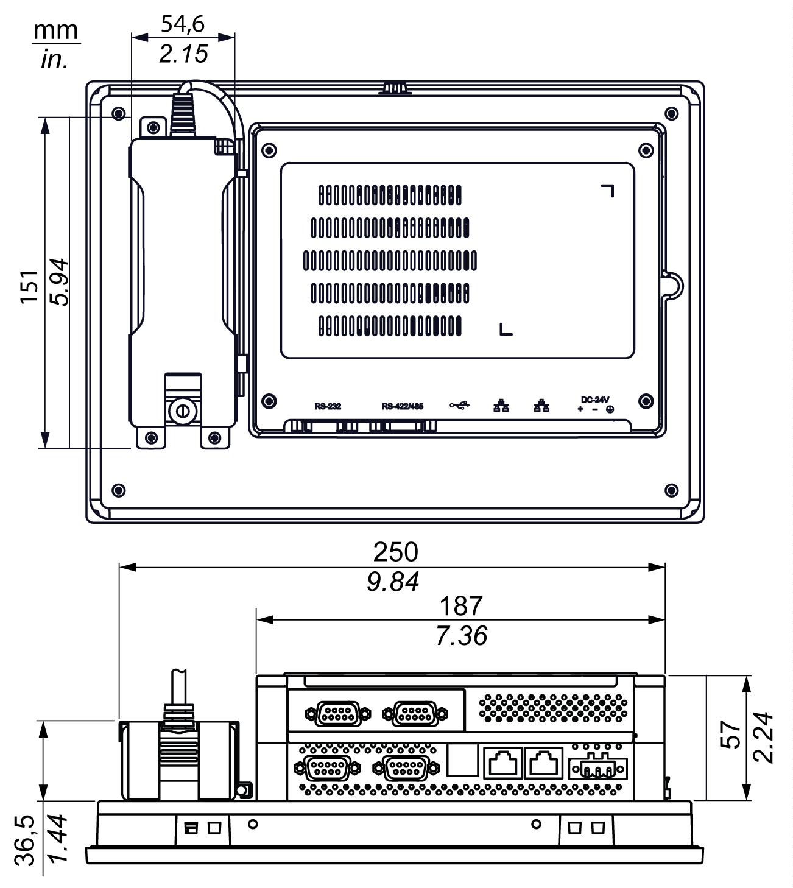
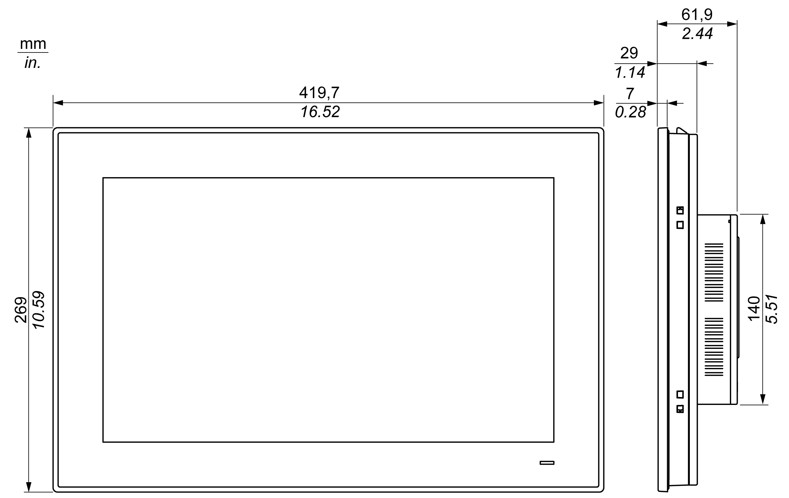
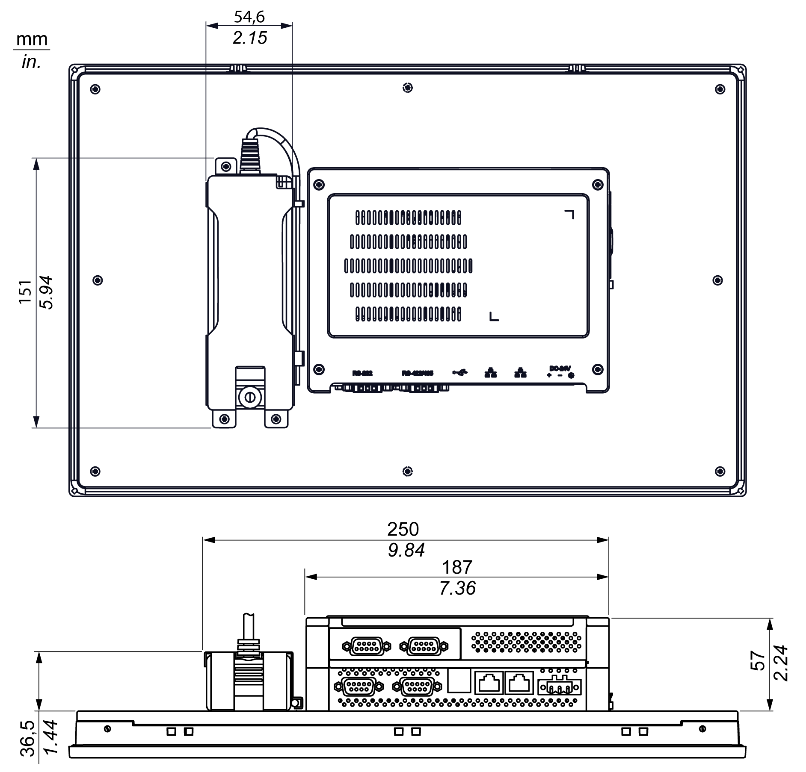

# Dimensions

Dimensions

W10”  Dimensions

The figure shows the dimensions without AC power supply:

The figure shows the dimensions with the AC power supply module (HMIYPSOMAC1) and the extension kit (HMIYPADPSOSTO1):

W15”  Dimensions

The figure shows the dimensions without AC power supply:

The figure shows the dimensions with the AC power supply module (HMIYPSOMAC1) and the extension kit (HMIYPADPSOSTO1):

EIO0000002041.03

© 2019 Schneider Electric. All rights reserved.