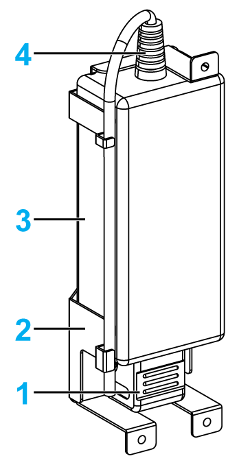
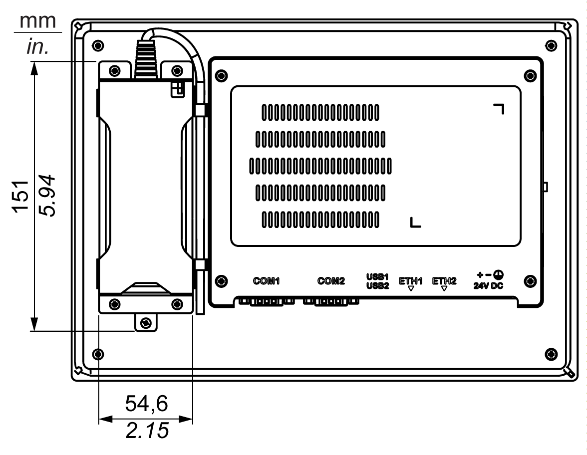

# AC Power Supply Description and Installation

AC Power Supply Description and Installation

Overview

The AC power supply module can optionally be mounted on the S-Panel PC to allow the S-Panel PC to be operated with 100...240 Vac.

|  |
| --- |
| DangerElectrical_Color.gifDanger_Color.gifDANGER |
| HAZARD OF ELECTRIC SHOCK, EXPLOSION OR ARC FLASH |
| oRemove all power from the device before removing any covers or elements of the system, and prior to installing or removing any accessories, hardware, or cables.  oUnplug the power cable from both the Magelis Industrial PC and the power supply.  oAlways use a properly rated voltage sensing device to confirm that power is off.  oReplace and secure all covers or elements of the system before applying power to the unit.  oUse only the specified voltage when operating the Magelis Industrial PC. The AC unit is designed to use 100...240 Vac input. |
| Failure to follow these instructions will result in death or serious injury. |

|  |
| --- |
| Warning_Color.gifWARNING |
| EQUIPMENT DISCONNECTION OR UNINTENDED EQUIPMENT OPERATION |
| oEnsure that power, communication, and accessory connections do not place excessive stress on the ports. Consider the vibration in the environment.  oSecurely attach power, communication, and external accessory cables to the panel or cabinet.  oUse only D-Sub 9-pin connector cables with a locking system in good condition.  oUse only commercially available USB cables. |
| Failure to follow these instructions can result in death, serious injury, or equipment damage. |

|  |
| --- |
| Warning_Color.gifWARNING |
| RISK OF BURNS |
| Do not touch the surface of the heat sink during operation. |
| Failure to follow these instructions can result in death, serious injury, or equipment damage. |

This figure shows the AC power supply module:

1   AC power cord

2   Support

3   AC power supply

4   DC power cord

This figure shows the dimensions of the AC power supply module:

AC Power Supply

The table provides technical data for the AC power supply:

| Element | Characteristics |
| --- | --- |
| Input | 90...260 Vac / 47...63 Hz / 1.6 A at 100 Vac |
| Output | 24 Vdc / 2.62 A maximum |
| Inrush current | 70 A at 230 Vac |
| Environment | |
| Operation temperature | 0...70 °C (32...158 °F), see derating curve |
| Storage temperature | -40...85 °C (-40...185 °F) |
| Relative humidity: | 0...95 %, non-condensing |

Operation temperature of the AC power supply derating curve:

Wiring and Connecting the Terminal Block

The table provides how to connect the AC power supply module:

| Step | Action |
| --- | --- |
| 1 | Remove all power from the S-Panel PC and confirm that the power adapter is disconnected from its power source. |
| 2 | The AC power supply module is mounted to the S-Panel PC with 4 screws:  G-SE-0042885.1.gif-high.gif      NOTE: The recommended torque to tighten these screws is 0.5 Nm (4.5 lb-in). |
| 3 | Remove the terminal block from the power connector and connect the power cord to the terminal block:  G-SE-0042005.2.gif-high.gif      Connect the black wire with the 0 V and the red wire with the 24 V of the terminal block. Use 2.5 mm2 copper wire to make the ground connection of the terminal block. |
| 4 | Place the terminal block in the power connector and tighten the screws:  G-SE-0041991.2.gif-high.gif      NOTE: The recommended torque to tighten these screws is 0.5 Nm (4.5 lb-in). |
| 5 | Attach the power cord and tighten the screws:  G-SE-0044368.1.gif-high.gif |

|  |
| --- |
| Caution_Color.gifCAUTION |
| OVERTORQUE AND LOOSE HARDWARE |
| oDo not exert more than 0.5 Nm (4.5 lb-in) of torque when tightening the installation fastener, enclosure, accessory, or terminal block screws. Tightening the screws with excessive force can damage the installation fastener.  oWhen fastening or removing screws, ensure that they do not fall inside the Magelis Industrial PC chassis. |
| Failure to follow these instructions can result in injury or equipment damage. |

EIO0000002041.03

© 2019 Schneider Electric. All rights reserved.