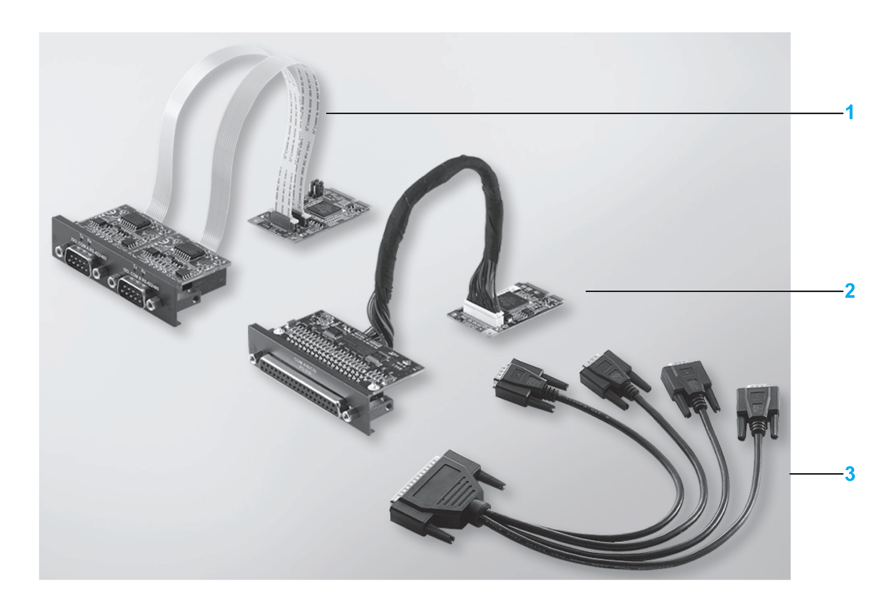
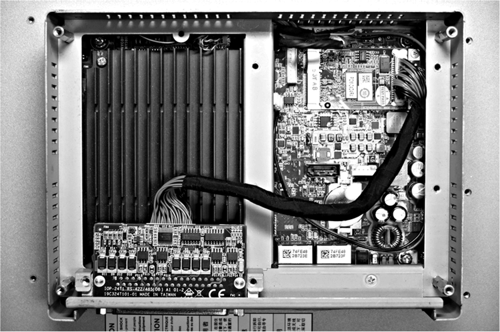
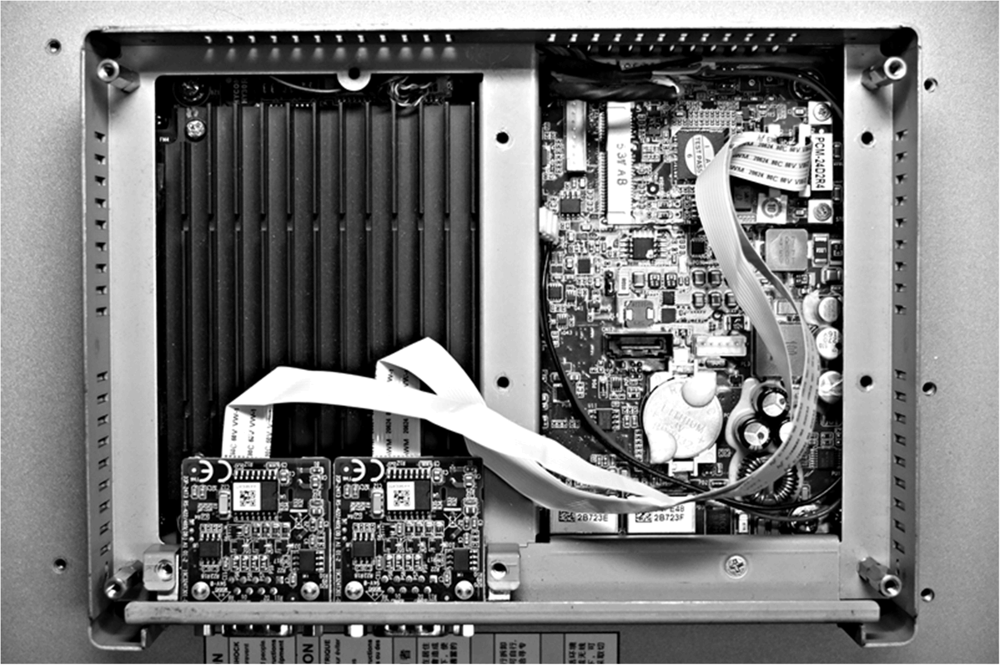

# RS-232, RS-422/485 Interface Description

RS-232, RS-422/485 Interface Description

Introduction

The HMIYMINSL series are categorized as communication modules. They are all compatible with the mini PCIe card including isolated / non-isolated RS-232, RS-422/485 communication cards for automation control.

The figure shows the RS-232, RS-422/485 interfaces:

1   2 x RS-232, RS-422/485 interface

2   4 x RS-232, RS-422/485 interface

3   1 x interface cables

The following figure shows the dimensions of the 2 x RS-232, RS-422/485 interface:

The following figure shows the dimensions of the 4 x RS-232, RS-422/485 interface:

Serial Interface

The table shows technical data for the serial interfaces:

| Element | Characteristics | | | |
| --- | --- | --- | --- | --- |
| Part number | HMIYMINSL24851 | HMIYMINSL22321 | HMIYMINSL44851 | HMIYMINSL42321 |
| General | | | | |
| Bus type | Mini PCIe card revision 1.2 | | | |
| Type | 2 x RS-422/485, electrically isolated | 2 x RS-232, electrically isolated | 4 x RS-422/485, electrically non-isolated | 4 x RS-232, electrically non-isolated |
| Connectors | 2 x D-Sub 9-pin, plug | | 1 x D-Sub 37-pin, socket | |
| Power consumption | 3.3 Vdc at 400 mA | | 3.3 Vdc at 500 mA | |
| Communication | | | | |
| Data bits | 5, 6, 7, 8 | | | |
| FIFO | 128 bytes | | | |
| Flow control | RTS/CTS  Xon/Xoff | | RTS/CTS (not supported)  Xon/Xoff | RTS/CTS  Xon/Xoff |
| Parity | None, odd, even, Mark and space | | | |
| Speed | 50 bps...921.6 kbps | 50 bps...230.4 kbps | 50 bps...921.6 kbps | 50 bps...230.4 kbps |
| Stop bits | 1, 1.5, 2 | | | |
| Transfer rate | | | | |
| Transfer rate  RS-232 | Maximum 115 kbps with cable length ≤ 10 m  Maximum 64 kbps with cable length ≤ 15 m | | | |
| Transfer rate  RS-422/485 | Maximum 115 kbps with cable length ≤ 1200 m | | | |

Cable Serial Interface

The table shows the technical data of the cable serial interface:

| Element | Characteristics | |
| --- | --- | --- |
| Signal lines | Cable cross section RS-232  Cable cross section RS-422  Cable cross section RS-485  Wire insulation  Conductor resistance  Stranding  Shield | 4 x 0.16 mm² (26 AWG), tinned Cu. wire  4 x 0.25 mm² (24 AWG), tinned Cu. wire  4 x 0.25 mm² (24 AWG), tinned Cu. wire  Protective earth ground  ≤ 82 Ω/km  Wires stranded in pairs  Paired shield with aluminum foil |
| Grounding line | Cable cross section  Wire insulation  Conductor resistance | 1 x 0.34 mm² (22 AWG/19), tinned Cu. wire  Protective earth ground  ≤ 59 Ω/km |
| Outer sheathing | Material  Features  Cable shielding | PUR mixture  Halogen free  From tinned Cu. wires |

Serial Interface Connections

This interface is used to connect the S-Panel PC to remote equipment, via a cable. The connector is a D-Sub 9-pin plug connector.

By using a long PLC cable to connect to the S-Panel PC, it is possible that the cable can be at an electrical potential that is different from the electrical potential of the panel, even if both are connected to ground.

The serial port that is not isolated has the signal ground (SG) and the functional ground terminals connected inside the panel.

|  |
| --- |
| DangerElectrical_Color.gifDanger_Color.gifDANGER |
| ELECTRIC SHOCK |
| oMake a direct connection between the ground connection screw and ground.  oDo not connect other devices to ground through the ground connection screw of this device.  oInstall all cables according to local codes and requirements. If local codes do not require grounding, follow a reliable guide such as the US National Electrical Code, Article 800. |
| Failure to follow these instructions will result in death or serious injury. |

The table shows the D-Sub 9-pin assignments:

| Pin | Assignment | | |
| --- | --- | --- | --- |
| RS-232 | RS-422/485 |  |
| 1 | DCD | TxD-/Data- | D-Sub 9-pin plug connector:  G-SE-0009066.2.gif-high.gif |
| 2 | RxD | TxD+/Data+ |
| 3 | TxD | RxD+ |
| 4 | DTR | RxD- |
| 5 | GND | GND/VEE |
| 6 | DSR | RTS- |
| 7 | RTS | RTS+ |
| 8 | CTS | CTS+ |
| 9 | RI | CTS- |

The table shows the D-Sub 37-pin assignments:

| Pin | Assignment | | |
| --- | --- | --- | --- |
| RS-232 | RS-422/485 |  |
| 1 | N.C. | N.C. | D-Sub 37-pin socket connector:  G-SE-0038758.1.gif-high.gif |
| 2 | DCD3 | TxD3-/Data3- |
| 3 | GND | GND/VEE3 |
| 4 | CTS3 | N.C. |
| 5 | RxD3 | TxD3/Data3 |
| 6 | RI4 | N.C. |
| 7 | DTR4 | RxD4- |
| 8 | DSR4 | N.C. |
| 9 | RTS4 | N.C. |
| 10 | TxD4 | RxD4 |
| 11 | DCD2 | TxD2-/Data2- |
| 12 | GND | GND |
| 13 | CTS2 | N.C. |
| 14 | RxD2 | TxD2/Data2 |
| 15 | RI1 | N.C. |
| 16 | DTR1 | RxD1- |
| 17 | DSR1 | N.C. |
| 18 | RTS1 | N.C. |
| 19 | TxD1 | RxD1 |
| 20 | RI3 | N.C. |
| 21 | DTR3 | RxD3- |
| 22 | DSR3 | N.C. |
| 23 | RTS3 | N.C. |
| 24 | TxD3 | RXD3 |
| 25 | DCD4 | TxD4-/Data4- |
| 26 | GND | GND/VEE4 |
| 27 | CTS4 | N.C. |
| 28 | RxD4 | TxD4/Data4+ |
| 29 | RI2 | N.C. |
| 30 | DTR2 | RxD2- |
| 31 | DSR2 | N.C. |  |
| 32 | RTS2 | N.C. |
| 33 | TxD2 | RxD2 |
| 34 | DCD1 | TxD1-/Data1- |
| 35 | GND | GND/VEE1 |
| 36 | CTS1 | N.C. |
| 37 | RxD1 | TxD1/Data1+ |

Any excessive weight or stress on communication cables may disconnect the equipment.

|  |
| --- |
| Caution_Color.gifCAUTION |
| LOSS OF POWER |
| oEnsure that communication connections do not place excessive stress on the communication ports of the Magelis Industrial PC.  oSecurely attach communication cables to the panel or cabinet.  oUse only D-Sub 9-pin cables with a locking system in good condition. |
| Failure to follow these instructions can result in injury or equipment damage. |

RS-485 Interface Specificity

NOTE: All the pins of the RS-422 default interface should be used for operation.

The RTS line must be switched each time the driver is sent and received. There is no automatic switch back. This cannot be configured in Windows.

The voltage drop caused by long line lengths can lead to greater potential differences between bus stations, which can hinder communication. You can improve the communication by running a ground wire with the other wires.

NOTE: When using RS-422/485 communication with PLCs, you may need to reduce the transmission speed and increase the TX Wait time.

Compatible Table

| Part number | Description | S-Panel PC |
| --- | --- | --- |
| HMIYMINSL24851 | Inteface 2 x RS-422/485 isolation | Yes |
| HMIYMINSL44851 | Inteface 4 x RS-422/485 isolation, DB37, cable | Yes |
| HMIYMINSL22321 | Inteface 2 x RS-232 isolation | Yes |
| HMIYMINSL42321 | Inteface 4 x RS-232, DB 37, cable | Yes |

Cable Routing

S-Panel PC and HMIYMINSL42321:

S-Panel PC and HMIYMINSL22321:

S-Panel PC and HMIYMINSL44851:

S-Panel PC and HMIYMINSL24851:

Device Manager and Hardware Installation

Install the driver before you install the interface into the S-Panel PC. The driver installation media is included with the package. After the interface is installed, you can verify whether it is properly installed on your system through the Device Manager.

EIO0000002041.03

© 2019 Schneider Electric. All rights reserved.