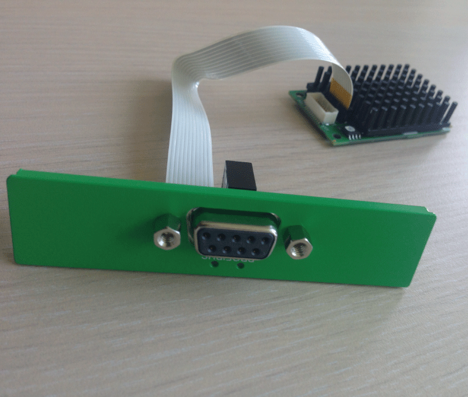
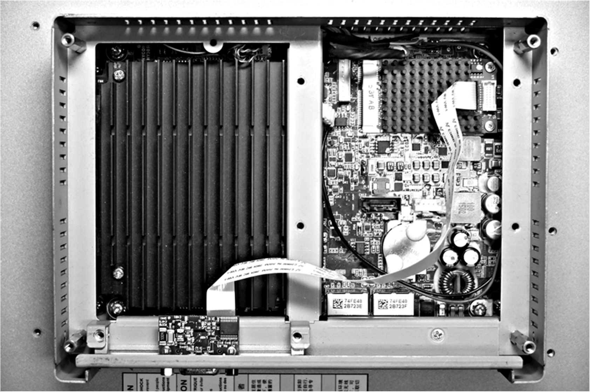

# Profibus DP Interface Description

Profibus DP Interface Description

Introduction

The HMIYMINPRO1 is categorized as industrial communication with fieldbus protocol modules (Profibus DP master or slave). It is compatible with the mini PCIe card.

NOTE: Download the firmware and configuration. Use the corresponding master or slave DTM in the configuration software SYCON.net (HILSCHER CIFX 90E-DP\ET\F\MR\ADVA/+ML).

The figure shows the Profibus DP interface:

Profibus DP Interface Description

The table shows technical data for the Profibus DP interface:

| Features | Values |
| --- | --- |
| General | |
| Bus type | mini PCIe card revision 1.2 |
| Connector | 1 x socket D-Sub 9-pin |
| Memory | 8 Mb SDRAM / 4 Mb serial flash EPROM |
| Size of the dual-port memory | 64 Kbyte |
| Power consumption | 600 mA at 3.3 Vdc |
| Communication | |
| Protocol | Profibus DP V1 |
| Signal support | RxD/TxD-P, RxD/TxD-N |
| Transmission rate | 33 MHz |
| Dimensions | 60 x 45 x 9.5 mm (2.36 x 1.77 x 0.37 in) |

Profibus DP Specification

The table shows the Profibus DP specification:

| Features | Profibus DP slave | Profibus DP master |
| --- | --- | --- |
| Slave max. | – | 125 |
| Cyclic data max. | 244 bytes | 244 bytes/slave |
| Acyclic read/write | 6,240 bytes | |
| Maximum number of modules | 24 | – |
| Configuration data | 244 bytes | 244 bytes/slave |
| Parameter data | 237 bytes | |

NOTE: To configure the master, a GSD file (device description file) is required. The settings in the used master must comply with the settings in the slave to establish communication. The main parameters are: Station address, ID number, baudrate, and config data (the configuration data for the output and input length).

Connections

This interface is used to connect S-Panel PC to remote equipment, via a cable. The connector is a D-Sub 9-pin plug connector.

If you use a long PLC cable to connect to the S-Panel PC, the cable can be at an electrical potential that is different from the electrical potential of the panel, even if both are connected to ground.

The table shows the D-Sub 9-pin assignments:

| Pin | Assignment | Description | D-Sub 9-pin plug female connector |
| --- | --- | --- | --- |
| 1 | – | – | G-SE-0063956.1.gif-high.gif |
| 2 | – | – |
| 3 | RxD/TxD-P | Receive/Send Data-P  connection B plug |
| 4 | – | – |
| 5 | GND | Reference potential |
| 6 | VP | Positive supply voltage |
| 7 | – | – |
| 8 | RxD/TxD-N | Receive/Send Data-N  connection A plug |
| 9 | – | – |

Any excessive weight or stress on communication cables may disconnect the equipment.

|  |
| --- |
| Caution_Color.gifCAUTION |
| LOSS OF POWER |
| oEnsure that communication connections do not place excessive stress on the communication ports of the Magelis Industrial PC.  oSecurely attach communication cables to the panel or cabinet.  oUse only D-Sub 9-pin cables with a locking system in good condition. |
| Failure to follow these instructions can result in injury or equipment damage. |

Compatible Table

| Part number | Description | S-Panel PC |
| --- | --- | --- |
| HMIYMINPRO1 | Interface Profibus w/NVRAM, 128 Mb + ML | Yes |

Cable Routing

S-Panel PC:

Device Manager and Hardware Installation

Install the driver before you install the interface into the S-Panel PC. The driver installation media is included with the package. After the interface is installed, you can verify whether it is properly installed on your system through the Device Manager.

EIO0000002041.03

© 2019 Schneider Electric. All rights reserved.