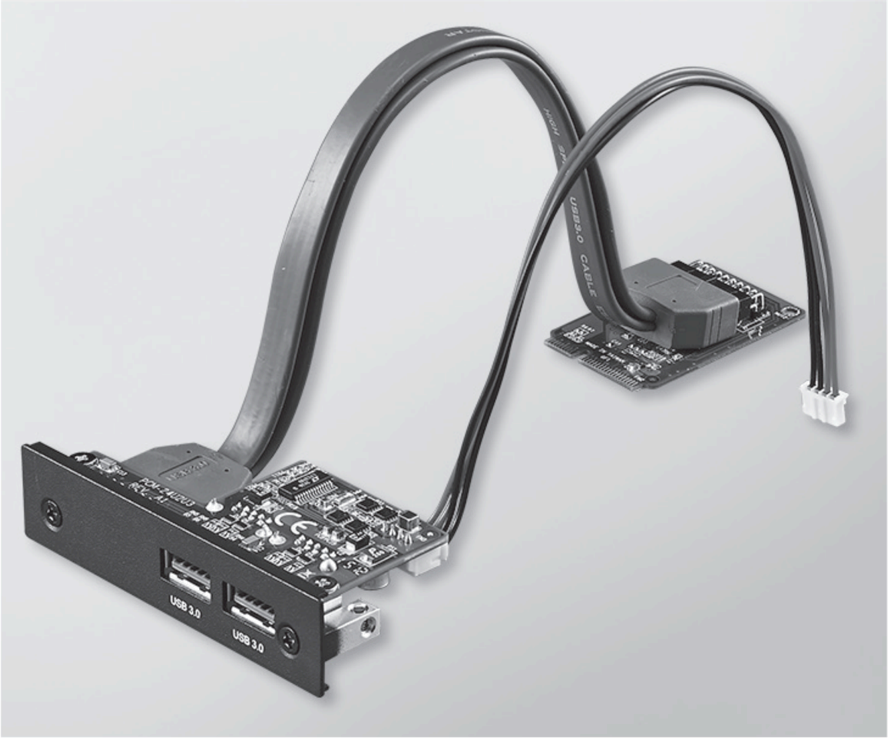
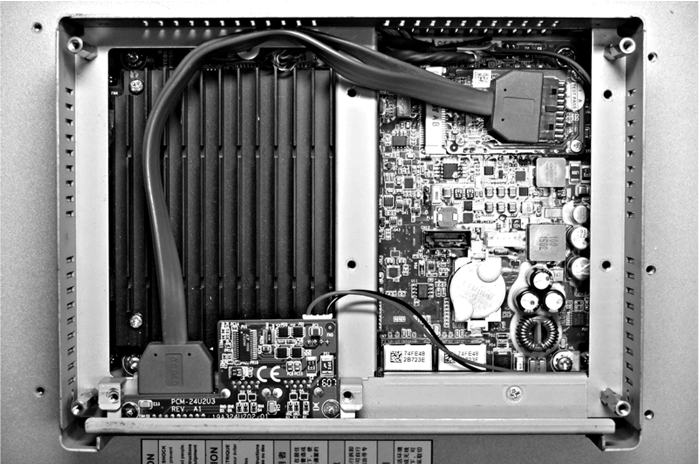

# USB Interface Description

USB Interface Description

Introduction

The HMIYMINUSB1 are categorized as communication modules. It is all compatible with the mini PCIe card.

The figure shows the USB interface:

The figure shows the dimensions of the USB interface:

USB Interface

The table shows technical data for the USB interface:

| Element | Characteristics |
| --- | --- |
| General | |
| Bus type | Mini PCIe card revision 1.2 |
| Connector | 2 x ports USB 3.0 |
| Power consumption | +5 Vdc / 900 mA power output to USB device (typical: 3.3 Vdc) |
| Communication | |
| Protocol | Universal serial Bus 3.0 specification Rev. 1.0 |
| Speed | Low speed: 1.5 Mb/s, full speed: 12 Mb/s, high speed: 480 Mb/s, super speed: 5 Gb/s |

Compatible Table

| Part number | Description | S-Panel PC |
| --- | --- | --- |
| HMIYMINUSB1 | Interface USB 3.0, 2 x USB | Yes |

Cable Routing

S-Panel PC:

Device Manager and Hardware Installation

Install the driver before you install the interface into the S-Panel PC. The driver installation media is included with the package. After the interface is installed, you can verify whether it is properly installed on your system through the Device Manager.

EIO0000002041.03

© 2019 Schneider Electric. All rights reserved.