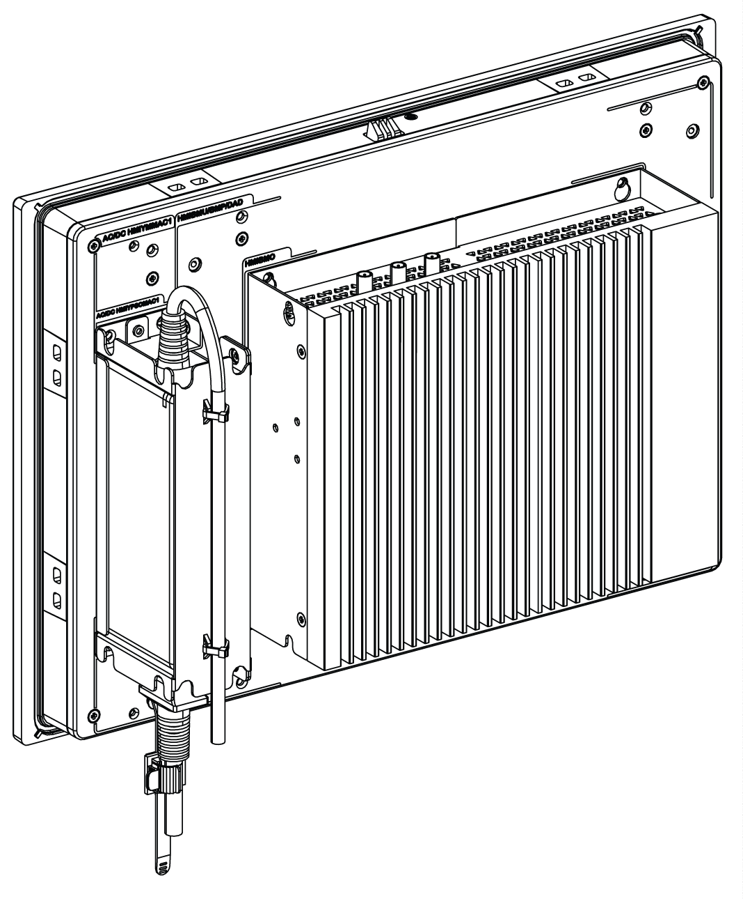

# Overview

Overview

NOTE:

oWindows setting (with drivers already installed): The Box iPC Optimized can support two DisplayPort at the same time when mounted with a display (HMIDM).

oAfter DisplayPort cable is plugged, Operating System must be reboot.

oFor connecting the Box iPC on display with DVI interface, use an active DP to DVI cable: HMIYADDPDVI11 (see in accessories).