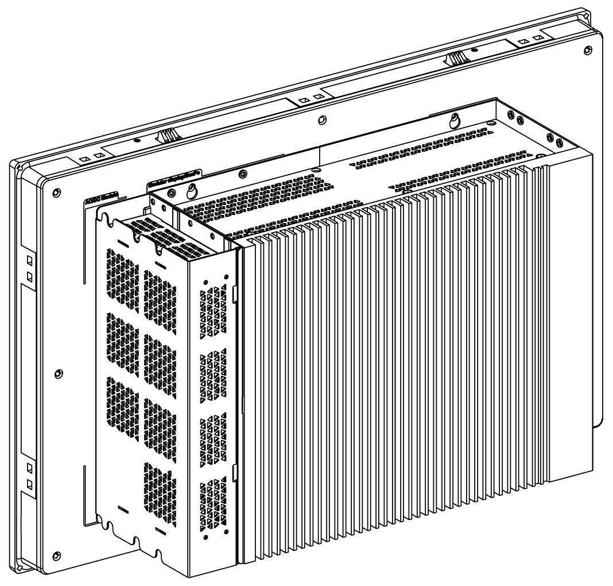

# Overview

Overview

NOTE:

oThe Box iPC (HMIBMU/HMIBMP) can support two DisplayPort. When the Box iPC is mounted with the display, the DisplayPort 2 is not functional.

oAfter DisplayPort cable is connected, Operating System must be rebooted.

oFor connecting the Box iPC to a display with DVI interface, use an active DP to DVI cable: HMIYADDPDVI11 (see in accessories).